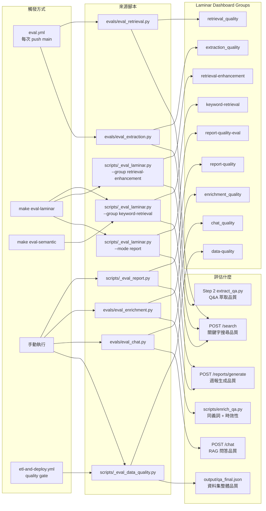
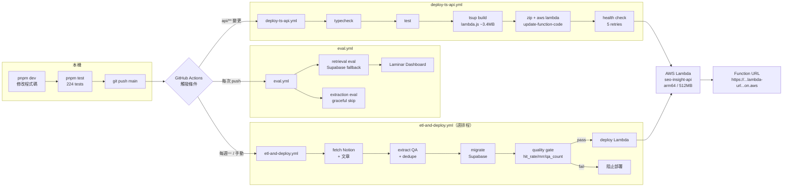
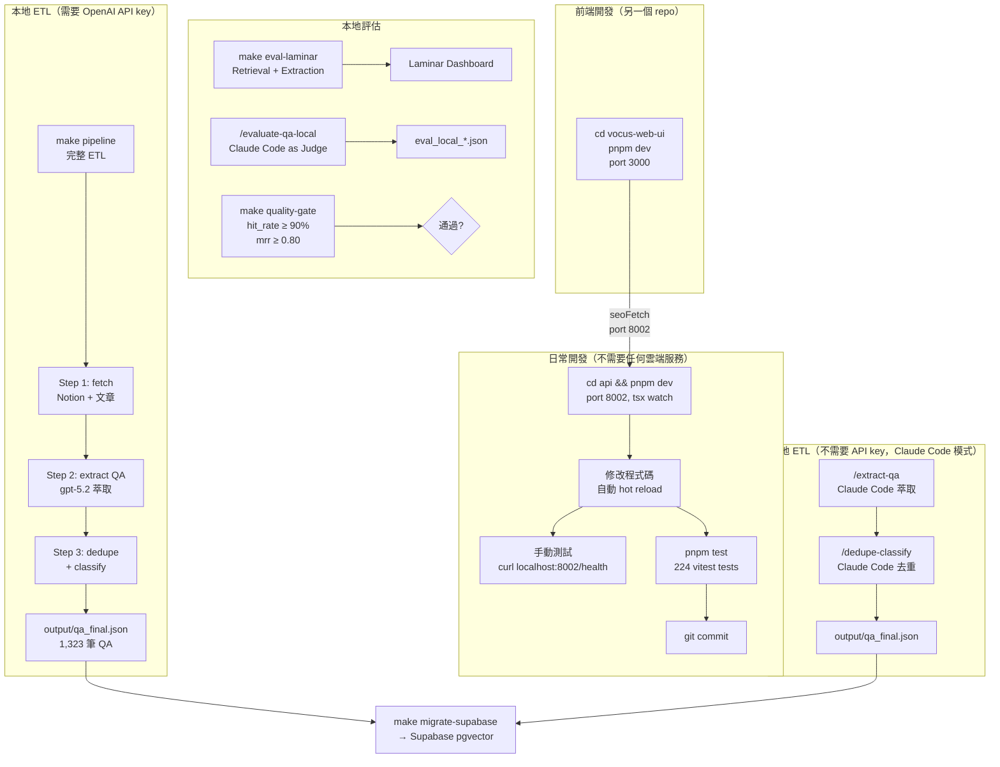
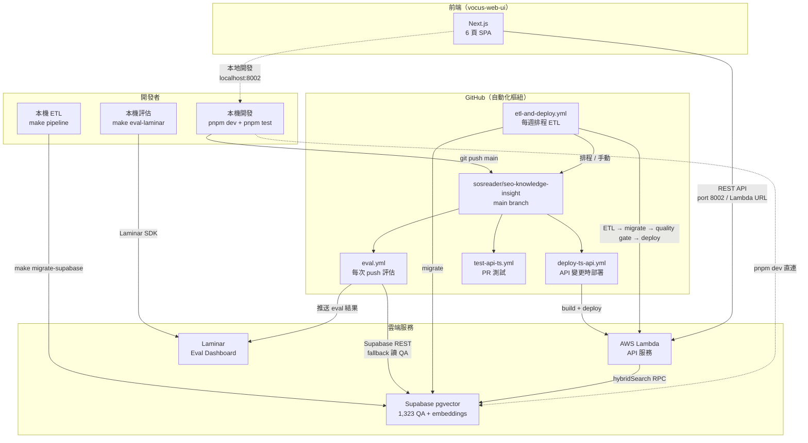

# SEO Q&A 資料庫建構 Pipeline

從 Notion 上累積兩年的 SEO 顧問會議紀錄中，自動萃取結構化的問答資料庫。

## 功能總覽

本系統提供六大功能，自動化建構並維護企業 SEO 知識庫。新使用者可在 1 分鐘內快速理解系統能力。

### 1. 知識庫建構 Pipeline（步驟 1–3）

- **多來源擷取** — Notion 增量擷取（87 場會議）+ Medium RSS + iThome HTML scraping + Google Case Studies HTML scraping
- **OpenAI 自動萃取** — 用 `gpt-5.2` 將 Markdown 解析為結構化 Q&A（What/Why/How/Evidence）
- **Collection-Scoped 去重合併** — 各 collection 內部獨立去重，跨 collection 保留（支援多來源知識不互相覆蓋）
- **智能分類標籤** — 10 個分類（技術 SEO、內容策略、連結建設等），用 `gpt-5-mini` 自動標記難度與時效性
- **雙層 metadata** — `source_type`（meeting/article）+ `source_collection`（seo-meetings/genehong-medium/ithelp-sc-kpi/google-case-studies）
- **目前規模** — 1,323 筆 Q&A（4 個 collection：notion-seo-meetings 584、medium-genehong 511、ithelp-gsc-kpi 185、google-case-studies 43）

### 2. 每週 SEO 週報生成（步驟 4）

- **自動指標拉取** — 從 Google Sheets 讀取週度指標（無需手動複製貼上）
- **異常值偵測** — 月趨勢 ±15% 或週趨勢 ±20% 自動標記異常；Health Score 演算法：100 - (DOWN×10)，三級標籤（良好/需關注/警示）
- **四層生成模式**（v2.23）
  - `template`：本地模板引擎（無需 API）
  - `hybrid`：模板 + LLM 5 維度增強（前端可選）
  - `openai`：Python `04_generate_report.py` + OpenAI API（ECC 6 維度 + Health Score 扣分明細）
  - `claude-code`：前端 Claude Code 自動 fallback
- **ECC 7 維度報告** — 情勢快照、流量信號、技術 SEO、搜尋意圖、優先行動、AI 可見度、知識庫引用；OpenAI 模式含 Health Score 扣分明細、CTR 四象限分析、Perplexity 風格 [N] 引用
- **業界研究引用** — 內建 7 條引用常數（Backlinko 2024、arxiv SERP Features、NavBoost 洩露、E-E-A-T 2024、First Page Sage 2025、Semrush Intent Framework、GSC CausalImpact）
- **報告品質評估** — `report-evaluator.ts` 5 維度規則式評分（section_coverage / kb_citations / research_cited / kb_links / alert_coverage），生成後非同步推送 Laminar scoreEvent
- **知識庫交叉引用** — 關鍵字搜尋對應 Q&A，生成含原文連結的行動建議
- **報告元資料** — `<!-- report_meta {"generation_mode":"openai","model":"gpt-5.2",...} -->` 紀錄生成模式與模型版本

### 3. Q&A 品質評估（步驟 5）

- **五維度 LLM-as-Judge** — Relevance、Accuracy、Completeness、Granularity、Faithfulness（各 1–5 分）
- **Retrieval 品質指標** — Hit Rate 100%、MRR 0.88、Recall@K 77.5%、NDCG@K 0.72（v2.12 基準，20 golden cases）
- **分類準確度檢驗** — Category、Difficulty、Evergreen 標籤驗證
- **對標基準線** — 自動與歷史 eval 比較進度（v2.0: Relevance 5.00、Accuracy 4.30、Completeness 3.95）

### 4. REST API 服務（Hono + TypeScript，`api/`）

- **語意搜尋** — `POST /api/v1/search`（有 OpenAI: hybrid search，無 OpenAI: 原生 keyword search 自動降級）
- **RAG 問答** — `POST /api/v1/chat`（三模式：Agent mode / Full RAG + GPT / Context-only 自動降級）+ `POST /api/v1/chat/stream`（SSE streaming）
- **Q&A 管理** — `GET /api/v1/qa/*`（列表、詳情、分類查詢，使用穩定的 16-char hex ID 或 seq number）
- **週報管理** — `GET/POST /api/v1/reports/*`（列表、詳情、生成）
- **對話管理** — `GET/POST/DELETE /api/v1/sessions/*`（CRUD、訊息歷史）
- **Pipeline 管理** — `/api/v1/pipeline/*`（17 endpoints：狀態、會議、來源文件、指標、快照、趨勢分析、觸發 fetch/fetch-articles/extract/dedupe）
- **同義詞管理** — `/api/v1/synonyms/*`（4 endpoints：列表、新增、更新、刪除；雙層設計：靜態+自訂）
- **API 安全** — API Key 認證（`X-API-Key` header）、Rate Limit（chat 20/min、search/qa 60/min）、Zod schema validation
- **API 文件** — 啟動 dev server 後存取：
  - [`/docs`](http://localhost:8002/docs) — Scalar 互動式文件（可直接在瀏覽器測試 API）
  - [`/openapi.json`](http://localhost:8002/openapi.json) — OpenAPI 3.1 規格（可匯入 Postman / Swagger Editor）

#### RAG 迭代改進（v2.11 新增）

**Phase 2：Contextual Embeddings**
- `scripts/_generate_context.py` — 用 Claude Haiku 離線生成 QA 情境 context（150–300 字/筆）
- `output/qa_context.json` — 預生成的 situating context（無運行時成本）
- 搜尋和 chat 時可利用 context 豐富檢索結果

**Phase 3：Re-ranking 服務**（可選，需要 `ANTHROPIC_API_KEY`）
- `api/src/services/reranker.ts` — Claude Haiku reranker service
  - 初期 over-retrieve K×3 候選
  - 用 XML 結構化 prompt 重排序、評分
  - 篩選 top-K 結果
  - 錯誤時自動 fallback 至原始排序
- **實際效果**：Hit Rate 100%、MRR 0.88（v2.12 基準）

**Phase 4：Context Relevance 評估（v2.12 新增）**
- `api/src/services/context-relevance.ts` — Claude Haiku LLM judge
  - 評估 query 與 retrieved contexts 的語意相關性
  - 輸出 0–1 分（0 = 完全不相關，1 = 完全相關）+ per-context 細分評分
  - Dynamic import fallback：ANTHROPIC_API_KEY 缺失時，使用 freshness_score 啟發式評分
  - `escapeXml()` 防 XML prompt injection
- eval endpoints 已於 v2.18 移除（改用離線 Laminar eval + CI 自動化）

**環境變數（v2.11）**：
```env
ANTHROPIC_API_KEY=sk-ant-...     # 用於 Reranker（可選）
CONTEXT_EMBEDDING_WEIGHT=0.6     # Context 加權（預設 0.6）
RERANKER_ENABLED=auto            # 是否啟用 reranker（"auto"/"true"/"false"，預設 auto）
```

評估基準線（v2.11，20 cases，top-k=5）：
| 指標 | 數值 |
|------|------|
| KW Hit Rate | 73% |
| Precision@K | 76% |
| Recall@K | 80% |
| F1 Score | 0.73 |
| MRR | 0.88 |

### 5. Claude Code 模式（不需要 OpenAI API Key）

- **`/search`** — 知識庫語意搜尋（Claude 本身作為 LLM 引擎）
- **`/chat`** — 互動式 RAG 問答（Claude 推理 + 本地知識庫）
- **`/generate-report`** — SEO 週報生成（解析指標、知識庫搜尋、推薦行動）
- **`/pipeline-local`** — 完整 Pipeline Steps 1–4（無需 OpenAI API）
- **`/evaluate-provider`** — LLM Provider SEO 洞察評估（4 維度：Grounding、Actionability、Relevance、Topic Coverage）

### 6. LLM Provider 品質對標（獨立工具）

- **四維度 LLM-as-Judge** — Grounding（數字可追溯性）、Actionability（建議可執行性）、Relevance（SEO 聚焦度）、Topic Coverage（主題涵蓋率）
- **完整對比報告** — 多個 Provider 並排評分，delta 對比前次結果
- **無需 API key** — Claude Code 本身作為 Judge，評估任何 LLM Provider 的分析品質

### 7. Laminar 離線評估（v1.10 → v2.24 CI 整合）

- **CI 自動化** — 每次 push main 自動執行 `eval.yml`：retrieval eval 從 Supabase 讀 QA 資料、extraction eval 本機跑（CI graceful skip）
- **自動監控三環節** — Retrieval 品質、Q&A Extraction、RAG Chat 端到端表現
- **無需額外 API** — 基於 Laminar SDK，純 Python/SQL 邏輯，不消耗 OpenAI tokens
- **儀表板可視化** — 所有指標匯總至 Laminar 後台（laminar.sh/app/evals）
- **Meeting-Prep 評估（v3.2）** — 三層架構：Layer 1 結構 eval（11 evaluators，`evals/eval_meeting_prep_structure.py`）、Layer 2 grounding eval（5 evaluators，`evals/eval_meeting_prep_grounding.py`）、Layer 3 LLM-as-Judge（`/evaluate-meeting-prep-quality`）；共 13 個 Laminar eval groups

---

**快速開始**：[前置準備](#前置準備)

---

## 指令速查

依功能對照三種使用方式：CLI 腳本、Claude Code 指令、REST API。

### Pipeline 建構

| 功能                        | CLI 腳本                                          | Claude Code 指令                                    | REST API                                    |
| --------------------------- | ------------------------------------------------- | --------------------------------------------------- | ------------------------------------------- |
| Step 1a — Notion 擷取       | `make fetch-notion`                               | 由 `/pipeline-local` 整合執行                       | `POST /api/v1/pipeline/fetch`               |
| Step 1b-d — 文章擷取        | `make fetch-articles`                             | 由 `/pipeline-local` 整合執行                       | `POST /api/v1/pipeline/fetch-articles`      |
| Step 2 — Q&A 萃取           | `make extract-qa`                                 | `/extract-qa`（不需要 OpenAI）                      | `POST /api/v1/pipeline/extract-qa`          |
| Step 3 — 去重 + 分類        | `make dedupe-classify`                            | `/dedupe-classify`（不需要 OpenAI）                 | `POST /api/v1/pipeline/dedupe-classify`     |
| Step 4 — 週報生成           | `make generate-report`                            | `/generate-report <URL>`（不需要 OpenAI）           | `POST /api/v1/reports/generate`（支援兩種模式：snapshot_id 本地 / metrics_url OpenAI） |
| Step 5 — Q&A 品質評估       | `make evaluate-qa`                                | `/evaluate-qa-local`（不需要 OpenAI）               | 無對應 — 屬長時間離線作業                    |
| Step 5a — 語意 Reranker 評估| `make eval-semantic` / `make eval-semantic-k3`   | 無獨立指令                                          | 無對應 — 對比三種模式（keyword/hybrid/rerank）|
| Step 5b — Laminar Eval Run | `make eval-laminar`                               | 無獨立指令                                          | 無對應 — keyword baseline，推送 Dashboard   |
| Step 5c — Provider 評估     | 無獨立指令                                        | `/evaluate-provider <目錄>`（不需要 OpenAI）        | 無對應 — 屬長時間離線作業                    |
| Steps 1–4 — 知識庫建構      | `make pipeline`                                   | `/pipeline-local`（不需要 OpenAI）                  | 無對應 — 請依序呼叫上方個別端點               |
| Steps 1–5 — 完整 Pipeline   | `python scripts/run_pipeline.py`                  | `/run-pipeline`（需要 OpenAI）                      | 無對應 — 請依序呼叫上方個別端點               |

### Pipeline 監控

| 功能                        | CLI 腳本                                          | Claude Code 指令                                    | REST API                                    |
| --------------------------- | ------------------------------------------------- | --------------------------------------------------- | ------------------------------------------- |
| Pipeline 狀態               | `make status`                                     | 無獨立指令                                          | `GET /api/v1/pipeline/status`               |
| 待處理列表                  | `make list-unprocessed`                           | 無獨立指令                                          | `GET /api/v1/pipeline/unprocessed`          |
| 會議列表                    | 無獨立指令                                        | 無獨立指令                                          | `GET /api/v1/pipeline/meetings`             |
| 會議預覽                    | 無獨立指令 — 直接讀 `raw_data/markdown/*.md`      | 無獨立指令 — 直接讀檔案                              | `GET /api/v1/pipeline/meetings/{id}/preview`|
| 來源文件列表                | 無獨立指令                                        | 無獨立指令                                          | `GET /api/v1/pipeline/source-docs`（支援 filter） |
| 來源文件預覽                | 無獨立指令 — 直接讀檔案                            | 無獨立指令 — 直接讀檔案                              | `GET /api/v1/pipeline/source-docs/:collection/:file/preview` |
| Fetch 日誌                  | 無獨立指令 — 讀 `output/fetch_logs/`              | 無獨立指令 — 直接讀檔案                              | `GET /api/v1/pipeline/logs`                 |
| 指標解析                    | 無獨立指令                                        | 無獨立指令                                          | `POST /api/v1/pipeline/metrics`             |
| 指標快照管理                | 無獨立指令                                        | 無獨立指令                                          | `POST /api/v1/pipeline/metrics/save`、`GET /api/v1/pipeline/metrics/snapshots`、`DELETE /api/v1/pipeline/metrics/snapshots/{id}` |

### 搜尋與問答

| 功能                        | CLI 腳本                                          | Claude Code 指令                                    | REST API                                    |
| --------------------------- | ------------------------------------------------- | --------------------------------------------------- | ------------------------------------------- |
| 知識庫搜尋                  | `python scripts/qa_tools.py search --query "..."` | `/search <問題>`（不需要 OpenAI）                   | `POST /api/v1/search`                       |
| RAG 問答                    | 無對應 — 需維護多輪歷史狀態                       | `/chat`（不需要 OpenAI）                            | `POST /api/v1/chat`                         |
| Agentic RAG 問答            | 無對應                                            | `/chat-agent`（不需要 OpenAI，多輪自主搜尋）        | `POST /api/v1/chat`（`AGENT_ENABLED=true`） |
| 對話管理（CRUD）            | 無對應                                            | 無對應                                              | `GET/POST/DELETE /api/v1/sessions/*`        |
| 使用者回饋                  | 無對應                                            | 無對應                                              | `POST /api/v1/feedback`                     |

### 資料查詢

| 功能                        | CLI 腳本                                          | Claude Code 指令                                    | REST API                                    |
| --------------------------- | ------------------------------------------------- | --------------------------------------------------- | ------------------------------------------- |
| Q&A 列表查詢                | 無獨立指令 — 讀 `output/qa_final.json`            | 無對應 — 屬結構化過濾，REST 更適合                   | `GET /api/v1/qa`                            |
| 單筆 Q&A 詳情               | 無獨立指令 — 讀 `output/qa_final.json`            | 無對應 — 屬 ID 查詢，REST 更適合                     | `GET /api/v1/qa/{id}`（hex 或 seq）         |
| 所有分類                    | 無獨立指令 — 讀 `output/qa_final.json`            | 無對應 — 屬聚合查詢，REST 更適合                     | `GET /api/v1/qa/categories`                 |
| 資料集列表                  | 無獨立指令                                        | 無對應                                              | `GET /api/v1/qa/collections`                |
| 週報列表                    | 無獨立指令 — 掃描 `output/report_*.md`            | 無對應                                              | `GET /api/v1/reports`                       |
| 單篇週報詳情                | 無獨立指令 — 讀 `output/report_YYYYMMDD.md`       | 無對應                                              | `GET /api/v1/reports/{date}`                |

### 離線評估工具（v2.18 eval route 移除）

| 功能                        | CLI 腳本                                          | Claude Code 指令                                    | 說明                                    |
| --------------------------- | ------------------------------------------------- | --------------------------------------------------- | ------------------------------------------- |
| Q&A Retrieval 評估          | `make evaluate-qa`（含 `--eval-retrieval`）        | `/evaluate-qa-local`（含 Retrieval）                 | Keyword Hit Rate、MRR、Precision@K、Recall@K、F1 — 離線評估 |
| 語意 + Reranker 對比         | `make eval-semantic`（三模式）、`make eval-semantic-k3`（top-k=3）| 無獨立指令 | 三種檢索模式（keyword/hybrid/hybrid+rerank）的品質對比     |
| Laminar 正式 Eval Run       | `make eval-laminar`（推送 Dashboard）             | 無獨立指令                                          | 離線 Laminar dataset，5 指標推送儀表板 |
| 週報品質評估                | `python scripts/_eval_report.py <report_path>`   | 無獨立指令                                          | 7 維度規則式評分 — section_coverage、kb_citations、...；推送 Laminar |
| 跨 Provider 評估             | 無獨立指令                                        | `/evaluate-provider <目錄>`（不需要 OpenAI）        | LLM Provider SEO 洞察品質評估（Grounding、Actionability、Relevance、Topic Coverage） |
| Faithfulness 評估           | 無獨立指令                                        | `/evaluate-faithfulness-local`                      | RAGAS：Answer 是否有幻覺（Claude Code as Judge）|
| Context Precision 評估      | 無獨立指令                                        | `/evaluate-context-precision-local`                 | RAGAS：Retrieved contexts 相關性評估 |
| Meeting-Prep 結構 eval（L1）| `make evaluate-meeting-prep-structure`            | 無獨立指令                                          | 11 evaluators：section_completeness、metadata_valid、eeat_score_format 等；推送 Laminar `meeting_prep_structure` group |
| Meeting-Prep Grounding eval（L2）| `make evaluate-meeting-prep-grounding`       | 無獨立指令                                          | 5 evaluators：citation_id_resolution、citation_count_in_range、inline_citation_coverage 等；推送 Laminar `meeting_prep_grounding` group |
| Meeting-Prep 合併（L1+L2）  | `make evaluate-meeting-prep`                      | 無獨立指令                                          | 執行 L1 + L2 兩層評估 |
| Meeting-Prep LLM Judge（L3）| 無獨立指令                                        | `/evaluate-meeting-prep-quality`                    | 5 維度 LLM-as-Judge（Claude Code as Judge，不需要 OpenAI） |

### Laminar Eval Groups ↔ 來源腳本 ↔ 評估對象



**Eval Groups 速查表**：

| Laminar Group | 來源腳本 | 觸發方式 | 評估對象 | 指標 |
|---------------|---------|---------|---------|------|
| `retrieval_quality` | `evals/eval_retrieval.py` | CI 自動（每次 push） | 關鍵字搜尋 | keyword_hit_rate, top1_category, top5_coverage |
| `keyword-retrieval` | `_eval_laminar.py` | `make eval-laminar` | 關鍵字搜尋 | hit_rate, mrr, precision, recall, f1, ndcg, top1_cat, top5_cov |
| `retrieval-enhancement` | `_eval_laminar.py --group` | `make eval-laminar` | 同義詞增強搜尋 | synonym_coverage, kw_hit_with_synonyms, freshness_rank |
| `report-quality` | `_eval_report.py` | 手動 | 週報生成 | section_coverage, kb_links, research_cited |
| `report-quality-eval` | `_eval_laminar.py --mode report` | `make eval-laminar` | 週報生成 | section_coverage, kb_links, research_cited, overall |
| `extraction_quality` | `evals/eval_extraction.py` | CI 自動（graceful skip） | Q&A 萃取 | qa_count_in_range, keyword_coverage, no_admin, avg_confidence |
| `enrichment_quality` | `evals/eval_enrichment.py` | 手動 | 離線 enrichment | kw_hit_with_synonyms, freshness_rank, synonym_coverage |
| `chat_quality` | `evals/eval_chat.py` | 手動 | RAG 問答 | answer_keyword_coverage, top_source_category |
| `data-quality` | `_eval_data_quality.py` | ETL CI / 手動 | 資料集整體 | qa_count, avg_confidence, category_distribution |
| `meeting_prep_structure` | `evals/eval_meeting_prep_structure.py` | `make evaluate-meeting-prep-structure` / CI | Meeting-Prep 報告結構 | section_completeness, metadata_valid, citation_block_valid, question_count_valid, eeat_score_format, maturity_level_format 等 11 指標 |
| `meeting_prep_grounding` | `evals/eval_meeting_prep_grounding.py` | `make evaluate-meeting-prep-grounding` / CI | Meeting-Prep 引用與接地性 | citation_id_resolution, citation_category_consistency, citation_count_in_range, s4_four_sources_populated, inline_citation_coverage |

> **注意**：Dashboard 中的 `v2.12-fixed`、`v2.12-1317items`、`retrieval-eval-20...` 等為歷史一次性 run（測試或版本驗證），不是固定 group。

### 系統

| 功能                        | CLI 腳本                                          | Claude Code 指令                                    | REST API                                    |
| --------------------------- | ------------------------------------------------- | --------------------------------------------------- | ------------------------------------------- |
| 健康檢查                    | 無對應                                            | 無對應                                              | `GET /health`                               |

**REST API** — 需要先啟動 `cd api && pnpm dev`（port 8002），並在 header 帶 `X-API-Key`（生產環境）。

---

## 架構流程

```
Notion/Medium/iThome/Google Cases → Markdown 轉換 → OpenAI 萃取 Q&A → Collection-Scoped 去重合併 → 分類標籤 → 最終資料庫
```

```
seo-knowledge-insight/
├── api/                         # Hono TypeScript API（v2.12+，主架構）
│   ├── src/
│   │   ├── index.ts             # 入口（middleware + route mount）
│   │   ├── config.ts            # Zod 驗證環境變數
│   │   ├── routes/              # 9 個路由（qa/search/chat/reports/sessions/feedback/pipeline/health/synonyms）
│   │   ├── agent/               # Agentic RAG（v2.28）— agent loop + tool definitions + executor + DI
│   │   ├── middleware/           # auth / rate-limit / cors / error-handler
│   │   ├── store/               # QAStore singleton + SearchEngine + SessionStore
│   │   ├── services/            # embedding + rag-chat + pipeline-runner
│   │   ├── schemas/             # Zod schema（10 個）
│   │   └── utils/               # npy-reader / cosine-similarity / keyword-boost / cjk-tokenizer / mode-detect / sanitize
│   ├── Dockerfile               # Multi-stage Node.js build（node:22-slim）
│   ├── package.json             # pnpm + tsup + vitest
│   └── tsconfig.json
├── config.py                    # Pipeline 設定檔
├── pyproject.toml               # Package 定義（pip install -e . 用）
├── .env                         # 你的 API keys（從 .env.example 複製）
├── scripts/
│   ├── 01_fetch_notion.py       # 步驟 1a：從 Notion 擷取
│   ├── 01b_fetch_medium.py      # 步驟 1b：Medium RSS → Markdown
│   ├── 01c_fetch_ithelp.py      # 步驟 1c：iThome 鐵人賽 HTML → Markdown
│   ├── 01d_fetch_google_cases.py # 步驟 1d：Google Case Studies HTML → Markdown
│   ├── 02_extract_qa.py         # 步驟 2：Q&A 萃取（多來源目錄掃描）
│   ├── 03_dedupe_classify.py    # 步驟 3：Collection-Scoped 去重 + 分類
│   ├── 04_generate_report.py    # 步驟 4：產生每週 SEO 週報
│   ├── 05_evaluate.py           # 步驟 5：Q&A 品質評估（LLM-as-Judge）
│   ├── run_pipeline.py          # 一鍵執行全部
│   ├── extract_qa_helpers.py    # 純邏輯函式（日期擷取、文字切分）
│   └── dedupe_helpers.py        # 純邏輯函式（cosine similarity 矩陣）
├── utils/
│   ├── notion_client.py         # Notion API 封裝
│   ├── block_to_markdown.py     # Block → Markdown 轉換
│   └── openai_helper.py         # OpenAI API 封裝
├── tests/
│   └── test_core.py             # 核心邏輯 unit tests（23 個）
├── evals/                       # Laminar 離線評估（v1.10 新增）
│   ├── __init__.py              # Package 初始化
│   ├── eval_retrieval.py        # Retrieval 品質評估（keyword hit rate 等）
│   ├── eval_extraction.py       # Q&A 萃取品質評估
│   ├── eval_chat.py             # RAG chat 端到端品質評估
│   ├── eval_meeting_prep_structure.py  # Meeting-Prep Layer 1 結構 eval（11 evaluators）
│   └── eval_meeting_prep_grounding.py  # Meeting-Prep Layer 2 grounding eval（5 evaluators）
├── raw_data/                    # 原始資料（source of truth）
│   ├── notion_json/             # Notion API 回傳的原始 JSON
│   ├── markdown/                # Notion 會議 Markdown（87 份）
│   ├── medium_markdown/         # Medium 文章 Markdown（RSS 擷取）
│   ├── ithelp_markdown/         # iThome 鐵人賽 Markdown（HTML scraping）
│   ├── google_cases_markdown/   # Google Case Studies Markdown（HTML scraping，12 篇）
│   └── images/                  # 下載的圖片
└── output/                      # 產出
    ├── qa_per_meeting/          # 每份會議的 Q&A（中間產物）
    ├── qa_per_article/          # 每篇文章的 Q&A（中間產物）
    ├── qa_all_raw.json          # 所有原始 Q&A（去重前，含 source_type/collection）
    ├── qa_final.json            # 最終 Q&A 資料庫（JSON）
    ├── qa_enriched.json         # 豐富化 Q&A（含同義詞、時效性、Notion 連結）
    ├── qa_final.md              # 人類可讀的 Markdown 版
    ├── qa_embeddings.npy        # 持久化 embedding 向量（Step 3 產出，API 載入）
    ├── metrics_sample.tsv       # 範例指標資料（可替换為實際資料）
    ├── report_YYYYMMDD.md       # 產生的每週 SEO 週報
    ├── eval_report.json         # 品質評估報告（JSON）
    ├── eval_report.md           # 品質評估報告（Markdown）
    ├── sessions/                # 對話歷史（JSON，API 產生）
    ├── fetch_logs/              # Step 1 fetch 事件 JSONL（Audit Trail）
    └── access_logs/             # API 存取事件 JSONL（Audit Trail）
```

---

## 前置準備

### 1. 安裝 Python 套件

```bash
pip install -r requirements.txt
```

### 2. 建立 Notion Integration

1. 前往 https://www.notion.so/my-integrations
2. 點「New integration」
3. 填入名稱（例如 `SEO-QA-Exporter`），選擇你的 workspace
4. **Capabilities** 只需要勾 ✅ **Read content**
5. 點「Submit」後複製 **Internal Integration Secret**（以 `ntn_` 開頭）

### 3. 分享頁面給 Integration

1. 打開你放 SEO 會議紀錄的**母頁面**（包含所有子頁面的那個）
2. 點右上角 `···` → `Connections` → 找到你剛建的 Integration → 確認
3. 複製母頁面的 **Page ID**：
   - 打開頁面，URL 長這樣：`https://www.notion.so/你的workspace/頁面標題-xxxxxxxxxxxxxxxxxxxxxxxxxxxxxxxx`
   - 最後面那串 32 字元的 hex 就是 Page ID
   - 或者：`xxxxxxxx-xxxx-xxxx-xxxx-xxxxxxxxxxxx` 格式也行

### 4. 設定環境變數

```bash
cp .env.example .env
```

編輯 `.env`，填入：

```env
NOTION_TOKEN=ntn_你的token
NOTION_PARENT_PAGE_ID=你的母頁面ID
OPENAI_API_KEY=sk-你的key
OPENAI_MODEL=gpt-5.2
ANTHROPIC_API_KEY=sk-ant-你的key  # v2.11 新增：用於 Reranker（可選）
LMNR_PROJECT_API_KEY=your-laminar-key  # 可選：用於 Observability traces
```

---

## 使用方式

### 一鍵執行完整流程

```bash
python scripts/run_pipeline.py
```

### 分步執行

每個步驟都可以直接執行，啟動時自動檢查前置步驟的資料是否就緒：

```bash
# 步驟 1：從 Notion 擷取（增量模式，只抓新增/有更新的）
python scripts/01_fetch_notion.py
python scripts/01_fetch_notion.py --force          # 全量重抓

# → 自動檢查：NOTION_TOKEN 是否已設定

# 步驟 2：OpenAI 萃取 Q&A（增量模式，跳過已完成的）
python scripts/02_extract_qa.py
python scripts/02_extract_qa.py --limit 3          # 先試 3 份
python scripts/02_extract_qa.py --force             # 全部重新處理

# → 自動檢查：raw_data/markdown/ 是否有 .md 檔案

# 步驟 3：去重 + 分類
python scripts/03_dedupe_classify.py
python scripts/03_dedupe_classify.py --skip-dedup   # 只分類
python scripts/03_dedupe_classify.py --limit 30     # 測試模式
python scripts/03_dedupe_classify.py --rebuild-embeddings  # 修復 qa_embeddings.npy 與 qa_final.json 不一致（不需 OPENAI_API_KEY preflight）

# → 自動檢查：output/qa_all_raw.json 是否存在

# 步驟 4：產生每週 SEO 週報
python scripts/04_generate_report.py
python scripts/04_generate_report.py --no-qa        # 不使用知識庫
python scripts/04_generate_report.py --input metrics.tsv  # 本機檔案

# → 自動檢查：output/qa_final.json 是否存在（--no-qa 可跳過）

# 步驟 5：品質評估
python scripts/05_evaluate.py
python scripts/05_evaluate.py --sample 50 --with-source
python scripts/05_evaluate.py --eval-retrieval

# → 自動檢查：output/qa_final.json（fallback: qa_all_raw.json）
```

#### 只檢查依賴（不執行）

```bash
python scripts/02_extract_qa.py --check
# 輸出：✅ Step 2: Q&A 萃取 依賴檢查通過
# 或：  ❌ raw_data/markdown/*.md 找到 0 個檔案（需 ≥ 1）
#       💡 請先執行 python scripts/01_fetch_notion.py
```

#### 全流程（保留向下相容）

```bash
python scripts/run_pipeline.py              # 完整 1→2→3
python scripts/run_pipeline.py --step generate-report     # 單步也行
python scripts/run_pipeline.py --check      # 只檢查所有步驟的依賴
python scripts/run_pipeline.py --dry-run    # 同 --check（向下相容）
```

### 透過 run_pipeline.py 分步（向下相容）

```bash
# 支援所有子腳本的 flags，透過 -- 轉發
python scripts/run_pipeline.py --step fetch-notion --force
python scripts/run_pipeline.py --step extract-qa --limit 3
python scripts/run_pipeline.py --step dedupe-classify --skip-dedup
python scripts/run_pipeline.py --step generate-report --tab vocus --input metrics.tsv
python scripts/run_pipeline.py --step evaluate-qa --sample 50 --with-source --eval-retrieval
```

---

## 資料完整性說明

### 會議記錄涵蓋範圍

- **最早記錄**：2023-03-20
- **最近記錄**：2026-02-23（持續累積中）
- **會議頻率**：每兩週一次；偶爾延至三週
- **Notion 子頁面總數**：86 筆（含非定期、顧問、特殊會議）
- **本機 Markdown 檔**：87 個（含一份重複的 `SEO_會議_20230920`）

> **檔名規則**：所有 markdown 均採 `YYYYMMDD` 格式（如 `SEO_會議_20230329.md`）。2023 年初期的幾份早期檔案原本只有 `MMDD`（如 `SEO_0614`），**已於** 2026-02-26 補齊年份重命名。

### 已確認的缺口

| 時段                | 說明                                                                                                                                             | 狀態           |
| ------------------- | ------------------------------------------------------------------------------------------------------------------------------------------------ | -------------- |
| **2023-04**         | 3/29 到 5/3 中間 35 天（預計約 2 次會議缺失）。2023-04-07 有排程會議，但 Notion 上無記錄，Notion Search API 亦查無結果。推測當時開了但未建頁面。 | ❌ Notion 無檔 |
| **2024-03-20 前後** | 3/6 到 4/3 中間 28 天（預計約 1 次缺失）。                                                                                                       | ❌ Notion 無檔 |

---

## 建議的工作流程

### 1. Production 部署流程



### 2. 本地開發流程



### 3. 開發流程互動關係



### 日常開發（API 功能修改）

1. `cd api && pnpm dev` 啟動本地開發伺服器
2. 修改程式碼（tsx watch 自動 reload）
3. `pnpm test` 確認測試通過
4. `git push origin main` → `deploy-ts-api.yml` 自動部署到 Lambda

### 知識庫更新（ETL Pipeline）

- **自動**：`etl-and-deploy.yml` 每週一 09:00 UTC 自動執行完整 pipeline
- **手動**：GitHub Actions → Run workflow → `etl-and-deploy.yml`
- **本地測試**：

```bash
make pipeline          # 完整 ETL（需要 OpenAI API key）
make extract-qa-test   # 小量驗證（--limit 3）
```

### 週報生成

- **前端操作**：週報頁面 → 選擇快照 → 點「生成」（支援 template / openai / claude-code 模式）
- **CLI**：`python scripts/run_pipeline.py --step generate-report`

### 品質評估

```bash
make eval-laminar              # 推送到 Laminar Dashboard
python scripts/quality_gate.py # 品質門檻檢查（ETL workflow 自動執行）
```

---

## 步驟 4：每週 SEO 週報

### 操作流程

**一行指令搞定（最簡方式）：**

```bash
python scripts/run_pipeline.py --step generate-report
```

腳本自動從 [Google Sheets](https://docs.google.com/spreadsheets/d/1fzttLHJfl2Tnecxg0PDKsTmj0-PT5eSsYOivTI6wRdo) 下載最新資料（無需手動複製），報告儲存至 `output/report_YYYYMMDD.md`。

**資料來源優先順序：**

| 優先度 | 方式                                | 說明                              |
| ------ | ----------------------------------- | --------------------------------- |
| 1      | `--input <URL 或檔案>`              | 明確指定 URL 或本機 `.tsv` 檔     |
| 2      | `.env` 裡的 `SHEETS_URL`            | 適合換了試算表 URL 時設定         |
| 3      | `config.py` 的 `DEFAULT_SHEETS_URL` | 內建預設（目前指向 vocus 試算表） |

> **前提**：Google Sheets 須設為「任何知道連結者可檢視」（Anyone with the link - Viewer）。
> **安全性**：腳本驗證 URL 格式與主機名稱，防止注入攻擊（僅允許 `docs.google.com`），回應大小上限 10MB。

### 報告內容

| 區段                  | 說明                                                                  |
| --------------------- | --------------------------------------------------------------------- |
| **本週 SEO 狀況概覽** | 2-3 句總結本週最重要變化                                              |
| **重點指標分析**      | 核心指標（曝光/點擊/CTR/Coverage/Organic Search 等）數值與趨勢        |
| **異常值與潛在原因**  | 月趨勢超過 ±15% 或週趨勢超過 ±20% 的指標，結合 Q&A 知識庫解釋可能原因 |
| **本週行動建議**      | 2-3 條具體 Todo（附 Notion 連結指向原始會議紀錄）                      |
| **相關 SEO 知識補充** | 從 Q&A 知識庫節錄最相關的 1-2 個問答（含原始會議紀錄連結）             |

### 知識庫來源

- 優先使用 `output/qa_enriched.json`（含 Notion 連結；需執行 `make enrich`）
- 降級使用 `output/qa_final.json`（若 ≥50 筆，即步驟 3 完整跑過；無連結）
- 自動降級使用 `output/qa_all_raw.json`（670 筆，步驟 2 產出；無連結）

---

## 模型使用政策

**一律使用 GPT-5 系列模型，禁止使用 GPT-4 系列（gpt-4o、gpt-4o-mini 等已淘汰）。**

| 用途      | 模型                     | 說明                               |
| --------- | ------------------------ | ---------------------------------- |
| Q&A 萃取  | `gpt-5.2`                | 主力模型，需要高品質理解與生成     |
| Q&A 合併  | `gpt-5.2`                | 合併多源資訊需要強推理             |
| 分類標籤  | `gpt-5-mini`             | 結構化輸出，省成本                 |
| 週報生成  | `gpt-5.2`                | 需要深度分析與知識引用             |
| 品質評估  | `gpt-5.2` + `gpt-5-mini` | Judge 用主力模型，分類驗證用小模型 |
| Embedding | `text-embedding-3-small` | 去重與語意搜尋                     |

---

## 步驟 5：品質評估（Evaluation）

### 概述

用 LLM-as-Judge 對 Q&A 萃取品質做五維度自動評估，產出診斷報告。

### 操作方式

```bash
# 基本評估（抽樣 30 筆）
python scripts/run_pipeline.py --step evaluate-qa

# 加大抽樣
python scripts/run_pipeline.py --step evaluate-qa --sample 50

# 帶原始 Markdown 驗證 Faithfulness（更嚴格）
python scripts/run_pipeline.py --step evaluate-qa --with-source

# 含 Retrieval 品質評估
python scripts/run_pipeline.py --step evaluate-qa --eval-retrieval

# 完整評估（品質 + 分類 + Retrieval）
python scripts/run_pipeline.py --step evaluate-qa --sample 50 --with-source --eval-retrieval
```

### 評估維度（1–5 分）

| 維度             | 說明                                           |
| ---------------- | ---------------------------------------------- |
| **Relevance**    | Q&A 是否涵蓋真正有價值的 SEO 知識              |
| **Accuracy**     | A 的內容是否合理且無明顯虛構                   |
| **Completeness** | A 是否包含足夠上下文讓讀者理解                 |
| **Granularity**  | Q 的範圍是否恰當（不太粗也不太細）             |
| **Faithfulness** | （with-source 模式）A 是否忠實反映原始會議文本 |

### Retrieval 品質評估（--eval-retrieval）

| 指標                    | 說明                                           |
| ----------------------- | ---------------------------------------------- |
| **Keyword Hit Rate**    | 檢索結果的 keywords 是否覆蓋預期關鍵字         |
| **Category Hit Rate**   | 檢索結果的分類是否命中預期類別                 |
| **MRR**                 | Mean Reciprocal Rank，第一個相關結果的排名品質 |
| **LLM Top-1 Precision** | LLM 判斷排名第一的結果是否真的相關             |

### 附加檢查

- **Confidence 校準**：模型自評的 confidence 分數是否與實際品質一致
- **Self-contained**：Q 是否不需要看過原文就能理解
- **Actionable**：A 是否提供可執行的建議
- **分類準確度**：category、difficulty、evergreen 標籤是否合理

### 產出

- `output/eval_report.json` — 完整評估結果（每筆 Q&A 的詳細分數）
- `output/eval_report.md` — 人類可讀的摘要報告

---

## 成本估算

> 定價來源：OpenAI Developers Pricing（https://developers.openai.com/api/docs/pricing）

### 使用到的模型與單價（Standard tier；每 1M tokens）

- `gpt-5.2`：$1.75
- `gpt-5-mini`：$0.10（本專案用於「分類標籤」與「分類評估」，見 `utils/openai_helper.py`）
- `text-embedding-3-small`：$0.02（Embeddings；Batch 會更便宜）

> 註：Pricing 頁面的「Text tokens」是以 tokens 計價；模型的 reasoning tokens 會算在 output tokens 內並計費。

### 用你目前已匯出的資料做估算（raw backup 規模）

你目前在 `raw_data/markdown/` 有 87 份 Markdown，總字元數約 163,664。

由於 token 與語言/符號密度有關，這裡用「字元 → tokens」做區間估算：

- 粗估範圍：約 40,916 ～ 81,832 tokens（以 4 chars/token 與 2 chars/token 夾出區間）

你可以用下面指令重算（不會呼叫 API，不花錢）：

```bash
python - <<'PY'
from pathlib import Path

md_dir = Path('raw_data/markdown')
paths = sorted(md_dir.glob('*.md'))

total_chars = 0
for p in paths:
    total_chars += len(p.read_text(encoding='utf-8', errors='replace'))

min_tokens = total_chars // 4
max_tokens = total_chars // 2

print('files=', len(paths))
print('chars=', total_chars)
print('tokens_est_range=', f'{min_tokens}..{max_tokens}')
PY
```

### 依 pipeline 各步驟估算（以你目前 87 份資料）

以下是「可重算」的估算方式（讓你之後換資料量/換模型時能快速更新）。

1. **步驟 2：萃取 Q&A（`gpt-5.2`）**

- 會議內容 tokens：$T_{raw}$（上面那個 40,916～81,832）
- 每份會議的 prompt/格式化開銷：假設 $T_{overhead}=800$ tokens/份（system prompt + JSON 格式要求等）
- 輸出 tokens：高度依「每場產出幾個 Q&A」而變，保守用 $0.6\times T_{raw}$ ～ $1.5\times T_{raw}$

則：

$$
T_{step2} \approx (T_{raw} + 87\times 800) + (0.6T_{raw} \sim 1.5T_{raw})
$$

套入你目前資料量，約：

- input：約 110,516 ～ 151,432 tokens
- output：約 24,549 ～ 122,748 tokens
- 合計：約 135,065 ～ 274,180 tokens
- 成本（`gpt-5.2` $1.75/1M）：約 **$0.24 ～ $0.48**

2. **步驟 3：Embedding 去重（`text-embedding-3-small`）**

- Embedding 的 tokens 大致跟「所有 Q&A 的文字量」同級（通常接近步驟 2 的輸出規模）。
- 若粗略用 output tokens 當 proxy：成本約 **$0.0005 ～ $0.0025**（非常低）

3. **步驟 3：合併重複（`gpt-5.2`）**

- 只有在判定重複的群組才會呼叫模型，且每群組通常 1 次。
- 成本主要看「重複群組數」與「每群組帶入的 Q&A 長度」，通常會遠小於步驟 2。

4. **步驟 3：分類標籤（`gpt-5-mini`）**

- 每個 Q&A 會呼叫 1 次分類。
- 以 **600 個 Q&A、每次約 350 tokens** 估算：成本約 **$0.02**（`gpt-5-mini` $0.10/1M）

> 總結：以你目前已匯出的 87 份 Markdown，整體通常會落在 **小於 $1** 的量級；真正差異會主要來自「每場會議產出的 Q&A 數量」與「去重合併需要呼叫模型的群組數」。

---

## 重要提醒

- **Raw data 永遠保留**：`raw_data/` 是你的 source of truth。就算 Q&A 萃取不理想，隨時可以重跑步驟 2、3。
- **圖片有效期**：Notion 內建圖片的 URL 是暫時的（1 小時過期），腳本會自動下載到本地 `raw_data/images/`。
- **重跑安全**：每個步驟都可以單獨重跑，不會影響其他步驟的資料。
- **SEO 時效性**：部分 Q&A 的建議可能隨演算法更新而過時，建議定期 review `evergreen: false` 的項目。

---

## 資料結構（Data Schema）

### `meetings_index.json`

步驟 1 產生的索引檔，記錄所有已擷取的會議紀錄。

```jsonc
[
  {
    "title": "SEO 會議_2024/05/02", // Notion 頁面標題
    "id": "052d1af9-3b5b-4de6-...", // Notion Page ID
    "created_time": "2024-05-15T01:55:00.000Z",
    "last_edited_time": "2024-09-18T01:01:00.000Z",
    "url": "https://www.notion.so/...",
    "json_file": "notion_json/SEO_會議_2024_05_02.json", // 對應的原始 JSON
    "md_file": "markdown/SEO_會議_2024_05_02.md", // 對應的 Markdown
  },
]
```

### `qa_per_meeting/{filename}_qa.json`（步驟 2 中間產物）

```jsonc
{
  "qa_pairs": [
    {
      "question": "Google 如何處理 JavaScript 渲染的頁面？",
      "answer": "Google 會用 headless Chromium 做二次渲染，但...",
      "keywords": ["JavaScript SEO", "渲染", "Googlebot"],
      "confidence": 0.9, // 0-1，萃取品質信心
      "source_file": "SEO_會議_2024_05_02.md",
      "source_title": "SEO 會議_2024/05/02",
      "source_date": "2024-05-02",
    },
  ],
  "meeting_summary": "本次會議討論了 JS 渲染問題與內部連結優化策略",
}
```

### `qa_all_raw.json`（步驟 2 最終合併）

```jsonc
{
  "total_qa_count": 342,
  "meetings_processed": 87,
  "qa_pairs": [
    /* 所有會議的 qa_pairs 合併 */
  ],
  "processing_summary": [
    {
      "file": "SEO_會議_2024_05_02.md",
      "qa_count": 5,
      "summary": "討論了 JS 渲染問題...",
    },
  ],
}
```

### `qa_final.json`（步驟 3 最終資料庫）

```jsonc
{
  "version": "1.0",
  "total_count": 280, // 去重後的數量
  "original_count": 342, // 去重前的數量
  "meetings_processed": 87,
  "qa_database": [
    {
      "id": 1, // 唯一序號
      "question": "...",
      "answer": "...",
      "keywords": ["..."],
      "category": "技術SEO", // 主分類（見下方分類列表）
      "difficulty": "進階", // 基礎 / 進階
      "evergreen": true, // true=常青知識, false=可能過時
      "source_file": "...",
      "source_title": "...",
      "source_date": "...",
      "is_merged": false, // 是否由多筆合併而來
      "merge_count": 3, // (選填) 合併了幾筆
      "merged_from": [
        // (選填) 合併來源
        { "source_title": "...", "source_date": "..." },
      ],
    },
  ],
}
```

### `qa_enriched.json`（Enrichment 階段豐富化資料）

```jsonc
{
  "qa_database": [
    {
      // 包含 qa_final.json 的所有欄位 +
      "_enrichment": {
        "synonyms": ["JavaScript rendering", "JS SEO", "..."],
        "freshness_score": 0.9076, // half_life=540d, min=0.5
        "search_hit_count": 3, // 來自 access_logs 統計
        "notion_url": "https://www.notion.so/SEO-_2024-05-02-052d1af93b5b4de688e0ac006848ed45"
      }
    }
  ]
}
```

### 分類標籤列表（`category`）

| 分類            | 說明                                              |
| --------------- | ------------------------------------------------- |
| 技術SEO         | Crawling、Indexing、Rendering、Structured Data 等 |
| 內容策略        | 內容規劃、改寫、E-E-A-T、內容行銷                 |
| 連結建設        | 外鏈、內鏈、Anchor Text 策略                      |
| 關鍵字研究      | 關鍵字挖掘、搜尋意圖、長尾策略                    |
| 網站架構        | URL 結構、導覽、分類架構、Breadcrumb              |
| Core Web Vitals | LCP、FID/INP、CLS、效能優化                       |
| 本地SEO         | Google 商家、NAP、在地搜尋                        |
| 電商SEO         | 商品頁、分類頁、結構化資料（Product）             |
| GA/GSC 數據分析 | Google Analytics、Search Console 數據解讀         |
| SEO 工具        | Ahrefs、Screaming Frog 等工具使用                 |
| 演算法更新      | Google 演算法更新、應對策略                       |
| 其他            | 無法歸類的項目                                    |

---

## Troubleshooting

### 常見錯誤

| 錯誤                                  | 原因                                         | 解法                                                                                     |
| ------------------------------------- | -------------------------------------------- | ---------------------------------------------------------------------------------------- |
| `Error code: 401 - Incorrect API key` | OpenAI API key 無效或過期                    | 確認 `.env` 裡的 `OPENAI_API_KEY` 正確，到 https://platform.openai.com/api-keys 重新產生 |
| `Unsupported parameter: 'max_tokens'` | 使用較新模型（如 `gpt-5.2`），舊參數名已棄用 | 已在 `utils/openai_helper.py` 改用 `max_completion_tokens`，若自訂 model 也需注意        |
| `必需環境變數 NOTION_TOKEN 未設定`    | `.env` 不存在或 key 為空（fail-fast 檢查）   | `cp .env.example .env` 後填入；啟動時即檢查必需變數                                      |
| `必需環境變數 OPENAI_API_KEY 未設定`  | `.env` 中 key 為空（fail-fast 檢查）         | 同上；兩個必需變數都要設定                                                               |
| `⚠️ 跳過（無存取權）`                 | Integration 沒有該子頁面的權限               | 到 Notion 母頁面 → `···` → `Connections` → 確認 Integration 已加入                       |
| `Rate limited, waiting Xs`            | API 呼叫太頻繁                               | 正常現象，腳本會自動等待重試                                                             |
| `JSON 解析失敗`                       | OpenAI 回傳非標準 JSON                       | 通常是內容太長導致截斷，可試著降低 `MAX_TOKENS_PER_CHUNK`                                |
| 圖片路徑 `[DOWNLOAD_FAILED: ...]`     | Notion 圖片 URL 已過期                       | 重跑步驟 1 會重新下載（Notion 暫存 URL 有效期約 1 小時）                                 |

### 驗證設定

```bash
# 只檢查 API key 等設定是否正確，不實際執行
python scripts/run_pipeline.py --dry-run
```

---

## 已知限制

1. **分類呼叫 API 次數 = Q&A 數量** — 沒有批次化，每筆各呼叫一次 `gpt-5-mini`。
2. **圖片只在步驟 1 下載** — 如果 Notion 上的圖片被替換，需要手動清除 `raw_data/images/` 後重跑步驟 1。

---

## 開發指南

### 環境設置

```bash
# Clone 後
cd seo-knowledge-insight
cp .env.example .env    # 填入 API keys
pip install -r requirements.txt

# （選擇性）安裝為可開發模式的 package，免去 sys.path 問題
pip install -e ".[dev]"

# 驗證設定
python scripts/run_pipeline.py --dry-run

# 執行測試
python -m pytest tests/ -v
```

### 專案慣例

- **Python 3.9+**，使用 `from __future__ import annotations` 支援新型別語法
- **非同步 I/O**：步驟 1 使用 `httpx.AsyncClient`；步驟 2、3 是同步
- **路徑管理**：所有路徑定義在 `config.py`，用 `pathlib.Path`
- **API 安全**：所有 key 透過 `.env` 載入，絕不 hardcode

### 調整 Prompt

Q&A 萃取的品質主要取決於 `utils/openai_helper.py` 中的 prompt：

- `EXTRACT_SYSTEM_PROMPT` — 控制萃取粒度、格式、語言
- `MERGE_SYSTEM_PROMPT` — 控制合併邏輯（以新日期為準等）
- `CLASSIFY_SYSTEM_PROMPT` — 控制分類維度和標籤列表

建議修改 prompt 後先用 `--limit 3` 試跑，確認效果再全量處理。

### 擴展新分類

修改 `CLASSIFY_SYSTEM_PROMPT` 中的分類列表，同步更新本 README 的「分類標籤列表」。

---

## SEO Insight API

> **當前主架構**：TypeScript Hono（v2.7，port 8002）。`api/` 目錄提供 Hono REST 服務，讀取 `output/qa_final.json`（或 `qa_enriched.json`）與 `output/qa_embeddings.npy` 進記憶體。
>
> **Legacy**：Python FastAPI（port 8001，`app/` 目錄）預計下線，功能完全對等。

### 架構（Hono TypeScript）

```
api/src/
├── index.ts             # Hono 應用入口（middleware stack + route mount）
├── config.ts            # Zod validated 環境設定
├── middleware/
│   ├── auth.ts          # X-API-Key timing-safe 驗證
│   ├── rate-limit.ts    # IP-based 速率限制（記憶體 store）
│   ├── cors.ts          # CORS 白名單
│   └── error-handler.ts # 全域錯誤捕捉（隱藏 stack trace）
├── routes/
│   ├── qa.ts            # GET /qa, /qa/categories, /qa/collections, /qa/{id}（hex+int）
│   ├── search.ts        # POST /search（hybrid / keyword 自動降級）
│   ├── chat.ts          # POST /chat（RAG 問答 / context-only 自動降級）
│   ├── reports.ts       # GET/POST /reports
│   ├── sessions.ts      # CRUD /sessions
│   ├── feedback.ts      # POST /feedback
│   ├── pipeline.ts      # Pipeline 管理（10 endpoints，含 Google Cases）
│   ├── eval.ts          # Eval 評估（4 endpoints）
│   ├── synonyms.ts      # 同義詞管理（4 endpoints）
│   └── health.ts        # GET /health
├── store/
│   ├── qa-store.ts      # QAStore singleton（JSON + optional npy）
│   ├── search-engine.ts # Hybrid + keyword-only search
│   ├── session-store.ts # FileSessionStore（Repository Pattern）
│   └── learning-store.ts # 失敗記憶（JSONL）
├── schemas/             # Zod runtime validation（9 個 schema）
├── services/
│   ├── embedding.ts     # OpenAI embedding wrapper
│   ├── rag-chat.ts      # RAG 問答邏輯
│   └── pipeline-runner.ts # Python CLI proxy（execPython / execQaTools）
└── utils/
    ├── npy-reader.ts    # NumPy .npy 格式解析
    ├── cosine-similarity.ts # Float32Array 向量運算
    ├── keyword-boost.ts # 4 層關鍵字匹配
    ├── cjk-tokenizer.ts # CJK 分詞（2-gram + 單字）
    ├── mode-detect.ts   # hasOpenAI() + SearchMode/ChatMode
    └── sanitize.ts      # HTML escape（防 XSS）
```

### Endpoints

#### Core（QA / Search / Chat）

| Method   | Path                           | 說明                                                                                 | Rate Limit |
| -------- | ------------------------------ | ------------------------------------------------------------------------------------ | ---------- |
| `GET`    | `/health`                      | 健康檢查，回傳 `{status, timestamp, version}`                                        | 無限制     |
| `POST`   | `/api/v1/search`               | 混合搜尋，body: `{query, top_k?, category?}`；回傳含 `mode: "hybrid" \| "keyword"`   | 60/min     |
| `POST`   | `/api/v1/chat`                 | RAG 問答，body: `{message, history?}`；回傳含 `mode: "full" \| "context-only"`        | 20/min     |
| `GET`    | `/api/v1/qa`                   | 列表查詢，query: `category`, `keyword`, `difficulty`, `evergreen`, `source_type`, `source_collection`, `limit`, `offset` | 60/min     |
| `GET`    | `/api/v1/qa/categories`        | 所有分類（依數量降序）                                                               | 60/min     |
| `GET`    | `/api/v1/qa/collections`       | 所有 collection 清單（含 source_type + count）                                        | 60/min     |
| `GET`    | `/api/v1/qa/{id}`              | 單筆 Q&A（支援 16-char hex stable_id 或 integer seq）                                 | 60/min     |

#### Reports / Sessions / Feedback

| Method   | Path                              | 說明                                    | Rate Limit |
| -------- | --------------------------------- | --------------------------------------- | ---------- |
| `GET`    | `/api/v1/reports`                 | 週報列表（newest first）                | 60/min     |
| `GET`    | `/api/v1/reports/{date}`          | 單篇週報 Markdown（YYYYMMDD）           | 60/min     |
| `POST`   | `/api/v1/reports/generate`        | 觸發週報生成（支援 3 種模式，詳見下方） | 5/min      |
| `GET`    | `/api/v1/sessions`                | 對話列表（分頁）                        | 60/min     |
| `POST`   | `/api/v1/sessions`                | 建立對話                                | 60/min     |
| `GET`    | `/api/v1/sessions/{id}`           | 對話詳情（含訊息歷史）                  | 60/min     |
| `POST`   | `/api/v1/sessions/{id}/messages`  | 新增訊息並取得 RAG 回覆（支援 context-only 降級） | 20/min     |
| `DELETE` | `/api/v1/sessions/{id}`           | 刪除對話                                | 60/min     |
| `POST`   | `/api/v1/feedback`                | 使用者回饋（helpful / not_relevant）     | 60/min     |

**週報生成模式（`POST /api/v1/reports/generate`，v2.23）**

四層生成模式支援前端無 OpenAI 情況下自動 fallback：

| 模式 | 需求 | 請求參數 | 說明 |
|------|------|---------|------|
| `template` | `snapshot_id` | — | 本地模板引擎：情勢快照、流量信號、技術 SEO、行動清單（<1s） |
| `hybrid` | `snapshot_id` + 5 維度分析欄位 | — | 模板 + LLM 5 維度增強（前端注入 `situation_analysis` 等） |
| `openai` | `snapshot_id` + `use_openai: true` | OPENAI_API_KEY | Python `04_generate_report.py --snapshot`：ECC 6 維度、Health Score、Perplexity [N] 引用 |
| `claude-code` | `/generate-report` 指令 | — | Claude Code 語意推理（互動式，非 API 觸發） |

**前端 OpenAI 模式切換（v2.23）**：
- UI：「OpenAI 模式」checkbox（勾選後搭配 snapshot_id 走 OpenAI 生成）
- `openai` 模式：需先儲存指標快照（獲得 `snapshot_id`），才能觸發 Python 後端
- Loading UX：spinner + elapsed timer + mode-aware 訊息（「準備指標中...」→「呼叫 LLM 中...」→「完成」）
- 報告元資料：`<!-- report_meta {"generation_mode":"openai","model":"gpt-5.2"} -->` 記錄生成模式

#### Pipeline 管理

| Method | Path                                     | 說明                            | Rate Limit |
| ------ | ---------------------------------------- | ------------------------------- | ---------- |
| `GET`  | `/api/v1/pipeline/status`                | 各步驟完成狀態（6 步驟）         | 60/min     |
| `GET`  | `/api/v1/pipeline/meetings`              | 會議列表（含 metadata）          | 60/min     |
| `GET`  | `/api/v1/pipeline/meetings/{id}/preview` | Markdown 預覽                   | 60/min     |
| `GET`  | `/api/v1/pipeline/unprocessed`           | 待處理的 Markdown 列表（含 source_collection） | 60/min |
| `GET`  | `/api/v1/pipeline/logs`                  | Fetch 歷史日誌                  | 60/min     |
| `POST` | `/api/v1/pipeline/fetch`                 | 觸發 Notion 增量擷取            | 60/min     |
| `POST` | `/api/v1/pipeline/fetch-articles`        | 觸發外部文章擷取（Medium + iThome + Google Cases） | 60/min  |
| `POST` | `/api/v1/pipeline/extract-qa`            | 觸發 Q&A 萃取                   | 60/min     |
| `POST` | `/api/v1/pipeline/dedupe-classify`       | 觸發去重 + 分類                  | 60/min     |
| `POST` | `/api/v1/pipeline/metrics`               | 解析 SEO 指標（Google Sheets/TSV）| 60/min    |

#### Eval 評估（v2.18 移除 REST endpoints，改用離線 CI）

> Eval endpoints 已於 v2.18 移除。評估改為離線執行：
> - **CI 自動化**：`eval.yml` 每次 push main 觸發 Laminar retrieval eval（Supabase fallback）
> - **本機**：`make eval-laminar`、`make eval-semantic`
> - **Claude Code**：`/evaluate-qa-local`、`/evaluate-faithfulness-local`

#### 安全機制

- **API Key 認證** — `SEO_API_KEY` env，`X-API-Key` header，timing-safe 比較；未設則開發模式放行 + warn
- **Rate Limit** — IP-based 記憶體 store，支援 `x-forwarded-for` proxy
- **Zod Schema Validation** — 所有輸入 runtime 驗證
- **HTML Escape** — 防 XSS（sanitize.ts）
- **Error Handler** — 全域捕捉，不洩漏 stack trace

### 開發流程

```bash
# 1. 本機開發（tsx watch, hot reload）
cd api
pnpm install
pnpm dev              # port 8002，自動連 Supabase

# 2. 驗證
pnpm test             # 224 tests
pnpm typecheck        # TypeScript 型別檢查

# 3. 測試 API
curl http://localhost:8002/health
curl 'http://localhost:8002/api/v1/qa/categories'

# 4. 提交 → 自動部署
git add . && git commit -m "feat: ..."
git push origin main  # 觸發 GitHub Actions → 自動部署到 Lambda
```

> **不需要手動部署。** Push 到 `main` 後，`deploy-ts-api.yml` 自動執行：
> typecheck → test → tsup build → zip → `aws lambda update-function-code` → health check。

### 部署架構（Lambda + Function URL）

> v2.24 從 App Runner 遷移至 Lambda + Function URL（arm64，~$0/月）。

**GitHub Actions 自動化流程：**

| Workflow | 觸發條件 | 做什麼 |
|----------|---------|--------|
| `deploy-ts-api.yml` | push `api/**` 到 main | typecheck → test → build → deploy Lambda |
| `etl-and-deploy.yml` | 每週一 09:00 UTC / 手動 | ETL → Supabase migrate → eval → quality gate → deploy |
| `test-api-ts.yml` | push/PR `api/**` | typecheck → test → build（不部署） |
| `eval.yml` | push/PR main | Laminar retrieval eval（Supabase fallback）+ extraction eval（CI graceful skip） |

**手動部署（緊急用）：**

```bash
cd api && pnpm build
cd dist-lambda && echo '{"type":"module"}' > package.json
zip -j ../lambda.zip lambda.js package.json
aws lambda update-function-code --function-name seo-insight-api \
  --zip-file fileb://../lambda.zip --region ap-northeast-1
```

**Lambda 設定**：

| 項目 | 值 | 說明 |
|------|-----|------|
| Function | `seo-insight-api` | arm64, Node.js 22 |
| Memory | 512 MB | 冷啟動 ~3s，執行 ~50ms |
| Timeout | 30s | RAG chat 需要較長回應時間 |
| Reserved Concurrency | 10 | 基本限流（in-process rate limit 在 Lambda 無效） |
| Function URL | HTTPS auto, auth: NONE | Hono 層 API Key 驗證 |
| Tracing (X-Ray) | PassThrough | 未啟用（用 Laminar 替代） |
| Provisioned Concurrency | 無 | 不需要（低流量，冷啟動可接受） |
| Layers | 無 | tsup 全量打包，不依賴 Layer |
| DLQ / VPC | 無 | 純 HTTP API，不需要 |
| IAM | `seo-insight-deployer` | lambda:UpdateFunctionCode + GetFunction |

**費用預估（~$0/月）：**

| 資源 | 免費額度 | 預估用量 | 費用 |
|------|---------|---------|------|
| Lambda 請求 | 100 萬次/月 | < 1,000 次 | $0 |
| Lambda 計算 | 40 萬 GB-秒/月 | < 500 GB-秒 | $0 |
| Function URL | 無額外費用 | — | $0 |
| CloudWatch Logs | 5 GB/月 | < 100 MB | $0 |
| Supabase（Free Plan） | 500 MB DB + 1 GB 傳輸 | 1,323 rows | $0 |

> 查看實際費用：[AWS Cost Explorer](https://console.aws.amazon.com/costmanagement/home#/cost-explorer)（Filter by Service: Lambda）
> 查看免費額度用量：[AWS Free Tier](https://console.aws.amazon.com/billing/home#/freetier)

**所需 GitHub Secrets：**

| Secret                                        | 說明                                                         |
| --------------------------------------------- | ------------------------------------------------------------ |
| `AWS_ACCESS_KEY_ID` / `AWS_SECRET_ACCESS_KEY` | IAM user `seo-insight-deployer`                              |
| `OPENAI_API_KEY`                              | OpenAI API key                                               |
| `SEO_API_KEY`                                 | API 認證金鑰                                                 |
| `SUPABASE_URL` / `SUPABASE_ANON_KEY`         | Supabase REST API                                            |
| `SUPABASE_SERVICE_KEY`                        | Supabase service role（migration 用，bypass RLS）            |
| `NOTION_API_KEY` / `NOTION_DATABASE_ID`      | Notion API（ETL pipeline 用）                                |
| `LMNR_PROJECT_API_KEY`                        | Laminar 追蹤（選配）                                         |

> GitHub Variable: `AWS_REGION` = `ap-northeast-1`（CI/CD 已 hardcode，此 variable 為備用）

**資料層**：Supabase pgvector（v2.24 遷移完成）。詳見 `research/07-deployment.md`。

### 環境變數（`api/`）

| 變數                     | 預設值                   | 說明                                                              |
| ------------------------ | ------------------------ | ----------------------------------------------------------------- |
| `PORT`                   | `8002`                   | 伺服器埠號                                                        |
| `OPENAI_API_KEY`         | `""`（空字串）           | 選填；有值→hybrid search + RAG chat，無值→keyword search + context-only |
| `OPENAI_MODEL`           | `gpt-5.2`                | RAG chat 模型（需 OPENAI_API_KEY）                                 |
| `OPENAI_EMBEDDING_MODEL` | `text-embedding-3-small` | Embedding 模型（需 OPENAI_API_KEY）                                |
| `SEO_API_KEY`            | —                        | API 認證金鑰（生產必填）                                           |
| `CORS_ORIGINS`           | `http://localhost:3000`  | 逗號分隔多個 origin                                                |
| `CHAT_CONTEXT_K`         | `5`                      | RAG chat 帶入的 context 筆數                                       |
| `RATE_LIMIT_DEFAULT`     | `60`                     | 預設速率限制（/min）                                               |
| `RATE_LIMIT_CHAT`        | `20`                     | 聊天速率限制（/min）                                               |
| `RATE_LIMIT_GENERATE`    | `5`                      | 週報生成速率限制（/min）                                           |
| `SUPABASE_URL`           | `""`（空字串）           | Supabase REST URL（設定後啟用 pgvector 模式）                      |
| `SUPABASE_ANON_KEY`      | `""`（空字串）           | Supabase anon key（RLS SELECT）                                    |
| `CHAT_MODEL`             | `gpt-5.2`                | RAG Chat 問答模型（獨立於 OPENAI_MODEL）                           |
| `ANTHROPIC_API_KEY`      | `""`（空字串）           | Reranker + Context Relevance（auto 模式偵測）                       |

### Local Mode（無 OpenAI API Key）

API 伺服器可在完全不設定 `OPENAI_API_KEY` 的情況下運作。此時 search 和 chat 端點自動降級：

| 端點 | 有 OpenAI（Hybrid Mode） | 無 OpenAI（Local Mode） |
|------|--------------------------|------------------------|
| `POST /search` | 語意 + 關鍵字 + 同義詞 + 時效性，`mode: "hybrid"` | 原生 TypeScript keyword search（<5ms），`mode: "keyword"` |
| `POST /chat` | RAG 檢索 + GPT 生成回答，`mode: "full"` | keyword 檢索 + 回傳 sources，`answer: null`，`mode: "context-only"` |

其他端點（qa、reports、sessions、pipeline、eval）不依賴 OpenAI，兩種模式下行為相同。

前端可根據 response 中的 `mode` 欄位決定 UI 顯示邏輯（例如 context-only 模式下顯示「以下是相關知識，請自行參考」）。

QAStore 同樣支援 optional embedding：若 `output/qa_embeddings.npy` 不存在，自動切換為 keyword-only search engine。

---

## 步驟 6：Laminar 離線評估（v1.10）

### 概述

基於 Laminar SDK 的離線評估系統，自動監控檢索、萃取、RAG chat 三個環節的品質。所有評估皆無需 OpenAI API（pure Python / SQL 邏輯）。

### 啟動方式

**前提**：安裝 Laminar SDK 並設定 API key

```bash
pip install lmnr
export LMNR_PROJECT_API_KEY=<your-key-from-laminar.sh>
```

**執行評估**：

```bash
# 方式 1：Laminar 正式 eval run（推薦，20 cases 黃金集合）
python scripts/_eval_laminar.py                  # 預設 top-k=5，group="retrieval-eval"
python scripts/_eval_laminar.py --top-k 10      # 改變檢索深度
python scripts/_eval_laminar.py --group "v2.12" # 自訂 group 名稱

# 方式 2：其他評估腳本
python evals/eval_retrieval.py
python evals/eval_extraction.py
python evals/eval_chat.py
```

**Group 設計**：
- 預設 `--group "keyword-retrieval"` 讓所有 eval run 進同一 group
- Laminar Dashboard 上可畫趨勢折線圖，追蹤 5 個指標變化
- `concurrency_limit=1`：每次單個 run，避免並發上傳失敗

**檢視結果**：

```
# Laminar 儀表板
https://laminar.sh/app/evals
```

### 評估維度

| 評估類型                | 檔案                           | 測試集                         | 評估指標（v2.12）                                      |
| ----------------------- | ------------------------------ | ------------------------------ | ------------------------------------------------------ |
| **Retrieval 品質**      | `scripts/_eval_laminar.py`     | golden_retrieval.json (20 筆)  | Precision@K、Recall@K、F1 Score、Hit Rate、MRR         |
| **Extraction 品質**     | `evals/eval_extraction.py`     | golden_extraction.json         | Q&A 計數、Keyword Coverage、無管理內容                 |
| **Chat 品質**           | `evals/eval_chat.py`           | 前 10 retrieval scenarios      | 回答長度、來源涵蓋、關鍵字匹配                         |

---

## 未來擴充（Roadmap）

### Phase 1 — 增量處理（近期）

- [x] `meetings_index.json` 增加 `status` 欄位（`fetched` / `extracted` / `classified`）
- [x] 步驟 1 比對 `last_edited_time`，只抓新增或有更新的頁面
- [x] 步驟 2 檢查 `qa_per_meeting/` 已存在就跳過（加 `--force` 強制重跑）
- [x] 步驟 2 即時寫入合併檔，中途 crash 不丟失進度

### Phase 2 — API 化（中期）

- [x] 加入 `app/` 目錄，用 FastAPI 提供 REST API（見 [SEO Insight API](#seo-insight-api)）
  - `GET /api/v1/qa` — 列表查詢（支援分類、關鍵字、難度、evergreen、分頁）
  - `GET /api/v1/qa/{id}` — 單筆詳情
  - `GET /api/v1/qa/categories` — 所有分類
  - `POST /api/v1/search` — 語意搜尋（embedding cosine similarity）
  - `POST /api/v1/chat` — RAG 問答（知識庫 + GPT 對話）
- [ ] 前端 `~/Documents/vocus-web-ui` 透過 API 讀取 Q&A 資料庫
- [x] 加入 `pyproject.toml`，讓專案可以 `pip install -e .` 安裝
- [x] Docker 化（`Dockerfile`），部署至 Lambda + Function URL（v2.24，從 App Runner 遷移）

### Phase 3 — 進階功能（遠期）

- [x] **Supabase 遷移**（v2.24 完成）：`SupabaseQAStore`（pgvector hybrid search），1,323 rows + embedding
- [ ] **匯入 Notion**：把最終 Q&A 匯回 Notion Database，用欄位篩選查詢
- [ ] **自動更新**：Notion webhook / 定時 cron 觸發 pipeline，增量處理新紀錄
- [ ] **版本追蹤**：Q&A 修改歷程，保留「何時更新」「因哪次會議更新」
- [ ] **品質儀表板**：追蹤 `confidence` 分布、`evergreen: false` 待 review 項目數量
