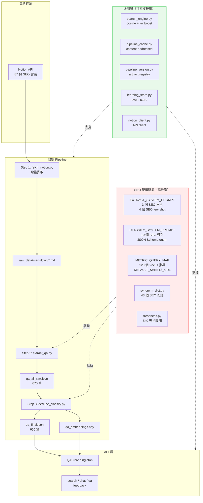
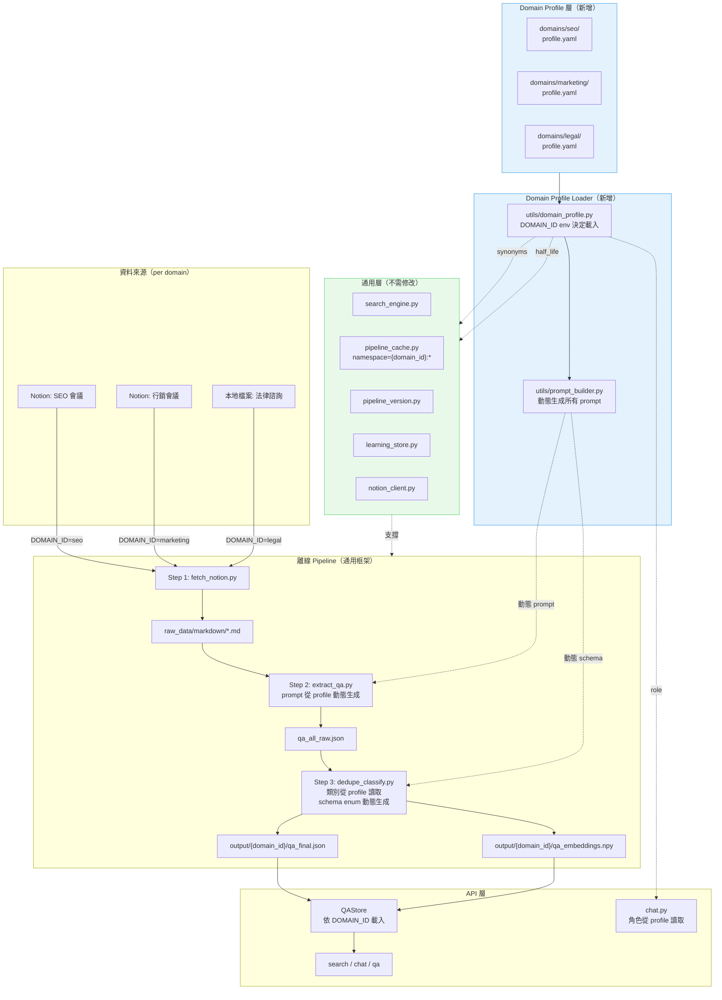
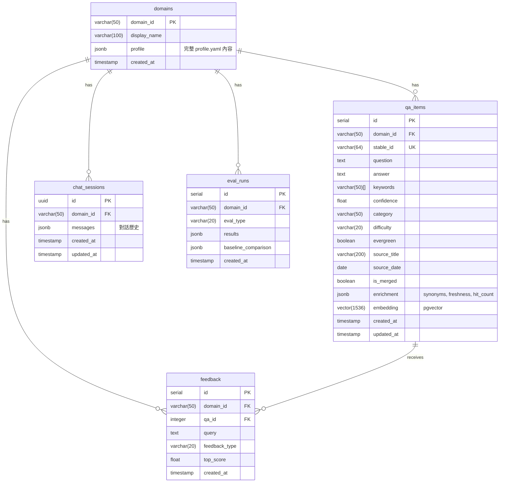

# Multi-Domain Analysis: SEO Pipeline 多領域擴增分析

> 狀態：計劃中（純架構分析，尚未開始實作）
> 建立日期：2026-03-02

---

## 一、耦合程度總覽

| 耦合度 | 環節 | 檔案 |
|--------|------|------|
| **極高** | LLM 萃取 Prompt | `utils/openai_helper.py` EXTRACT_SYSTEM_PROMPT |
| **極高** | 分類 Prompt + Schema | `utils/openai_helper.py` CLASSIFY_SYSTEM_PROMPT + `classify_qa()` enum |
| **極高** | 指標系統 | `utils/metrics_parser.py` METRIC_QUERY_MAP (~120個)、CORE_METRICS、DEFAULT_SHEETS_URL |
| **極高** | 週報 Prompt | `scripts/04_generate_report.py` REPORT_SYSTEM_PROMPT |
| **極高** | Claude Code 命令 | `.claude/commands/extract-qa.md`、`dedupe-classify.md`、`generate-report.md` |
| **高** | 合併 Prompt | `utils/openai_helper.py` MERGE_SYSTEM_PROMPT |
| **高** | 評估 Prompt | `scripts/05_evaluate.py` JUDGE/CLASSIFY_EVAL_PROMPT |
| **中** | 同義詞詞典 | `utils/synonym_dict.py` _SUPPLEMENTAL_SYNONYMS (43組 SEO 術語) |
| **中** | 時效性半衰期 | `utils/freshness.py` 540天 (Google 演算法更新週期) |
| **中** | Chat 角色 | `app/core/chat.py` _SYSTEM_PROMPT ("資深 SEO 顧問") |
| **低** | Version Registry | `utils/pipeline_version.py` 僅 STEP_NAMES 耦合 |
| **無** | 搜尋引擎演算法 | `utils/search_engine.py` cosine + keyword boost + freshness |
| **無** | Pipeline Cache | `utils/pipeline_cache.py` content-addressed |
| **無** | Learning Store | `utils/learning_store.py` 完全通用 |
| **無** | Notion Client | `utils/notion_client.py` 通用 API |
| **無** | API 安全/限流 | `app/core/security.py`、`limiter.py`、`schemas.py` |

---

## 二、6 大需重新設計的環節（按優先級）

### P1. LLM Prompt 層（極高，核心阻塞項）

**問題**：三個核心 prompt 全部硬編碼 SEO 內容

| Prompt | 位置 | SEO 耦合點 |
|--------|------|-----------|
| `EXTRACT_SYSTEM_PROMPT` | `openai_helper.py` L28 | 三個 SEO 角色、4 個 SEO few-shot、keywords 限定「SEO 術語」、工具路徑範例 (GSC) |
| `CLASSIFY_SYSTEM_PROMPT` | `openai_helper.py` | 10 個硬編碼類別 + 16 個 SEO few-shot + `classify_qa()` 的 JSON Schema enum |
| `MERGE_SYSTEM_PROMPT` | `openai_helper.py` | SEO 專業知識合併規則 |

**改造方向**：抽取為 `utils/prompt_builder.py`，從 Domain Profile 動態生成 prompt。關鍵細節：`classify_qa()` 的 OpenAI Structured Output `enum` 陣列也必須動態生成（不只是 prompt 文字）。

### P2. 分類體系（極高）

**問題**：10 個 SEO 類別硬編碼在 3 個地方

1. `utils/openai_helper.py` — JSON Schema enum
2. `scripts/05_evaluate.py` CLASSIFY_EVAL_PROMPT — 評估 judge
3. `.claude/commands/dedupe-classify.md` Step D — Claude Code 路徑

其中 `平台策略` 更進一步耦合到 Vocus 客戶（「Vocus 產品面 SEO」）。

**改造方向**：類別定義移入 Domain Profile YAML，所有讀取點統一從 profile 取值。

### P3. 指標系統（極高，Vocus 客戶特定）

**問題**：`utils/metrics_parser.py` 包含

- `METRIC_QUERY_MAP`：~120 個 Vocus 平台指標名稱 + 對應查詢語句
- `CORE_METRICS`：12 個核心 GSC/GA 指標
- `DEFAULT_SHEETS_URL`：硬編碼 Vocus Google Sheets URL
- URL 路徑（`/article/`、`/salon/`）是 Vocus 平台專屬

**改造方向**：指標映射移入 Domain Profile `metrics` 區塊。`metrics_parser.py` 保留純解析函式（`fetch_from_sheets()`、`parse_metrics_tsv()`），移除所有常數。非指標類領域設定 `metrics.enabled: false`。

### P4. 同義詞 + 時效性（中）

**同義詞**：`_SUPPLEMENTAL_SYNONYMS` 43 個 SEO 術語集群（AMP、canonical、CTR...），對其他領域完全無效。另外 `_build_metric_query_synonyms()` 依賴 `METRIC_QUERY_MAP` import，刪除指標時會連帶 break。

**時效性**：540 天半衰期基於「Google 演算法年更」假設。不同領域需不同數值：
- SEO：540 天（18 月）
- 醫療：180 天（6 月，指南更新快）
- 法律：730 天（2 年，法條修訂慢）

**改造方向**：兩者都移入 Domain Profile `search` 區塊（`synonyms` + `freshness_half_life_days`）。

### P5. 報告 + 評估 Prompt（高）

**週報**：`REPORT_SYSTEM_PROMPT` 角色是「資深 SEO 分析師」，報告格式固定為 SEO 週報結構（核心訊號 / 異常指標 / 行動清單 / 知識庫引用）。5 個 supplemental queries 也全是 SEO 情境。

**評估**：`JUDGE_SYSTEM_PROMPT` 自稱「專精 SEO 領域」，Completeness 維度引用 SEO 工具路徑慣例。

**改造方向**：角色、報告模板、評估維度描述移入 Domain Profile `report` 和 `evaluation` 區塊。

### P6. Claude Code 命令（高，但可後期處理）

三個命令檔案包含大量 SEO 特定內容：

| 命令 | SEO 耦合 |
|------|----------|
| `extract-qa.md` | 三個 SEO 角色、keywords「必須是 SEO 領域術語」、GSC 工具路徑範例 |
| `dedupe-classify.md` | 10 個 SEO 類別定義 |
| `generate-report.md` | SEO 週報模板 |

**改造方向**：命令改為動態讀取 -- 先執行 `qa_tools.py get-domain-config` 取得當前領域設定，再注入 prompt。

---

## 三、可直接複用的通用元件

以下模組**不需要修改**即可服務任何領域：

| 模組 | 為何通用 |
|------|----------|
| `utils/search_engine.py` | 純演算法：cosine + keyword boost + freshness，不含任何 SEO 假設 |
| `utils/pipeline_cache.py` | Content-addressed disk cache，domain-agnostic |
| `utils/pipeline_version.py` | Artifact registry（僅 `STEP_NAMES` dict 需小改） |
| `utils/learning_store.py` | Append-only JSONL event store，完全通用 |
| `utils/notion_client.py` | 通用 Notion API client |
| `utils/block_to_markdown.py` | 通用 Notion block -> Markdown 轉換 |
| `utils/audit_logger.py` | 通用結構化日誌 |
| `app/core/schemas.py` | 通用 `ApiResponse[T]` envelope |
| `app/core/security.py` | 通用 API key 認證 |
| `app/core/limiter.py` | 通用 slowapi 限流 |
| `scripts/enrich_qa.py` | Pipeline 邏輯通用（但依賴的 synonym/freshness util 有 SEO 耦合） |

---

## 四、建議的 Domain Profile 架構

```
domains/
  seo/
    profile.yaml       # SEO domain（從現有硬編碼提取）
  marketing/
    profile.yaml       # 行銷 domain（範例）
```

### Profile 結構（關鍵區塊）

```yaml
domain_id: seo
display_name: SEO 顧問知識庫

extraction:
  document_type: 顧問會議紀錄
  roles: [...]                    # 萃取角色定義
  keyword_guidance: "..."         # keywords 規範
  examples: [...]                 # few-shot 範例

classification:
  categories:                     # 取代硬編碼的 10 個類別
    - id: index_crawl
      label: 索引與檢索
      description: "..."
      few_shot: [...]
  difficulty_labels: [基礎, 進階]

search:
  freshness_half_life_days: 540   # 取代 freshness.py 常數
  staleness_threshold_months: 18  # 取代 chat.py 常數
  synonyms:                       # 取代 synonym_dict.py 常數
    AMP: [Accelerated Mobile Pages, 加速行動網頁]
    canonical: [正規化, canonical URL]

metrics:
  enabled: true                   # 法律領域可設 false
  core_metrics: [曝光, 點擊, CTR]
  metric_query_map: {...}         # 取代 metrics_parser.py 常數

report:
  analyst_role: 資深 SEO 分析師
  template: "..."                 # 報告 Markdown 結構

evaluation:
  judge_role: 資深 SEO 顧問
  dimensions: [...]               # 評估維度描述

chat:
  system_prompt_role: 資深 SEO 顧問
  knowledge_base_label: SEO 知識庫
```

---

## 五、分 Phase 實施路線

### Phase 1：抽取（向下相容）
- 新增 `utils/domain_profile.py`（DomainProfile dataclass + loader）
- 新增 `domains/seo/profile.yaml`（從硬編碼提取）
- 新增 `utils/prompt_builder.py`（動態 prompt 生成）
- 修改 `openai_helper.py`：函式改用 profile，但保留舊常數相容
- **成功指標**：206 tests 全過，行為不變

### Phase 2：切換機制
- `config.py` 加入 `DOMAIN_ID`，`OUTPUT_DIR` 改為 `output/{domain_id}/`
- `synonym_dict.py`、`freshness.py`、`chat.py` 改為從 profile 讀取
- `metrics_parser.py` 移除硬編碼常數
- 遷移現有 `output/` -> `output/seo/`
- **成功指標**：`DOMAIN_ID=marketing` 能跑通 extract-qa --limit 3

### Phase 3：完整功能
- 報告 + 評估 prompt 動態化
- API 路由支援 domain 切換
- Claude Code 命令動態化
- **成功指標**：兩個 domain 完整隔離運作

---

## 六、關鍵風險

| 風險 | 等級 | 說明 | 對策 |
|------|------|------|------|
| Structured Output enum | 高 | `classify_qa()` 的 JSON Schema enum 必須動態生成，不只改 prompt | `build_classify_schema(profile)` 動態生成完整 schema |
| Cache 污染 | 中 | 同內容不同 domain 的 cache key 相同 | cache namespace 加入 `{domain_id}:` prefix |
| Output 路徑衝突 | 高 | 兩個 domain 共用 `output/` 會覆蓋 | `output/{domain_id}/` 隔離 + 遷移腳本 |
| synonym_dict import 鏈 | 中 | `_build_metric_query_synonyms()` import `METRIC_QUERY_MAP`，刪除時 break | Phase 1 先解耦此依賴 |
| 測試 SEO 斷言 | 中 | 部分測試硬編碼 SEO 類別字串 | 改為參數化或加 `@pytest.mark.domain("seo")` |
| Few-shot 品質 | 中 | 新領域缺乏高品質 few-shot 會導致分類差 | 每個類別至少 1-2 個 few-shot |

---

## 七、架構對比圖

### 現狀：SEO 單一領域架構



### 目標：多領域架構



---

## 八、對目前使用方式的影響

### 不會改變的事

| 使用方式 | 影響 | 說明 |
|----------|------|------|
| `make pipeline` | 無 | SEO 是預設 domain，行為完全一致 |
| `make test` | 無 | 206 個測試全部保持通過 |
| `/search <問題>` | 無 | 搜尋演算法不變，結果相同 |
| `/chat` | 無 | RAG 問答邏輯不變 |
| `make evaluate-qa` | 無 | 評估流程不變 |
| API endpoints | 無 | 預設載入 SEO 知識庫，路徑和格式不變 |
| `output/qa_final.json` 格式 | 無 | Q&A schema 不變 |
| `.env` 設定 | 無 | 現有 env vars 全部保留 |

### 會改變的事（Phase 2 之後）

| 使用方式 | 變化 | 之前 | 之後 |
|----------|------|------|------|
| **Output 路徑** | 加入 domain 前綴 | `output/qa_final.json` | `output/seo/qa_final.json` |
| **切換領域** | 新增 env var | 不存在 | `DOMAIN_ID=marketing make pipeline` |
| **新增領域** | 建立 YAML 即可 | 需改 Python 程式碼 | 只需建立 `domains/{name}/profile.yaml` |
| **分類類別** | 來源改變 | 寫死在 Python | 從 `profile.yaml` 讀取 |
| **Claude Code 命令** | 多一步 | `/extract-qa` 直接用 | 需先設 `DOMAIN_ID` 或用 `/extract-qa --domain marketing` |

### 新增一個領域需要做什麼

只需 **3 步**（不需要修改任何 Python 程式碼）：

1. **建立 Notion 資料來源** -- 在 Notion 新建一個 parent page
2. **建立 Domain Profile** -- 複製 `domains/seo/profile.yaml`，修改類別、同義詞、角色、few-shot、半衰期
3. **設 `.env`** -- 加入該 domain 的 `NOTION_PARENT_PAGE_ID`

```bash
# 然後直接跑
DOMAIN_ID=marketing make pipeline
```

### 遷移影響（一次性）

Phase 2 上線時需要做一次資料遷移（會有自動化腳本）：

```bash
mv output/qa_final.json output/seo/qa_final.json
mv output/qa_enriched.json output/seo/qa_enriched.json
mv output/qa_embeddings.npy output/seo/qa_embeddings.npy
mv output/qa_per_meeting/ output/seo/qa_per_meeting/
```

---

## 九、API 層多領域設計

### 現狀 API 結構

```
POST /api/v1/search     -- 語意 + 關鍵字搜尋（60/min）
POST /api/v1/chat       -- RAG 問答（20/min）
GET  /api/v1/qa         -- Q&A 列表篩選（60/min）
GET  /api/v1/qa/{id}    -- 單筆查詢
GET  /api/v1/qa/categories -- 分類列表
POST /api/v1/feedback   -- 使用者回饋
GET  /health            -- 健康檢查
```

### SEO 耦合點（API 層）

| 位置 | 耦合 | 詳細 |
|------|------|------|
| `app/main.py` | 低 | `title="SEO Insight API"` 等文字 |
| `app/core/chat.py` _SYSTEM_PROMPT | 高 | 「資深 SEO 顧問」+「SEO 知識庫」 |
| `app/core/chat.py` _STALENESS_THRESHOLD | 中 | `18`（SEO 假設） |
| `app/routers/qa.py` difficulty | 中 | `^(基礎\|進階)$` 硬編碼 |
| `app/config.py` | 高 | 路徑硬編碼到 `output/` 目錄（無 domain 區隔） |

### 方案 A：單實例單領域（推薦 Phase 2）

最小改動：一個 FastAPI 實例只服務一個 domain。

```bash
DOMAIN_ID=seo     uvicorn app.main:app --port 8001
DOMAIN_ID=legal   uvicorn app.main:app --port 8002
```

### 方案 B：單實例多領域（Phase 3 或 DB 引入後）

API 路徑加入 domain 維度：

```
POST /api/v1/{domain_id}/search
POST /api/v1/{domain_id}/chat
GET  /api/v1/{domain_id}/qa
POST /api/v1/{domain_id}/feedback
GET  /health
```

**向下相容策略**：保留 `/api/v1/search` 等舊路徑作為 SEO alias，設定過渡期後移除。

---

## 十、引入 DB 後的架構影響

### 資料模型：從 JSON 到 PostgreSQL



### 關鍵設計決策

1. **`domain_id` 作為所有表的分區鍵** -- 資料完全隔離，查詢自動限定範圍
2. **embedding 從 `.npy` 遷移到 pgvector** -- 支援 HNSW 索引，SQL 查詢能力
3. **混合架構（推薦過渡期）** -- Pipeline 仍輸出 JSON，新增 DB sync 步驟；API 層獨立從 JSON 切到 DB

### DB 對 API 的具體影響

| API | 現在（JSON） | DB 後 | 影響程度 |
|-----|-------------|-------|---------|
| `POST /search` | 記憶體 cosine | pgvector `<=>` | 高 |
| `POST /chat` | 記憶體 hybrid + OpenAI | DB hybrid + OpenAI | 高 |
| `GET /qa` | 記憶體 filter | SQL WHERE | 中 |
| `GET /qa/{id}` | dict lookup | SQL SELECT | 低 |
| `POST /feedback` | JSONL append | INSERT | 低 |
| `GET /health` | len(items) | COUNT(*) | 低 |

### 不推薦的做法

| 做法 | 原因 |
|------|------|
| 每個 domain 一個 DB schema | 增加 DDL 管理複雜度 |
| 每個 domain 一個 DB 實例 | 成本過高，資料量不需要 |
| 先做 DB 再做多領域 | DB 遷移和多領域是獨立的，可以先在 JSON 模式完成多領域抽象 |
| embedding 存 JSON 而非 pgvector | 失去 SQL 查詢能力和 HNSW 索引加速 |
