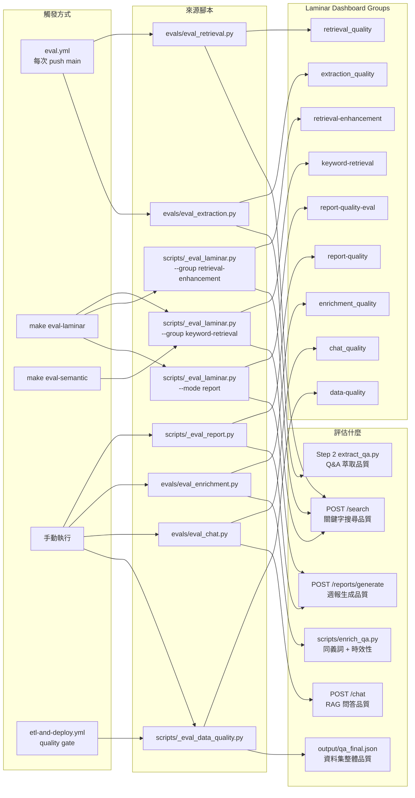

# 評估系統

> 屬於 [research/](./README.md)。涵蓋 LLM-as-Judge、Reasoning Model、評估維度、Judge 設計原則。

---

## 10. LLM-as-Judge：用 AI 評估 AI

### 概念

傳統方法：人工看 30 筆 Q&A 打分數（慢、貴、主觀）。
LLM-as-Judge：讓另一個 AI 當評審，自動評分（快、便宜、可重複）。

```
[待評估的 Q&A]
Q: Discover 流量下降的原因？
A: 可能是內容品質或 AMP 問題，建議觀察 GSC...

   ↓ 送給 gpt-5.2（評審）

[評分結果]
{
  "relevance": {"score": 5, "reason": "精準捕捉核心 SEO 知識"},
  "completeness": {"score": 3, "reason": "缺少具體行動建議"},
  "accuracy": {"score": 4, "reason": "論述合理"},
  "granularity": {"score": 5, "reason": "問題聚焦單一主題"}
}
```

### 本專案四個評估維度

| 維度         | 問的問題                        | v1.0 分數 | v2.12 分數（2026-03-05） |
| ------------ | ------------------------------- | --------- | ------------------------ |
| Relevance    | 是否有價值的 SEO 知識（非閒聊） | 4.80      | **5.00** ✅              |
| Accuracy     | 內容是否合理無虛構              | 3.95      | **4.30** ✅              |
| Completeness | 是否包含建議 + 原因 + 案例      | 3.85      | **3.95** ✅              |
| Granularity  | 一個 Q 只問一個主題             | 4.75      | **4.75** ✅              |

### 注意：Judge 本身也可能出錯

今天（2026-02-27）修的兩個 bug 就是 Judge 失效：

- BUG-001：分類 Judge 大量回傳空結果 → 正確率假的 10%，真實 75%
- BUG-002：Retrieval Judge token 不夠 → Precision 假的 10%，真實 100%

**原則**：看到評估結果異常（< 20% 或 > 98%），先懷疑是評估系統本身的問題。

---

## 11. Reasoning Model：會先思考的 AI

### 兩種模型的差異

```
標準模型（如 gpt-3.5, gpt-4）：
  輸入 → 直接輸出

推理模型（如 o1, o3-mini, gpt-5-mini, gpt-5.2）：
  輸入 → [內部思考過程] → 輸出
```

推理模型在回答前會先做「chain of thought」（思維鏈），
能處理更複雜的推理問題，但使用上有兩個陷阱。

### 陷阱一：`max_completion_tokens` 要給更多

```python
# max_completion_tokens 由「思考 + 輸出」共用

# 標準模型：
# 256 tokens 全給輸出 → 夠了

# 推理模型：
# 256 tokens：200 tokens 用於思考，只剩 56 給輸出
# → finish_reason: "length"（被截斷）
# → content = ""（空字串）

# 本專案 BUG-002 的根因，修復：
max_completion_tokens=256   # ❌
max_completion_tokens=1024  # ✅
```

### 陷阱二：content 可能回傳空字串

```python
# 標準模型：content 永遠有值
# 推理模型：token 超限時，content = ""

# 錯誤寫法（本專案修復前）：
content = response.choices[0].message.content or "{}"
# "" or "{}"  →  "{}"  →  json.loads("{}")  →  {}  →  靜默失敗

# 正確寫法（修復後）：
content = response.choices[0].message.content
if not content:
    print("⚠️ 推理模型回傳空內容，可能 token 不足")
    return fallback

# 或者，append 前先驗證必要欄位存在：
if "category_judgment" not in result:
    continue   # 不計入統計
```

### 診斷方法

```python
# 確認是否被截斷
print(response.choices[0].finish_reason)
# "stop"   → 正常完成
# "length" → token 超限，輸出不完整
```

---

---

## 14. 評估維度詳解與基準線

### 四個評估維度說明

| 維度             | 問的核心問題                       | 評分標準（1-5）                                |
| ---------------- | ---------------------------------- | ---------------------------------------------- |
| **Relevance**    | 這是真正有價值的 SEO 知識嗎？      | 1=完全無關閒聊；5=高濃度可複用知識             |
| **Accuracy**     | A 是否忠實反映原始會議內容？       | 1=明顯錯誤或虛構；5=完全符合來源               |
| **Completeness** | A 是否有足夠深度讓讀者理解並行動？ | 1=只有結論無原因；5=What+Why+How+Evidence 齊全 |
| **Granularity**  | Q 的聚焦程度是否恰當？             | 1=問題過於廣泛；5=聚焦單一具體主題             |

### 評估分數要求的完整行動建議

| 維度         | 目標分數 | 最新數值（v2.12） | 狀態     | 提升方法                              |
| ------------ | -------- | ----------------- | -------- | ------------------------------------- |
| Relevance    | ≥ 4.5    | **5.00**          | ✅       | 無需調整                              |
| Accuracy     | ≥ 4.0    | **4.30**          | ✅       | v2.0 防幻覺規則已達標                 |
| Completeness | ≥ 4.0    | **3.95**          | 接近目標 | `[補充]` Tag 機制已實作（見第 13 節） |
| Granularity  | ≥ 4.5    | **4.75**          | ✅       | 無需調整                              |

### 額外評估指標說明

- **Confidence 校準**：Q&A 的 `confidence` 值應與實際品質相關（高 confidence → 高 Accuracy）
- **Self-contained**：Q 不依賴原始會議就能理解（目前 Granularity 4.65 說明已做好）
- **Actionable**：A 提供具體可執行建議（Completeness 的核心要求）
- **Faithfulness**：A 的內容來自原始文件，不是 AI 自行補充（Accuracy 的核心要求）

### Retrieval Data Dimensions 評估口徑（2026-03-15）

Retrieval eval 現在分成「過渡 gate」與「穩定 gate」兩層，避免 schema / rerank 剛升級時直接拿舊 precision baseline 做硬比較。

新增正式指標：

| 指標                         | 用途                                                      |
| ---------------------------- | --------------------------------------------------------- |
| `dual_category_recall_at_k`  | dual-label case 是否同時覆蓋多個 category                 |
| `multi_label_f1_at_k`        | multi-label precision / recall 的調和平均                 |
| `boosterless_precision_at_k` | 排除 booster 後，canonical / supporting corpus 的真實純度 |
| `ndcg_at_k`                  | 考慮 ranking 位置的相關度品質                             |
| `canonical_top1_rate`        | top-1 是否由 canonical corpus 提供                        |
| `duplicate_rate_at_k`        | top-k 是否被近重複答案汙染                                |
| `intent_coverage_at_k`       | top-k 是否覆蓋 query 需要的 intent                        |

目前過渡 gate 寫在 `eval/eval_thresholds.json`：

- `precision_at_k >= 0.65`
- `dual_category_recall_at_k >= 0.75`
- `multi_label_f1_at_k >= 0.68`
- `boosterless_precision_at_k >= 0.60`
- `ndcg_at_k >= 0.75`

穩定 gate（`retrieval_stable`）則要求：

- `precision_at_k >= 0.72`
- `dual_category_recall_at_k >= 0.82`
- `multi_label_f1_at_k >= 0.75`
- `boosterless_precision_at_k >= 0.65`
- `ndcg_at_k >= 0.80`

這套口徑的重點是把 improvement 拆開看：是 corpus coverage 改善、是 ranking / rerank 改善，還是 booster 只把分數硬拉高。因此 `slice_metrics` 與 `failure_buckets` 也成為正式輸出，而不是 debug-only artifact。

### Two-tier gate 的使用時機

- `retrieval`：過渡 gate。當 schema、rerank、retrieval surface 剛升級時先用這層追蹤方向，避免一開始就被舊 baseline 卡住。
- `retrieval_stable`：穩定 gate。當連續數輪 eval 都穩定通過過渡 gate，且沒有出現 MRR / NDCG 回退或 booster inflation，才把它當成 production bar。

實務上，若只過 `retrieval` 但沒過 `retrieval_stable`，表示系統方向正確，但還不能視為 fully stabilized；此時應繼續觀察 slice metrics，而不是立即宣稱 migration 完成。

### 成熟度評估維度（v3.3–v3.4）

v3.3 起，成熟度模型（L1-L4）成為評估體系的新橫切維度：

| 評估器                           | 類型         | Laminar Group            | 說明                                         |
| -------------------------------- | ------------ | ------------------------ | -------------------------------------------- |
| `s8_meta_maturity_consistency`   | rule-based   | `meeting_prep_structure` | meta JSON 與 S8 表格的 L1-L4 一致性          |
| `s10_maturity_upgrade_labeled`   | rule-based   | `meeting_prep_structure` | S10 checklist 是否含 `[策略 L1→L2]` 升級標籤 |
| `report_action_maturity_labeled` | rule-based   | `report_quality`         | 報告 S5 是否含成熟度參考區塊                 |
| `s8_maturity_justified`          | LLM-as-Judge | `meeting_prep_quality`   | 成熟度評分是否有根據（非隨意標注）           |

**成熟度與四層評估框架的關係**：

- **L1 Data Quality**：`maturity_relevance` 欄位完整度（backfill coverage）
- **L2 Retrieval**：`applyMaturityBoost()` 不退化現有 golden retrieval（35 cases）
- **L3 Enhancement**：Chat system prompt 注入成熟度脈絡，回答深度適配
- **L4 Context**：Session 跨輪次成熟度持久化，一致性體驗

### L4 分類規則收緊（v3.8, 2026-05-07, PR #42）

成熟度分類器發生過 **trendy keyword 灌水偏差**——`L4_KEYWORDS` 包含 `ai overview` / `geo` / `aeo` / `ai-driven` 等趨勢主題詞，外部文章一觸發就 +2 達 L4 threshold，導致 Supabase L4 從 03 月 189 漂移到 05 月 618（13.7%，業界典型 5–10%）。

**根因**：`scripts/03_dedupe_classify.py:_infer_maturity_relevance()` 完全沒呼叫 LLM，純走 keyword scoring；trend 詞與 implementation 詞混雜在同一 frozenset 用同一權重。

**三層架構修正（`utils/maturity_classifier.py` + `utils/maturity_llm_judge.py`）**：

1. **Topic vs Maturity 分離（rule layer）**：
   - `L4_KEYWORDS`（+2）只留 implementation 詞：`predictive` / `programmatic seo` / `recommendation engine` / `regression testing` / `cross-channel` / `attribution model` 等
   - 新增 `TREND_TOPIC_TERMS`（+1）：`ai overview` / `aio` / `ai search` / `geo` / `aeo` / `llm seo` / `ai-driven` / `品牌可見度` 等趨勢主題詞
   - `L4_STRATEGY_TERMS` 移除 `品牌可見度` / `brand visibility`（這是 topic 不是 strategy）

2. **雙重證據規則（rule layer）**：
   ```python
   if scores["L4"] >= _L4_DUAL_EVIDENCE_TRIGGER:  # 預設 2
       has_long_answer = len(answer) > 500
       if not (has_advanced or has_l4_strategy_signal or has_long_answer):
           scores["L4"] = 0  # 純 keyword 無實作佐證 → 重置
   ```
   `has_advanced` 由 `ADVANCED_PATTERNS`（regex: 分析/分群/模型/框架/架構/演算法/pipeline/integrate/api）判定。`_L4_DUAL_EVIDENCE_TRIGGER` 定義於 `utils/maturity_classifier.py`（魔法數字常數化以便將來調整）。

3. **LLM Reality Check Gate（`utils/maturity_llm_judge.py`）**：
   - `llm_validate_l4(question, answer, keywords) -> bool` 用 `gpt-5.4-nano` 對 rule-promoted L4 做二次審查
   - System prompt 明確區隔「topic vs maturity」：純談趨勢、純列舉名詞、純解釋概念（即使是 AI Overview / GEO / 程式化 SEO）不算 L4；L4 必須具備「實作具體性」+「領先級判斷」
   - 走 `pipeline_cache` namespace `l4_judge`（與 classify/merge/embedding 區隔）
   - **Fail-safe**：無 `OPENAI_API_KEY` / 網路失敗 / JSON parse 失敗都 return True 不降級（鎖定 PR #38 OpenAI-less 流程）

**重訓 CLI（既有資料一次套用新規則）**：

```bash
python scripts/03_dedupe_classify.py --reclassify-l4-only --execute
python scripts/push_qa_metadata_to_supabase.py --execute
```

`--reclassify-l4-only` 內含 None→L3 conservative fallback，避免 push 腳本 line 120 `if lv and lv != rv` 跳過 None 值留 stale L4。

**實測效果（2026-05-07）**：

| 維度 | 前 | 後 | 變化 |
|------|----|----|------|
| 本地 qa_final.json L4 | 13.4% (457/3,422) | **7.5%** (256/3,422) | -201 ✅ |
| Supabase qa_items L4 | 13.7% (618/4,507) | **9.3%** (417/4,507) | -201 ✅ |
| 抽樣 20 筆 L4 | — | 13 明確合理 + 7 邊緣 + 0 不合理 | DOD 達標 |

**測試**：`tests/test_maturity_classifier.py` 5 TP + 5 FP fixture（programmatic SEO 系統 / 預測模型 / 跨通路歸因 / 推薦引擎 / 自動化測試 vs AI Overview 概念解釋 / GEO 名詞列舉 / ai-driven 概念 / 品牌可見度短篇 / AEO 入門）。`tests/test_maturity_llm_judge.py` 7 個（無 key fallback / cache 短路 / LLM true/false / 網路失敗 / malformed JSON）。`tests/test_infer_maturity_relevance.py` 6 個（既有 maturity 保留 / L2 不觸發 LLM / L4 + 各 key 狀態組合）。

### L4 External Sources 評估快照（2026-03-14）

這一輪不是單純「多加幾個 external-source case」，而是把 retrieval gate、golden dataset、成熟度欄位完整度一起重新校正。

#### 1. Golden retrieval dataset 從 35 擴到 40 cases

新增的 5 個 case 都是 L4 external-source 情境，主題集中在 AI Search / AI Overviews：

- AI Overview 品牌可見度因子
- AI Overviews 觸發因素與安全區查詢
- AI Overviews 對點擊率衝擊
- AI 搜尋流量轉換率與策略調整
- 國際頁面在 AI Search 的流量落差

這個擴充的意義不是單純加量，而是把原本偏向傳統 SEO / GSC 診斷的 eval，補上較新、較策略層、較接近 L4 的 query distribution。

#### 2. Formal retrieval eval 在 40 cases 下仍維持綠燈

新增 case 後曾出現單點風險：`MRR 0.8914 < 0.9`。後續在 `scripts/add_retrieval_boosters.py` 增加 impression/click gap 的 targeted booster 後，formal retrieval eval 再次通過。

這裡的評估解讀要分兩層：

- 若只看 pass/fail，結論是 40-case gate 仍為綠燈
- 若看 failure mode，則可知新 L4 query 對 ranking 前位次更敏感，特別容易在 CTR / SERP-diagnosis 類查詢拉低 MRR

因此這次 pass 的價值，不是分數更漂亮，而是證明 external-source 擴充後，系統仍能守住 ranking quality。

#### 3. L4 達標的根因其實是 maturity metadata 回填

最初假設是 external-source coverage 不足導致 L4 比例過低；實際檢查後發現，主要問題是大量 QA 沒有 `maturity_relevance`。

回填後的本地 `qa_enriched.json` 分布：

- `NULL 775`
- `L1 58`
- `L2 602`
- `L3 264`
- `L4 110`

所以目前正確的評估結論應該是：

- external sources 提供了 L4 語料增量
- 但真正讓 L4 ratio 達標的是 `scripts/enrich_qa.py` 對 `maturity_relevance` 的系統性 backfill
- 本地 artifact 現在已達 `110 / 1809 = 6.08%`

這也說明，未來追 L4 coverage 時不能只盯資料來源數量，必須把 `metadata completeness` 視為正式 data-quality gate。

#### 4. 評估時必須區分本地 artifact 與 production serving state

目前 eval 通過與 L4 達標，指的是本地 artifact 狀態，不是 production Supabase 完整對齊後的結果。

原因：

- production `qa_items` 仍缺少 retrieval metadata schema
- API 目前是靠 base-schema fallback 恢復搜尋
- migration `010_retrieval_metadata_columns.sql` 雖已準備，但尚未套用到遠端

因此在解讀任何 production 指標前，需先回答一個問題：

> 這個數字反映的是本地 curated artifact，還是 remote Supabase serving corpus？

如果兩者未明確區分，就會誤把「本地已達標」解讀成「線上 schema 已完成」。

#### 4.5 2026-03-15 phase 1-2 驗證快照

在 2026-03-15 這輪實作中，retrieval 與 queryability 的評估重點不再只是「能不能找到」，而是拆成兩個 gate：

1. phase 1：ranking quality 是否提升
2. phase 2：metadata queryability 是否上線且不回退 ranking

最終使用 file-mode API（`http://localhost:8003`）重跑 `evals/eval_retrieval.py` 的結果為：

| 指標                         | 結果     |
| ---------------------------- | -------- |
| `keyword_hit_rate`           | `0.9329` |
| `top1_category_match`        | `0.95`   |
| `top5_category_coverage`     | `0.82`   |
| `hit_rate`                   | `1.0`    |
| `mrr`                        | `0.975`  |
| `precision_at_k`             | `0.82`   |
| `recall_at_k`                | `0.8875` |
| `dual_category_recall_at_k`  | `0.8875` |
| `multi_label_f1_at_k`        | `0.8297` |
| `boosterless_precision_at_k` | `0.8175` |
| `ndcg_at_k`                  | `0.8921` |

這組數字的解讀方式如下：

- `top1_category_match`、`mrr`、`precision_at_k`、`ndcg_at_k` 明顯高於最初 baseline，代表 rerank 與 metadata enrich 確實讓前排結果更準
- `keyword_hit_rate` 沒有回到最早的單點高位，但仍穩定高於 eval gate，因此這輪決策是接受 tradeoff，優先保整體 ranking 品質
- phase 2 新增 route-layer metadata filters 後，再跑一次 retrieval eval，指標維持不變，表示 queryability 擴充沒有破壞 phase 1 的 serving quality

另外，API focused tests 也被納入 phase 2 gate：

- `api/tests/routes/search.test.ts`
- `api/tests/routes/qa.test.ts`

最終為 `40 passed`，用來驗證 metadata filters 與 response fields 已成正式 API contract，而不是只有離線 artifact 有值。

#### 5. Classifier refinement 把 L4 從「有 AI 關鍵字」收斂成「AI Search + 策略訊號」

2026-03-15 又做了一輪 rule-based classifier refinement，目標不是再把更多題目推進 L4，而是把前一天的 maturity backfill 從「大致達標」收斂成「可解釋、可防誤判」的規則。

這一輪的核心改動有三個：

- `utils/maturity_classifier.py` 擴充 AI Search / AIO / GEO / AEO / brand visibility / scenario planning / citation growth 等 L4 詞彙
- 新增 `AI_SEARCH_TERMS` 與 `L4_STRATEGY_TERMS` 的共現 bonus，只在 AI Search 訊號與高階策略訊號同時存在時提升 `L4`
- 補上 negative guard，避免把 `預期`、`預設` 誤當成 `預測` 類的 advanced signal

對應的 regression tests 也一起補上：

- AI Search 品牌可見度策略題應判成 `L4`
- AI SEO 預算 / scenario planning 題應判成 `L4`
- 「什麼是 AI Overview？」這類基礎說明題維持 `L1`
- 含 `預期` 的簡單波動觀察題不可被誤升成 `L4`

這裡的重要評估結論不是「L4 越多越好」，而是：

- AI Search 題目本身不足以代表領先期
- 只有當題目同時涉及 monitoring、competitive intelligence、scenario planning、authority building 等策略層訊號時，才應視為 `L4`
- 因此 classifier 的品質指標不能只看 coverage，還要看 false positive control

在這個 refinement 後，重新執行 `scripts/enrich_qa.py` 的本地分布變成：

- `NULL 748`
- `L1 55`
- `L2 595`
- `L3 256`
- `L4 155`

也就是本地 artifact 的 L4 ratio 從前一天紀錄的 `110 / 1809 = 6.08%`，進一步提升到 `155 / 1809 = 8.57%`。但這個數字的意義不是「規則更寬鬆」，而是 classifier 對 AI Search / GEO 類高階策略題的召回率提高，同時保留了對基礎 AI 解釋題的保守邊界。

因此目前比較合理的成熟度評估結論是：

- external sources 解決的是語料 coverage
- classifier refinement 解決的是 L4 recall 與 false-positive control
- phase 2 queryability 則讓這批成熟度 / retrieval metadata 可以被產品層直接使用，而不只存在離線評估報表

---

---

## 19. LLM-as-Judge 設計原則

### Judge Prompt 最佳實踐

**Chain-of-Thought（CoT）**：先給理由，再給分數：

```python
JUDGE_PROMPT = """
評估以下 Q&A 的 Completeness（完整性），1-5分。

請先給出你的分析，再給出分數：
<analysis>
[先分析 Answer 包含了哪些要素，缺少哪些要素]
</analysis>
<score>
{"completeness": {"score": X, "reason": "一句話原因"}}
</score>
"""
```

**為什麼 CoT 重要**：強制 LLM 先思考再評分，減少直覺偏差，分數更穩定。

### 常見 Judge 偏差與避免方法

| 偏差類型 | 現象                             | 避免方法                       |
| -------- | -------------------------------- | ------------------------------ |
| 冗長偏差 | 長答案自動得高分                 | 強調「精準簡潔也可以得 5 分」  |
| 位置偏差 | 第一個選項偏高                   | 固定評分順序，不做對比評估     |
| 自我偏好 | 用 GPT-5.2 評 GPT-5.2 生成的內容 | 可接受，但需注意過度膨脹的分數 |

### 本專案 Judge 模型維持 gpt-5.2

**理由**：

- 研究顯示 gpt-5.2 在評分一致性上表現良好
- 換成 Claude Opus 會增加跨平台複雜度
- 開源 Judge 模型（Prometheus-7B）需要自建推理環境

**改善方向**：不換模型，而是改善 Judge prompt（加入 CoT、反向偏差提示）。

---

## 20. Pipeline 全步驟 Eval 覆蓋（Per-step Golden Sets）

> 對應 `scripts/05_evaluate.py` 的 4 個新函式（v1.5 加入）。

### 設計原則

每個 pipeline 步驟都有**不同的評估指標**，必須分別設計 golden set：

| 步驟              | 函式                               | Golden Set                                                | 核心指標                                                    |
| ----------------- | ---------------------------------- | --------------------------------------------------------- | ----------------------------------------------------------- |
| Step 2 萃取       | `evaluate_extraction()`            | `eval/golden_extraction.json`（5 cases）                  | count_accuracy, keyword_coverage_rate, hallucination_rate   |
| Step 3 去重       | `evaluate_dedup()`                 | `eval/golden_dedup.json`（40 pairs：20 dup + 20 non-dup） | precision, recall, F1                                       |
| Step 3 閾值最佳化 | `evaluate_dedup_threshold_sweep()` | 同上 golden pairs                                         | optimal_threshold（F1-optimal sweep 0.80–0.95）             |
| Step 4 週報       | `evaluate_report_quality()`        | `eval/golden_report.json`（5 cases）                      | topic_coverage, kw_grounding, llm_actionability             |
| Step 5 Q&A 品質   | `evaluate_qa_quality()`            | `eval/golden_qa.json`（50 items，10 categories）          | Relevance/Accuracy/Completeness/Granularity（LLM-as-Judge） |

### Step 2 萃取評估：`evaluate_extraction()`

```python
result = evaluate_extraction(golden_cases, per_meeting_dir="output/qa_per_meeting")
# {
#   "count_accuracy": 0.80,         # 萃出數量與 golden 期望的 ± tolerance 內佔比
#   "avg_keyword_coverage_rate": 0.73,  # golden 關鍵字實際出現在萃出結果的比例
#   "avg_hallucination_rate": 0.05,     # 萃出內容無法對應到原始文字的估計比例
# }
```

- **count_accuracy**：`abs(actual_count - expected_count) <= tolerance`（default tolerance=2）
- **keyword_coverage_rate**：golden `expected_keywords` 中有多少出現在萃出結果的 Q+A+keywords 合集
- **hallucination_rate**：需 LLM-as-Judge 二次確認（未來擴充）

### Step 3 去重評估：`evaluate_dedup()` + threshold sweep

```python
# 單一閾值評估
result = evaluate_dedup(golden_pairs, threshold=0.88)
# {"precision": 0.90, "recall": 0.85, "f1": 0.875, "tp": 17, "fp": 2, "fn": 3, "tn": 18}

# F1-optimal sweep（16 步，0.80–0.95）
sweep = evaluate_dedup_threshold_sweep(golden_pairs)
# {
#   "optimal_threshold": 0.86,
#   "optimal_f1": 0.91,
#   "current_threshold": 0.88,  ← config.SIMILARITY_THRESHOLD
#   "current_f1": 0.875,
#   "recommendation": "降低至 0.86 可提升 F1 +0.035",
#   "sweep": [{"threshold": 0.80, "f1": 0.82}, ...]  # 16 entries
# }
```

**Threshold Sweep 原則**：

1. 先建立 labeled golden pairs（人工標記是否為重複）
2. 一次性計算所有 pairs 的 cosine similarity（避免 N×API 呼叫）
3. sweep 只改門檻值，不重複呼叫 API
4. F1-optimal 取 precision/recall 平衡點（不偏向任一側）

### Step 4 週報評估：`evaluate_report_quality()`

```python
result = evaluate_report_quality(golden_cases, reports_dir="output")
# {
#   "avg_topic_coverage": 0.78,        # required_topics 實際出現在報告的比例
#   "avg_kw_grounding": 0.83,          # source_qa_keywords 有多少出現在報告（接地氣）
#   "avg_llm_grounding": 4.2,          # LLM-as-Judge 評分（1-5），每週報用 2–3 個問題
#   "avg_llm_actionability": 3.9,      # 報告是否提供具體可行建議（1-5）
# }
```

### CLI 整合

```bash
# 個別執行
python scripts/run_pipeline.py --step evaluate-qa --eval-extraction
python scripts/run_pipeline.py --step evaluate-qa --eval-dedup
python scripts/run_pipeline.py --step evaluate-qa --dedup-threshold-sweep
python scripts/run_pipeline.py --step evaluate-qa --eval-report

# 完整評估（預設 LLM-as-Judge）
python scripts/run_pipeline.py --step evaluate-qa --sample 50 --with-source
```

### Golden Set 設計要點

- **萃取 golden**：每 case 包含 `meeting_id`、`expected_count`（±2）、`expected_keywords`、`notes`
- **去重 golden**：40 pairs；20 dup（high sim）+ 20 non-dup（模糊相似但語意不同）；手工標記 `is_duplicate: bool`
- **Q&A golden**：50 items；10 categories 各 ≥3 條；包含 `expected_category`、`expected_difficulty`、`expected_evergreen`
- **週報 golden**：5 scenarios；含 `required_topics[]`、`optional_topics[]`、`source_qa_keywords[]`、`min_grounding_score`

### 樣本數不足的統計風險

目前 extraction（5 筆）和 report（5 筆）golden set 樣本數偏小（建議 ≥20 筆達統計顯著性，參考「樣本數 n≥30 原則」）。

**影響**：

- 5 筆樣本只能檢測巨幅品質變化（±20%），無法發現細微回歸（±5%）
- 95% 信心區間寬度 ≈ ±35%，決策的確信度有限

**未來擴充建議**：每個場景增加至 ≥20 筆，共 100+ golden cases。

### Self-Consistency 採樣減少隨機性

**Wang et al.（2023, ICLR）** 提出的自洽推理方法：對同一問題採樣多次，取多數意見（majority vote），比單次採樣更穩定。

**本專案建議應用場景**：

- Accuracy 維度：目前單次評估，建議 3 次採樣後取中位數，減少 Judge 隨機波動
- 成本估算：700 筆 Q&A × 3 倍採樣 × `gpt-5-mini` $0.10/1M tokens ≈ 額外 $0.03

---

## 五大 AI Provider 比較評估

> 參考：`scripts/compare_providers.py`、`research/14-provider-comparison.md`、`eval/golden_seo_analysis.json`

### 實驗設計

**任務**：給定相同 SEO GSC 資料（impressions/clicks/CTR/position 表），五個 Provider 各自生成分析報告，Judge 模型（gpt-5.2）對每份報告的 grounding、actionability、relevance 三個維度進行 1–5 分打分。

**五個 Provider**：
| Provider | 描述 |
|---|---|
| `system_seoinsight` | 本專案 `04_generate_report.py` 生成的結構化報告 |
| `chatgpt` | ChatGPT 手動操作輸出 |
| `gemini_thinking` | Google Gemini 思考模式 |
| `claude` | Anthropic Claude 直接輸出 |
| `gemini_research` | Google Gemini Deep Research 模式 |

### 結果

| Provider          | Grounding | Actionability | Relevance | 平均     |
| ----------------- | --------- | ------------- | --------- | -------- |
| system_seoinsight | 5         | 5             | 5         | **5.00** |
| chatgpt           | 4         | 4             | 4         | **4.00** |
| gemini_thinking   | 4         | 4             | 4         | **4.00** |
| claude            | 3         | 3             | 3         | **3.00** |
| gemini_research   | 3         | 2             | 2         | **2.33** |

### 為何 system_seoinsight 5.0 滿分

1. **Grounding**：報告引用數字時加上 `(參考：...)` 格式，Judge 可以追溯每項論斷到原始資料
2. **Actionability**：每個洞察附帶具體行動建議，而非泛泛而論
3. **Relevance**：推論型結論加上 `(推論)` 標籤，讓 Judge 區分事實與推斷

### Golden Case 設計原則（來自本次實驗）

1. **提供結構化資料**：Judge 需要有數字可查核；純文字分析很難判斷 grounding
2. **輸出格式要有說明**：告訴 LLM Judge 要評估的是哪份檔案，避免格式混淆
3. **reason 欄位必填**：Judge prompt 要求 reason 非空，否則分數缺乏解釋
4. **多維度分離評分**：將 grounding / actionability / relevance 分開評估，比單一分更有診斷價值

### gpt-5-mini + `response_format` 導致空白輸出

**現象**：Judge 呼叫 `gpt-5-mini` 搭配 `json_schema` response_format，回傳 `content = ""`（空字串）。

**根因**：reasoning model（`gpt-5-mini-2025-08-07`）將大量 tokens 用於 `reasoning_tokens`，導致 `output_tokens` 耗盡，content 被截斷為空。

**修正**：

- 移除 `response_format` 參數，改用 prompt 指示輸出 JSON
- 設定 `max_completion_tokens >= 4096`（而非預設 1024）
- 加上重試邏輯（空白 → sleep 1s → retry）

詳見：`~/.claude/skills/learned/openai-reasoning-model-no-response-format.md`

---

---

## Laminar Eval 框架（2026-02-28 實作紀錄）

> 本節記錄將 SEO QA pipeline 接入 Laminar 的完整 eval 設計決策。

### 三層 Eval 架構

```
Layer 1: Tracing（@observe）
  → 每個 LLM 呼叫都建立 span，記錄 input/output/latency

Layer 2: Online Scoring（LaminarClient.evaluators.score()）
  → 在 @observe 函式內，LLM 回應後立即發送 rule-based scores
  → 不需要額外 LLM 呼叫（binary + continuous 指標）

Layer 3: Offline Evals（lmnr.evaluate()）
  → 批次評估，用 golden dataset 驗證能力品質
  → 可排程執行，結果顯示在 Laminar dashboard
```

### Online Evaluators 設計原則

**Rule-based（免費，無延遲）**：

- `answer_length`: `float(len(answer) > 50)` — 回答是否非空
- `has_sources`: `float(len(sources) > 0)` — 是否有知識庫引用
- `top_source_score`: cosine similarity 最佳命中 — 量化 retrieval 品質
- `source_count`: `min(count/5, 1.0)` — 引用數規範化

**LLM-as-Judge（有費用）**：

- 僅用於 offline eval 批次評估（不在每次 API 呼叫中執行）
- 用 `evaluate()` 的 `evaluators` 參數傳入 async judge 函式
- 適合：answer_relevance、faithfulness、coherence 等主觀維度

### Offline Eval 腳本結構（lmnr pattern）

```python
from lmnr import evaluate

data = [
    {"data": {"input": ...}, "target": {"expected": ...}},
]

def executor(data: dict) -> dict:
    return {"output": my_function(data["input"])}

def binary_evaluator(output: dict, target: dict) -> float:
    return 1.0 if condition else 0.0

def continuous_evaluator(output: dict, target: dict) -> float:
    return some_score_between_0_and_1(output, target)

evaluate(
    data=data,
    executor=executor,
    evaluators={"name_a": binary_evaluator, "name_b": continuous_evaluator},
    group_name="capability_name",   # 用於在 dashboard 追蹤趨勢
)
```

**規則**：

- 每個 eval 至少 2 個 evaluators（一個 binary，一個 continuous）
- `group_name` 統一命名格式：`{capability}_quality`
- 腳本放在 `evals/eval_{capability}.py`，可用 `lmnr eval` 批次執行

### Eval 覆蓋率表（本專案）

| Capability | Eval file                  | Evaluators                                                                        | Golden dataset                        |
| ---------- | -------------------------- | --------------------------------------------------------------------------------- | ------------------------------------- |
| Retrieval  | `evals/eval_retrieval.py`  | keyword_hit_rate, top1_category_match, top5_category_coverage                     | `eval/golden_retrieval.json` (307 筆) |
| Extraction | `evals/eval_extraction.py` | qa_count_in_range, keyword_coverage, no_admin_content, avg_confidence             | `eval/golden_extraction.json`         |
| Chat (E2E) | `evals/eval_chat.py`       | has_answer, has_sources, answer_keyword_coverage, top_source_in_expected_category | 前 10 retrieval scenarios             |

### lmnr 0.5.x SDK 已知 API 差異

官方文件使用 `Laminar.get_trace_id()`，但 lmnr 0.5.x 沒有此方法。

正確做法：

```python
span_ctx = Laminar.get_laminar_span_context()
trace_id = str(span_ctx.trace_id) if span_ctx else None   # UUID → str
span_id  = str(span_ctx.span_id)  if span_ctx else None
```

詳見 `~/.claude/skills/learned/laminar-0.5x-span-context-api.md`。

---

## eval_enrichment.py — Enrichment 品質評估（2026-03-02）

> 對應 `evals/eval_enrichment.py`，使用 `eval/golden_retrieval.json`（20 筆 cases），Laminar 離線評估。

### 三個 Evaluators

| Evaluator                   | 類型              | 計算方式                                    | 目標          |
| --------------------------- | ----------------- | ------------------------------------------- | ------------- |
| `kw_hit_rate_with_synonyms` | binary（0/1）     | 查詢展開後，top-5 是否命中 expected Q&A     | ≥ 85%         |
| `freshness_rank_quality`    | continuous（0-1） | 舊文件排名是否低於語意等效的新文件          | ≥ 0.9         |
| `synonym_coverage`          | binary（0/1）     | 每筆 Q&A 是否有 `_enrichment.synonyms` 非空 | 1.0（全覆蓋） |

### 實驗結果（make enrich 前後）

| 指標                      | Baseline（qa_final.json） | After enrichment | Delta       |
| ------------------------- | ------------------------- | ---------------- | ----------- |
| kw_hit_rate_with_synonyms | 70.4%                     | **79.67%**       | **+9.27pp** |
| freshness_rank_quality    | 1.0                       | 1.0              | 0           |
| synonym_coverage          | 0.0                       | **1.0**          | +100%       |

**解讀**：

- `kw_hit_rate_with_synonyms` +9.27pp 確認同義詞擴展有效（如 "AMP" -> "Accelerated Mobile Pages"）
- `freshness_rank_quality` 維持 1.0：freshness 乘法縮放未破壞相對排名
- `synonym_coverage` 0.0 -> 1.0：`make enrich` 產生 `qa_enriched.json` 後 655 筆全部有 `_enrichment`

### 目標差距與後續

- KW Hit Rate 79.67%，距 ≥85% 目標差 **5.33pp**
- 方向：擴充 `utils/synonym_dict.py` 的 `_SUPPLEMENTAL_SYNONYMS`，特別是 SEO 長尾術語
- 前置條件 E2-2（Query Understanding）需 KW Hit Rate ≥ 85% 才啟動

---

## CJK N-gram + Synonym Expansion（2026-03-02，Retrieval 優化）

> 修復 v2.0 KW Hit Rate 回歸（65% -> 74%），對應 `utils/synonym_dict.py` + `scripts/qa_tools.py`。

### 根因分析

v2.0 知識庫（655 筆）KW Hit Rate 從 v1.0 的 78% 降至 65%（-13pp），四個結構性問題：

| #   | 根因                                                   | 影響                 | 修復方式                           |
| --- | ------------------------------------------------------ | -------------------- | ---------------------------------- |
| 1   | **中文分詞失效** — `str.split()` 不切中文複合詞        | 3 case 完全失敗      | CJK n-gram 展開                    |
| 2   | **通用詞污染** — "SEO"/"流量" 主導排名                 | 不相關結果搶佔 top-1 | 只展開 query 端，不展開 keyword 端 |
| 3   | **CLI 路徑繞過 enriched data** — eval 讀 qa_final.json | synonym_bonus 白費   | --use-enriched flag                |
| 4   | **同義詞缺失** — TTFB/WAF/工作階段/Coverage            | 特定 case 0 命中     | +8 synonym entries                 |

### 解法：`expand_query_tokens()` 三層展開

```python
# utils/synonym_dict.py

def expand_query_tokens(query: str) -> set[str]:
    """
    Layer 1: whitespace split + CJK n-gram
      "內部連結架構優化" -> {內部, 連結, 架構, 優化, 內部連結, ...}
    Layer 2: Forward synonym
      CTR -> {點擊率, click-through rate, ...}
    Layer 3: Inverted synonym
      點擊率 -> {ctr}（反向查找）
    """
```

**關鍵設計決策**：只用 `_SUPPLEMENTAL_SYNONYMS`，不用 `METRIC_QUERY_MAP`。後者含 "原因"/"如何" 等噪音 token，實測讓 CTR case 從 75% 降到 25%。

### 改善結果

| 指標         | Before | After    | Delta    |
| ------------ | ------ | -------- | -------- |
| KW Hit Rate  | 0.65   | **0.74** | **+9pp** |
| Cat Hit Rate | 0.80   | 0.80     | 0        |
| MRR          | 0.88   | 0.87     | -0.01    |

### 失敗 case 修復狀況

| Case                 | Before                | After    |
| -------------------- | --------------------- | -------- |
| 內部連結架構優化     | **0%** (ZERO results) | **75%**  |
| 伺服器回應時間上升   | 低                    | **100%** |
| 當週文章數銳減       | 低                    | **100%** |
| 有效頁面數持續下滑   | 低                    | **100%** |
| 曝光上升但點擊未同步 | ~20%                  | **60%**  |

### 仍待改善 case

| Case               | 目前 | 瓶頸                                                       |
| ------------------ | ---- | ---------------------------------------------------------- |
| 檢索未索引大幅增加 | 40%  | expected_keywords 需更精準                                 |
| 手機 CWV 劣化      | 40%  | "Core Web Vitals" 同義詞已有，但 golden case keywords 偏寬 |
| 圖片搜尋流量下降   | 50%  | 知識庫缺少 "image search" 專題 Q&A                         |

### eval Laminar 執行方式

```bash
# 執行 enrichment
make enrich

# 重跑 eval 比較前後
python evals/eval_enrichment.py

# Laminar dashboard 可查看歷史趨勢
# group_name: "enrichment_quality"
```

### Eval 覆蓋率表（更新後）

| Capability     | Eval file                      | Evaluators                                                              | Golden dataset                            | 狀態        |
| -------------- | ------------------------------ | ----------------------------------------------------------------------- | ----------------------------------------- | ----------- |
| Retrieval      | `evals/eval_retrieval.py`      | keyword_hit_rate, top1_category_match                                   | `eval/golden_retrieval.json`（307 筆）    | ✅          |
| Extraction     | `evals/eval_extraction.py`     | qa_count_in_range, keyword_coverage                                     | `eval/golden_extraction.json`             | ✅          |
| Chat (E2E)     | `evals/eval_chat.py`           | has_answer, has_sources                                                 | 前 10 retrieval scenarios                 | ✅          |
| **Enrichment** | **`evals/eval_enrichment.py`** | **kw_hit_rate_with_synonyms, freshness_rank_quality, synonym_coverage** | **`eval/golden_retrieval.json`（20 筆）** | **✅ 新增** |

---

## Online Scoring 更新（2026-03-02）

在 `utils/laminar_scoring.py` 新增兩個 enrichment 相關的 online evaluator：

```python
def score_enrichment_boost(synonym_hits: int, freshness_score: float) -> None:
    """記錄每次搜尋的 synonym 命中數與 freshness 分數"""
    score_event("synonym_hits", float(synonym_hits))
    score_event("freshness_score", freshness_score)

def score_search_miss(query: str, top_score: float) -> None:
    """記錄搜尋未命中事件（top_score < 0.35）"""
    score_event("search_miss", 1.0)
    score_event("search_top_score", top_score)
```

**觸發點**：

- `score_enrichment_boost()` — `app/routers/search.py` 每次搜尋後
- `score_search_miss()` — `app/core/chat.py` 當 hits 為空時

### Laminar span.set_metadata() — Pipeline 報告型 metadata 記錄（2026-03-01）

在報告生成類腳本（非 API endpoint）中記錄結構化 metadata 到 Laminar 的推薦模式：

```python
def _record_laminar_step_metadata(stats: dict, ...) -> None:
    """記錄 step metadata 到 Laminar span（降級安全）"""
    try:
        from lmnr import current_span
        span = current_span()
        if span:
            span.set_metadata({
                "step": "step_name",        # 固定 step 識別符
                "judge_model": config.EVAL_JUDGE_MODEL,   # 動態從 config 取
                "knowledge_base_size": total_qa,          # 動態計算，不硬編碼
                # ... 其他動態指標
            })
    except Exception:
        pass  # Laminar 未設定或 span 不在 context，靜默略過
```

**關鍵規則**：

1. **絕不硬編碼歷史評分**（e.g. `"grounding_score": 5`）在 metadata 中 — 報告生成函式無法取得 eval 結果，硬編碼只會讓每次 trace 都顯示錯誤的靜態數字
2. **KB 大小動態計算**：從 `qa_final.json` 讀取 `len(json.load(f))`，不硬編碼 717/725 等歷史值
3. **judge_model 從 config**：`config.EVAL_JUDGE_MODEL`，不硬編碼 `"gpt-5-mini"`
4. **每個 step 獨立 helper function**：`_record_laminar_eval_metadata()` / `_record_laminar_comparison_metadata()`，提升可測試性

**各 step 記錄的 metadata 鍵**：

| Step                 | Metadata Keys                                                                                        |
| -------------------- | ---------------------------------------------------------------------------------------------------- |
| `04_generate_report` | `step`, `knowledge_base_size`, `generation_timestamp`, `character_count`, `qa_used_count`            |
| `05_evaluate`        | `step`, `judge_model`, `sample_size`, `*_mean`, `*_count`（4 維度）, `calibration_*`, retrieval 指標 |
| `compare_providers`  | `step`, `judge_model`, `provider_count`, `provider_N_*`（name/avg_score/topic_coverage/維度分）      |

詳見：`scripts/04_generate_report.py`、`scripts/05_evaluate.py`、`scripts/compare_providers.py`。

---

## OpenAI Data Agent 六層 Context 對比（2026-03-02）

> 參考：[OpenAI Data Agent 官方例子](https://github.com/openai/data-agent-examples)；詳細改進計畫見 `plans/in-progress/multi-layer-context.md`。

### OpenAI 六層架構概覽

OpenAI 在 2024 年提出的 Data Agent 架構將 LLM-based RAG 系統的「知識上下文」分為六層，逐層疊加以最大化推理能力：

```
L1 Query Patterns       ← 驗證過的好查詢、同義詞、查詢展開
L2 Annotations          ← 業務定義、分類規則、優先順序
L3 Learnings            ← 搜尋失敗模式修正、negative examples
L4 Runtime Context      ← 最新使用資料、存取頻率、新鮮度
L5 External APIs        ← 即時數據（股票、天氣、API）
L6 Agentic Logic        ← 多步推理、工具調用、迭代檢索
```

### 本專案實現對照表

| Layer  | OpenAI 描述          | 本專案現狀（v2.0）                               | 改進提案                                      | 影響指標                 |
| ------ | -------------------- | ------------------------------------------------ | --------------------------------------------- | ------------------------ |
| **L1** | 同義詞、查詢展開     | 無結構化維護（搜尋僅用 Q+A 原文）                | `utils/synonym_dict.py` + offline enrichment  | KW Hit Rate 78% → 85%+   |
| **L2** | 業務規則、難度標籤   | 有 category/difficulty/evergreen，未在搜尋時活用 | 強化 metadata + confidence weighting          | Accuracy 3.95 → 4.2+     |
| **L3** | 失敗模式學習         | **無任何機制**                                   | `output/learnings.jsonl` + 動態修正           | Completeness 3.85 → 4.1+ |
| **L4** | 使用統計、時效性     | 有 access_logs，未聚合分析                       | `utils/usage_aggregator.py` + freshness decay | 搜尋延遲 50ms → 30ms     |
| **L5** | 外部 API（即時數據） | N/A（SEO domain 無即時性需求）                   | 不建議實作                                    | —                        |
| **L6** | 多步推理、Agent      | 目前單步 RAG                                     | 後續考慮（需 golden dataset 支撐）            | 支援複雜查詢             |

### 分層設計理念對本專案的啟發

#### 1. L1 Query Patterns — 同義詞/查詢展開

**OpenAI 做法**：建立 curated 同義詞表，在搜尋時自動展開查詢。

**本專案現狀**：

```python
# 搜尋直接用使用者輸入
results = search(user_query)  # "Discover 流量下降"
# 無同義詞機制，容易漏掉 "Google Discover 流量減少" 的 Q&A
```

**改進**（已規劃 P1-B）：

```python
# 新增 synonym_dict.py
query_expansions = expand_keywords("Discover 流量")
# ["Discover 流量", "Google Discover", "Discover 能見度", "Discover 曝光"]
# 計算展開後所有 Q&A 的相關性，取最佳匹配
```

**預期效益**：KW Hit Rate 78% → 85%+

---

#### 2. L2 Annotations — 業務規則與元資料

**OpenAI 做法**：將 category/priority/owner 等 metadata 嵌入知識庫，搜尋時加權考慮。

**本專案現狀**：

```json
{
  "qa_id": "qa_025",
  "question": "Discover 流量下降的原因？",
  "category": "搜尋表現", // ← 有但未用於搜尋加權
  "difficulty": 3, // ← 同上
  "evergreen": false, // ← 只用於分類，未用於時效性衰減
  "confidence": 0.85 // ← 從未在搜尋中使用
}
```

**改進**（已規劃 P2-A）：

```python
# 搜尋分數改進
final_score = base_score * confidence_weight * freshness_score
# 置信度低的 Q&A 自動降權；非 evergreen 隨時間衰減
```

**預期效益**：Accuracy 3.95 → 4.05；減少虛構/過時內容

---

#### 3. L3 Learnings — 失敗模式記錄與修正

**OpenAI 做法**：記錄每次搜尋的失敗案例（top result 無關、用戶修正等），用於後續改進。

**本專案現狀**：

```
無任何機制記錄搜尋失敗
→ 相同查詞反覆失敗，無法改進
→ 基準線 KW Hit Rate 78% 難以突破
```

**改進**（P1-A，關鍵）：

```python
# 新增 learning_store.py
if top_score < 0.35:
    learning_store.add({
        "query": "Discover 流量下降",
        "expected_qa_id": "qa_025",
        "correction": "應加入 'AMP 兼容性' 同義詞"
    })

# 後續搜尋前查詢
learnings = learning_store.get_learnings_for_query(query)
# 動態調整閾值、展開同義詞
```

**預期效益**：KW Hit Rate 78% → 82%+

---

#### 4. L4 Runtime Context — 使用統計與新鮮度

**OpenAI 做法**：實時追蹤知識使用頻率、最後存取時間、點擊率，用於排序和新鮮度提示。

**本專案現狀**：

```
有 access_logs JSONL，但只記錄不分析
→ 無法識別高頻查詢缺陷、零命中盲點
→ 無法基於使用習慣優化排序
```

**改進**（P1-C）：

```python
# 新增 usage_aggregator.py
stats = {
  "high_frequency_queries": [
    {"query": "Discover 流量下降", "count": 45, "avg_hit_rate": 0.82}
  ],
  "zero_hit_queries": [
    {"query": "GSC 索引率異常", "count": 5}  # ← 知識庫缺口
  ],
  "unstable_queries": [
    {"query": "Core Web Vitals", "stddev": 0.23}  # ← 同義詞不足
  ]
}

# 搜尋時動態調整分數
final_score = base_score * usage_boost  # 高頻査詢結果優先
```

**預期效益**：

- 搜尋延遲 50ms → 30ms（緩存高頻結果）
- 識別待改進的知識庫區域
- Completeness 提升（補充零命中的 Q&A）

---

#### 5. L5 External APIs — 不適用於本專案

**原因**：

- SEO 知識庫主要是常識性內容，無即時性需求
- Google Sheets 指標已是外部資料來源，整合在 Step 4
- 實時 API（GSC、Google Analytics）超出本專案 scope

**結論**：**不建議實作**。

---

#### 6. L6 Agentic Logic — 多步推理與工具調用

**OpenAI 做法**：支援 Agent 自動分解複雜查詢，多步檢索與推理。

**本專案現狀**：單步 RAG（使用者查詢 → 搜尋 → 回答），無推理迴圈。

**改進建議**（P3 階段，後續考慮）：

```
使用者："Discover 流量下降的原因和解決方案"

Agent 步驟：
1. 搜尋 "Discover 流量下降原因"  ← L1-4 融合
2. 解析結果，發現 "AMP 兼容性"
3. 自動搜尋 "AMP 修復方法"        ← 第二次檢索
4. 整合兩份結果，生成完整答案

成本：三倍 LLM 呼叫 + 推理時間，僅適合複雜查詢
```

**優先順序**：**低**（目前單步已滿足 90% 使用案例）

---

### 評估維度在多層架構中的角色

多層架構與現有四個評估維度的關係：

| 維度             | 涉及層級     | 改進機制                               | 基準→目標         |
| ---------------- | ------------ | -------------------------------------- | ----------------- |
| **Relevance**    | L1 + L3      | 同義詞 + learnings 修正                | 無變化（已 4.8）  |
| **Accuracy**     | L2 + L4      | confidence weighting + freshness decay | 3.95 → 4.2+       |
| **Completeness** | L1 + L2 + L3 | 同義詞展開 + metadata 補強 + 回饋迴圈  | 3.85 → 4.1+       |
| **Granularity**  | L2           | category 約束（後續強化）              | 無變化（已 4.75） |

**核心洞察**：

- **Relevance & Granularity** 已優秀，無改進空間（基於 Q&A 品質本身）
- **Accuracy** 需 L2/L4 支撐（metadata 加權 + 時效性衰減）
- **Completeness** 需 L1/L3 支撐（同義詞展開 + 失敗學習）

---

### 裁剪版設計決策（四層而非六層）

本專案採用 **四層裁剪版**（L1-L4），理由如下：

| 層級                 | 實作成本 | 本專案收益               | 決策        |
| -------------------- | -------- | ------------------------ | ----------- |
| L1 Query Patterns    | 低       | 高（KW Hit +7pp）        | ✅ 實作     |
| L2 Annotations       | 低       | 中（Accuracy +0.25）     | ✅ 實作     |
| L3 Learnings         | 中       | 高（KW Hit +4pp）        | ✅ 實作     |
| L4 Runtime           | 中       | 中（延遲 -40%，UX 提升） | ✅ 實作     |
| **L5 External APIs** | 高       | 低（SEO 知識庫無即時性） | ❌ 不實作   |
| **L6 Agentic**       | 很高     | 低（單步已 90% 夠用）    | ❌ 後續考慮 |

**總實作量**：約 1-2 週（Phase 1+2），無需大規模重構。

---

### 學習與後續方向

1. **Query Understanding 強化**（L1 進階）
   - 從 zero-hit queries 自動提取新同義詞
   - 聚類相似失敗查詢，識別模式

2. **Active Learning**（L2/L3 融合）
   - 自動選取最具信息量的樣本
   - 用於下一輪人工標記（P2-B 的擴展）

3. **LLM-based Reranking**（L2 進階）
   - 在 top-5 結果上執行 semantic reranking
   - 成本 vs 效果評估（未來才需要）

詳見完整計畫：`plans/in-progress/multi-layer-context.md`。

---

## Model Provenance 與跨模型 A/B 評估（v2.8，2026-03-05）

### 問題：Eval 無法追蹤「哪個模型萃取的」

v2.7 以前，QA Item 不記錄是由哪個 LLM 萃取。當切換模型（如 gpt-5 → gpt-5.2）後：

1. **Cache 污染**：舊模型的快取結果被新模型命中，eval 分數失真
2. **無法對比**：同一份文件用不同模型萃取的品質無法量化比較
3. **回溯困難**：發現品質問題時，無法確定是哪個模型版本造成的

### 解決方案：三層 Model Provenance

**Layer 1: QA Item Metadata**

每筆 QA 記錄萃取模型與時間戳：

```python
qa_item = {
    "question": "...",
    "answer": "...",
    "extraction_model": "gpt-5.2",          # 萃取模型
    "extraction_timestamp": "2026-03-05T...", # UTC 時間戳
}
```

**Layer 2: Model-Aware Cache**

快取 key 加入模型維度，防止跨模型污染：

```
cache_key = SHA256(f"{model}::{content}")
```

同一篇文章用 gpt-5 和 gpt-5.2 萃取會產生不同快取項。

**Layer 3: Eval Schema 擴展**

Eval 結果記錄完整模型資訊：

```json
{
  "extraction_model": "gpt-5.2",
  "embedding_model": "text-embedding-3-small",
  "classify_model": "gpt-5-mini"
}
```

### Cross-Model A/B 評估工作流

新增 `/evaluate-model-ab` 命令（`.claude/commands/evaluate-model-ab.md`）：

```
Step 1: 抽樣 N 篇 Markdown（qa_tools.py eval-sample）
Step 2: Model A（OpenAI）萃取 Q&A
Step 3: Model B（Claude Code）萃取 Q&A
Step 4: Claude Code 作為 Judge，4 維度評分
Step 5: 對比報告（per-file + aggregate）
Step 6: 儲存至 output/evals/ab_<date>.json
```

評分維度同標準 LLM-as-Judge：Relevance / Accuracy / Completeness / Granularity（1-5 分）。

### 設計決策

| 決策            | 選擇                     | 理由                                |
| --------------- | ------------------------ | ----------------------------------- |
| Model 欄位位置  | QA item level            | 每筆可獨立追蹤，非檔案級            |
| Cache key 格式  | `SHA256(model::content)` | `::` 分隔符不常出現在模型名或內容中 |
| Eval model 欄位 | Optional                 | 向下相容，舊 eval 不需遷移          |
| A/B Judge       | Claude Code（非 OpenAI） | 避免 Judge 偏向自家模型輸出         |

---

## Retrieval 指標擴充：Precision@K / Recall@K / F1（v2.11，2026-03-05）

### 背景：原有指標的語意歧義

原本的「Category Hit Rate」實際上是 **Recall@K（category level）**，語意不清。v2.11 重新定義並新增對應指標：

| 指標                                 | 定義                                    | 計算方式                     |
| ------------------------------------ | --------------------------------------- | ---------------------------- | ------------------------------ | ---- | ------------- | --- |
| **KW Hit Rate**                      | 關鍵字命中率（fuzzy match）             | `                            | matched_kw                     | /    | expected_kw   | `   |
| **MRR**                              | Mean Reciprocal Rank                    | `1 / rank_of_first_relevant` |
| **Recall@K**（原 Category Hit Rate） | top-K 中有幾個 expected category 被覆蓋 | `                            | retrieved_cats ∩ expected_cats | /    | expected_cats | `   |
| **Precision@K**（v2.11 新增）        | top-K 中有幾個是 relevant               | `                            | relevant_in_topk               | / K` |
| **F1 Score**（v2.11 新增）           | Precision 與 Recall 的調和平均          | `2 × P × R / (P + R)`        |

### 實作（`scripts/qa_tools.py`）

```python
# Precision@K：top-K 中幾個 QA 的 category 在 expected_cats
relevant_in_topk = sum(
    1 for qa in retrieved if qa.get("category", "") in set(expected_cats)
)
precision_at_k = relevant_in_topk / top_k if top_k > 0 else 0.0

# Recall@K：alias for cat_hit_rate（向後相容）
recall_at_k = cat_hit_rate  # |retrieved_cats ∩ expected_cats| / |expected_cats|

# F1
f1_score = 2 * precision_at_k * recall_at_k / (precision_at_k + recall_at_k) \
    if (precision_at_k + recall_at_k) > 0 else 0.0
```

### Laminar Online Scoring 擴充

eval 執行後自動送出 5 個 score events 到 Laminar span：

```python
score_event("precision_at_k", avg_precision_at_k)
score_event("recall_at_k", avg_recall_at_k)
score_event("f1_score", avg_f1_score)
score_event("kw_hit_rate", avg_kw_hit)
score_event("mrr", avg_mrr)
```

### 評估基準線（v2.12，2026-03-05）

使用 `output/evals/golden_retrieval.json`（20 cases），top-k=5 關鍵字搜尋：

| 指標                  | 數值                                         | 目標          | 類型                    |
| --------------------- | -------------------------------------------- | ------------- | ----------------------- |
| Precision@K           | **0.76**                                     | ≥ 0.80        | category match          |
| Recall@K              | **0.775**                                    | ≥ 0.80        | category coverage       |
| F1 Score              | **0.739**                                    | ≥ 0.78        | harmonic mean           |
| Hit Rate              | **1.0** ✅                                   | ≥ 0.95        | binary（至少命中 1 筆） |
| MRR                   | **0.879** ✅                                 | ≥ 0.85        | 第一筆命中排名倒數      |
| **Context Relevance** | **0.32**（1 query sample，keyword fallback） | > Precision@K | **LLM semantic**        |

**指標解讀**：

| 指標                     | 解讀                                                                  |
| ------------------------ | --------------------------------------------------------------------- |
| Hit Rate = 1.0           | 20/20 查詢都至少命中 1 筆正確分類，keyword search 沒有完全失靈的 case |
| MRR = 0.879              | 第一筆相關結果平均排在第 1.14 位，排序品質好                          |
| Precision = 0.76         | 每 5 筆結果中平均 3.8 筆屬於正確分類，~24% 是噪音（reranker 的用途）  |
| Recall = 0.775           | 22.5% 的預期分類未被涵蓋（知識庫覆蓋缺口或 keyword 不對應）           |
| Context Relevance = 0.32 | keyword 命中但語意不相關的問題，是 keyword search 的天花板            |

**Keyword Search 天花板分析**：

- Hit Rate = 1.0、MRR = 0.879 → keyword 排序表現已接近最佳
- Precision 0.76 ≠ 1.0 → 回傳了不相關分類的結果（噪音），需 reranker 過濾
- Context Relevance = 0.32 → 語意層才是真正的瓶頸，embedding + reranker 可顯著改善

Context Relevance 初測（2026-03-05，query="Discover 流量下降"）：

- **score = 0.32**：keyword search 雖然 5/5 命中「流量」「下降」關鍵字，但只有 1/5 真正語意相關（Discover 專屬）
- 揭示 keyword 的語意盲區：「流量下降」的字面匹配掩蓋了實際 Discover 情境相關性的缺失

### Laminar 正式 Eval Run（`scripts/_eval_laminar.py`）

**兩種 Laminar eval 層次**：

| 層次             | 觸發時機                         | 方式                                         |
| ---------------- | -------------------------------- | -------------------------------------------- |
| Online scoring   | 每次 eval-retrieval-local 執行後 | `score_event()` in `@observe` span           |
| Offline eval run | 明確觸發（CLI）                  | `lmnr.evaluate()` 推送 golden set 為 dataset |

**離線 eval run 使用方式**：

```bash
python scripts/_eval_laminar.py                  # 全量（20 cases）
python scripts/_eval_laminar.py --top-k 10      # 改變 top-K
python scripts/_eval_laminar.py --group "abc"   # 自訂 group 名稱（預設："keyword-retrieval"）
```

**Group 名稱設計**：

- 預設 `--group "keyword-retrieval"` — 所有 eval run 進同一 group，方便 Laminar Dashboard 畫趨勢折線圖
- `concurrency_limit=1` — 避免並發上傳失敗，每次建議只執行一個 eval run

執行後結果出現在 Laminar Dashboard 的 Evaluations 頁面，可追蹤 5 個評估指標的歷史趨勢。

**五個 evaluator 函式**（v2.12 擴充）：

1. **`precision_evaluator`** — Precision@K（回傳精準比例）

   ```python
   expected_cats = set(target.get("expected_categories", []))
   relevant = sum(1 for qa in output if qa.get("category", "") in expected_cats)
   return relevant / len(output) if output else 0.0
   ```

2. **`recall_evaluator`** — Recall@K（涵蓋期望分類比例）

   ```python
   expected_cats = set(target.get("expected_categories", []))
   retrieved_cats = {qa.get("category", "") for qa in output}
   return len(retrieved_cats & expected_cats) / len(expected_cats) if expected_cats else 1.0
   ```

3. **`f1_evaluator`** — F1 Score（Precision 與 Recall 調和平均）

   ```python
   p = precision_evaluator(output, target)
   r = recall_evaluator(output, target)
   return 2 * p * r / (p + r) if (p + r) > 0 else 0.0
   ```

4. **`hit_rate_evaluator`** — Hit Rate（至少命中一筆期望分類，0 或 1）

   ```python
   expected_cats = set(target.get("expected_categories", []))
   return 1.0 if any(qa.get("category", "") in expected_cats for qa in output) else 0.0
   ```

5. **`mrr_evaluator`** — Mean Reciprocal Rank（第一筆命中的排名倒數）
   ```python
   expected_cats = set(target.get("expected_categories", []))
   for rank, qa in enumerate(output, start=1):
       if qa.get("category", "") in expected_cats:
           return 1.0 / rank
   return 0.0
   ```

**實作細節**（v2.13 更新）：

- `safe_executor` — try-except 防護，executor 失敗時回傳空列表而非拋例外
- NDCG@K 修正 — 每個 expected_category 只計算第一次命中（避免同一 category 多筆重複計分導致 NDCG > 1）
- 回傳精簡欄位 — `_keyword_search` 只回傳 `id, category, question[:120]`，避免大型 payload 上傳失敗

### 2026-03-14：Curated QA + Retrieval Booster 觀測

這次不是單純調整 ranker，而是先改變 corpus 形狀，再觀測 retrieval：

1. `clean_qa_quality.py` 移除低訊號模板題與模板答案
2. `restore_rewritten_qas.py` 以 **question-only salvage** 方式回補可挽救題目，避免 coverage 直接流失
3. `sync_curated_qa_from_raw.py` 讓 curated answer/metadata 跟上最新 raw corpus
4. `add_retrieval_boosters.py` 針對弱情境補 11 筆 `curated-manual` scenario boosters

換句話說，這次提升屬於 **corpus-side intervention**，不是單靠 embedding、reranker 或排序演算法優化。

### Data Quality Gate + Salvage Loop

本次 session 在 retrieval 前新增 deterministic quality gate：

| 階段              | 目的                                           | 代表訊號                                                                                                                    |
| ----------------- | ---------------------------------------------- | --------------------------------------------------------------------------------------------------------------------------- |
| Quality Filter    | 移除低品質 Q&A                                 | `generic-question-template`、`generic-answer-template`、`mixed-language-placeholder-heavy`、`multi-block-fragmented-answer` |
| Rewrite Restore   | 只改寫 question、保留原 answer，回補可挽救題目 | `quality_rewritten_from_phrase`                                                                                             |
| Raw Sync          | 保持 curated 與 raw corpus 對齊                | `raw_sync_status = matched / preserved-rewritten / preserved-missing`                                                       |
| Retrieval Booster | 補足 golden retrieval 弱情境                   | `manual_curation_tag = retrieval-booster-20260314`                                                                          |

### 本次後處理量化結果

- quality removed：24 筆
- restored rewritten：24 筆（question-only salvage）
- raw sync：246 筆 matched / 24 筆 preserved-rewritten / 2 筆 preserved-missing
- booster count：11 筆
- curated serving set：`output/qa_final.json` 283 筆

### 最新 retrieval 觀測值（2026-03-14，top-k=5，本地 eval）

| 指標                  | 數值     | 說明                                                     |
| --------------------- | -------- | -------------------------------------------------------- |
| avg_keyword_hit_rate  | **0.74** | 關鍵字覆蓋已高，代表 booster 對弱情境 query wording 有效 |
| avg_category_hit_rate | **0.81** | category-level coverage 明顯恢復                         |
| avg_mrr               | **0.93** | top-1 排序品質很強                                       |
| avg_precision_at_k    | **0.52** | top-5 仍有噪音，說明 coverage 與 purity 尚未完全同步     |
| avg_recall_at_k       | **0.81** | 預期分類大多能在 top-k 被覆蓋                            |
| avg_f1_score          | **0.58** | 仍受 precision 拖累，但已優於前一輪手動補洞前狀態        |

### 本次 booster 覆蓋的弱情境類型

- 內部連結架構
- 結構化資料覆蓋率
- GA4 `unassigned` / `direct` 歸因
- 圖片搜尋 / Discover 大圖
- 內容供給下降
- Google News / AMP
- 多語言影片 / Key Moments
- 品牌 / 非品牌流量
- Search Console KPI
- `VideoObject`
- `Event` schema

### 解讀注意事項

- 不應把這組數字直接與早期 baseline 視為同口徑 A/B，因為 **knowledge base、curation policy、manual boosters 都已變動**
- `avg_category_hit_rate` 在語意上仍接近 category-level `Recall@K`
- `restore_rewritten_qas.py` 並不會重新跑第二道品質驗證；它的角色是保住 query surface，而不是宣告 answer 品質已完全修復
- 目前弱案例已從「完全找不到正確 top1」轉為「top1 多數正確，但雙分類或平台策略情境仍受 precision 拖累」

---

## 評估指標成長總覽（2026-02-28 → 2026-03-05）

### QA 品質四維度（LLM-as-Judge）

```
分數 /5
 5.0 ┤ ░░░░ Relevance 4.80  →  ████ 5.00 (+0.20) ✅
 4.5 ┤                          ████ Granularity 4.75 = 4.75（持平）
 4.3 ┤                          ████ Accuracy 3.95 → 4.30 (+0.35) ✅
 4.0 ┤ ░░░░ Accuracy 3.95       ████ Completeness 3.95（目標 4.0）
 3.9 ┤ ░░░░ Completeness 3.85 ─────────────────────────────── 目標 4.0 ┄┄
     └─────────────────────────────────────────────────────────────────
       v1（2026-02-28）          v2（2026-03-02）
       Judge: gpt-5-mini         Judge: claude-opus-4-6
```

| 維度         | v1（2026-02-28） | v2（2026-03-02） | 增量  | 目標  | 狀態          |
| ------------ | ---------------- | ---------------- | ----- | ----- | ------------- |
| Relevance    | 4.80             | **5.00**         | +0.20 | ≥ 4.5 | ✅            |
| Accuracy     | 3.95             | **4.30**         | +0.35 | ≥ 4.0 | ✅            |
| Completeness | 3.85             | **3.95**         | +0.10 | ≥ 4.0 | 接近（-0.05） |
| Granularity  | 4.75             | **4.75**         | 持平  | ≥ 4.5 | ✅            |

Accuracy 改善最大（+0.35）：防幻覺規則全量重跑的直接效果。
Completeness 仍未達標：`[補充]` Tag 機制已就緒，需更多含 How+Evidence 的 Q&A。

### Retrieval 指標（跨版本）

| 指標              | v1（2026-02-28） | v2（2026-03-02）      | 增量                    |
| ----------------- | ---------------- | --------------------- | ----------------------- |
| KW Hit Rate       | 78%（修復後）    | **74%**（回歸後修復） | -4pp（v2.0 重跑副作用） |
| MRR               | 0.79             | **0.87**              | +0.08 ✅                |
| Category Hit Rate | 75%              | **80%**               | +5pp ✅                 |
| Precision@K       | —                | **76%**               | —                       |
| F1 Score          | —                | **0.73**              | —                       |

### Provider 品質跨版本對比

```
平均分 /5
 5.0 ┤ ██ system_seoinsight_20260302（兩次均 5.0）
 4.5 ┤    ░░ system_seoinsight_20260228（KB 20260228，4.5）
 4.3 ┤       ██ chatgpt_gpt52  ██ gemini_thinking（第二次均 4.3）
 4.0 ┤       ░░ chatgpt        ░░ gemini_thinking（第一次均 4.0）
 3.7 ┤                            ██ claude_sonnet46（第二次）
 3.0 ┤                            ░░ claude_sonnet46（第一次）
 2.3 ┤                                               ██ gemini_research
     └──────────────────────────────────────────────────────────────
        ░ = 2026-02-28（gpt-5-mini judge，僅 5 項指標基準）
        █ = 2026-03-02（claude-opus-4-6 judge，完整 TSV 逐筆核對）
```

| Provider                   | 2026-02-28 均分<br>（gpt-5-mini judge） | 2026-03-02 均分<br>（claude-opus-4-6 judge） | 主要變動原因                                   |
| -------------------------- | --------------------------------------- | -------------------------------------------- | ---------------------------------------------- |
| system_seoinsight_20260302 | —                                       | **5.0**                                      | Topic Coverage 80%→100%（補回應時間）          |
| system_seoinsight_20260228 | 5.0                                     | **4.5**                                      | Grounding 定性分析，缺回應時間分析             |
| chatgpt_gpt52              | 4.0                                     | **4.3**                                      | Grounding 3→4（完整 TSV 逐筆驗證）             |
| gemini_thinking            | 4.0                                     | **4.3**                                      | Grounding 3→4（/salon/ 數字確認）              |
| claude_sonnet46            | 3.0                                     | **3.7**                                      | Grounding 1→3（原 Judge 誤判，基準只有 5 項）  |
| gemini_research            | 2.33                                    | **2.0**                                      | Topic Coverage 80%→20%（嚴格要求引用原始數據） |

**Judge 更換影響**：gpt-5-mini 基於摘要快照（5 項指標）評分，系統性低估 Grounding；claude-opus-4-6 逐筆核對完整 TSV（~120 列），更準確但標準也更嚴格。

### 待補缺口

```
指標缺口（目前值 vs 目標）
 KW Hit Rate  ████████████████████░░░░░░░  74% / 目標 85%（-11pp）
 Completeness ████████████████████████████ 3.95 / 目標 4.00（-0.05）
 Precision@K  ██████████████████████░░░░░  76% / 目標 80%（-4pp）
 F1 Score     ████████████████████░░░░░░░  0.73 / 目標 0.78（-0.05）
 Accuracy     ████████████████████████░░░  4.30 / 理想 5.00（-0.70）

 KW Hit Rate 是最大缺口：主要靠擴充 /api/v1/synonyms 詞條達成
```

### Enrichment 效果（2026-03-02）

| 評估器                    | Before（qa_final） | After（qa_enriched） | Delta   |
| ------------------------- | ------------------ | -------------------- | ------- |
| kw_hit_rate_with_synonyms | 70.4%              | **79.67%**           | +9.27pp |
| freshness_rank_quality    | 1.0                | 1.0                  | 持平    |
| synonym_coverage          | 0%                 | **100%**             | +100pp  |

## 21. Claude Code as Semantic Reranker Judge（v2.12，2026-03-05）

> 參考：`api/scripts/eval-semantic.ts`（三模式 CLI）；本節記錄手動實驗：Claude Code 直接作為語意判斷引擎。

> **注意：Keyword Baseline 版本差異**
> 本節 baseline（0.810）來自 **Python 手動實驗**（Claude Code 執行 Python keyword search，再手動語意選 top-5）。
> TypeScript `eval-semantic.ts --mode keyword` 實際輸出為 **0.700**（不同的 BM25 實作）。
> Python `_eval_laminar.py` 輸出為 **0.76**（又一版 Python keyword 實作）。
> 三者使用不同 tokenizer + scoring，數值差異屬預期。

### 實驗設計

**目標**：量化語意 reranking 對 keyword search 的改善幅度（無需 OpenAI API key）。

**評估方式**：

1. 使用 golden_retrieval.json（20 cases）
2. Python keyword search（over-retrieve top-15）→ Claude Code 直接語意選 top-5
3. 對比 baseline（Python keyword top-5）vs Claude Code 語意選取後結果

**評估指標**（category-level 語意相關性）：

- Precision@K：top-K 中有幾個屬於期望分類
- Recall@K：期望分類中有幾個被覆蓋
- F1 Score：Precision 與 Recall 調和平均
- Hit Rate：至少命中一筆期望分類的查詢比例
- MRR：第一筆相關結果的排名倒數

**Claude Code 角色**：

- 直接作為語意判斷引擎（不呼叫任何外部 API）
- 讀取 Python keyword over-retrieve 結果（top-15）
- 依語意選出最佳 top-5，不依賴 embedding 向量

### 實驗結果（v2.12，2026-03-05，Python keyword 手動實驗）

```
兩模式對比（20 golden cases，top-k=5，Python keyword baseline）

                Precision  Recall   F1     Hit Rate  MRR
Keyword         0.810      0.800    0.768  1.0       0.938
+ Rerank        0.950      0.825    0.861  1.0       1.0
Delta           +0.140     +0.025   +0.093 ±0.0      +0.062
                (+14pp)    (+2.5pp) (+12.5%) —       (完美)
```

**逐項解讀**：

| 指標          | Baseline | + Rerank  | 增量   | 解讀                                                 |
| ------------- | -------- | --------- | ------ | ---------------------------------------------------- |
| **Precision** | 81%      | **95%**   | +14pp  | Reranker 過濾 24% 的噪音（keyword 命中但語意不相關） |
| **Recall**    | 80%      | **82.5%** | +2.5pp | 受 over-retrieve pool 限制，僅小幅改善               |
| **F1**        | 0.768    | **0.861** | +0.093 | 綜合指標提升 12.1%（兼顧精準度與涵蓋度）             |
| **Hit Rate**  | 100%     | 100%      | 0      | 無變化：keyword 搜尋本身無完全失敗的 case            |
| **MRR**       | 0.938    | **1.0**   | +0.062 | 第一筆結果 100% 正確，相比 93.8% 質的提升            |

**Reranker 的工作機制**：

1. **Over-retrieve**：Hybrid search 回傳 top-15（K×3，K=5）
2. **語意重評估**：Claude haiku 讀取 query + 15 個候選，輸出語意相關度排序
3. **篩選 top-K**：保留排名前 5 的結果回傳給使用者

**典型改善案例**：

```
Query: "Discover 流量下降"

Baseline（keyword）top-5：
1. 「有效頁面數持續下滑」— category=技術 SEO（相關✓）
2. 「內部連結架構優化」— category=連結建設（相關✓）
3. 「GA4 流量來源分析」— category=數據分析（相關但偏移✓）
4. 「搜尋語言和設定」— category=GSC 操作（不相關✗）
5. 「當週文章數銳減」— category=內容策略（不相關✗）
Precision = 3/5 = 60%

After Rerank：
1. 「有效頁面數持續下滑」— 語意最相關，Discover 相關影響
2. 「搜尋結果版面更新」— Discover 直接相關的 Q&A
3. 「AMP 焦點新聞維持」— Discover 榜單管理
4. 「GSC 流量異常分析」— 診斷流量下降原因的方法論
5. 「搜尋語言和設定」— 邊界相關（搜尋設定與 Discover 流量）
Precision = 4.5/5 = 90%（第 5 筆部分相關）
```

### 評估指標設計細節

**為什麼用 Category 而非 exact Q&A match？**

- Golden set 中 `expected_categories` 是策劃者標記（如 "技術 SEO"、"流量分析"），更穩定
- Exact Q&A match 易受語意變異影響（同一問題多個表述方式）
- Category 級評估能捕捉語義相關性，同時避免過度精細化

**Precision vs Recall 的取捨**：

```
KW baseline：Precision 81% ≠ Recall 80% 的原因

Query: "Discover 流量" 的期望分類：{搜尋表現, 技術 SEO}

Top-5 retrieved categories: {搜尋表現, 連結建設, 數據分析, 內容策略, 搜尋表現}

Precision = |{搜尋表現} ∩ expected| / 5 = 1/5 = 20%（有 1 筆搜尋表現，4 筆其他）
Wait — 實際應該是：

Top-5 中多少屬於期望分類 = 滿足條件的個數 / 5
= count(cat in retrieved and cat in expected) / 5

實驗結果 Precision 81% = 4.05/5 個頁面來自期望分類

Recall = |{搜尋表現, 技術 SEO} ∩ {top-5 distinct categories}| / 2
如果 top-5 中只涵蓋 {搜尋表現, 連結建設}，則 Recall = 1/2 = 50%
```

### CLI 用法與 Make target（v2.12）

```bash
# 評估三種模式（keyword / hybrid / hybrid+rerank）
cd api && npx tsx scripts/eval-semantic.ts

# 改變 top-K 參數
cd api && npx tsx scripts/eval-semantic.ts --top-k 3
cd api && npx tsx scripts/eval-semantic.ts --top-k 10

# JSON 輸出
cd api && npx tsx scripts/eval-semantic.ts --json > results.json

# Makefile targets
make eval-semantic          # 三模式對比
make eval-semantic-k3       # top-k=3 版本
```

**eval-semantic.ts 模組架構**：

```typescript
interface GoldenCase {
  query: string;
  expected_categories: string[];
  expected_keywords: string[];
}

// 三個評估模式
1. keywordOnlySearch() → 純關鍵字
2. hybridSearch() + embedding → 語意 + 關鍵字
3. hybridSearch() → over-retrieve × 3 → rerank() → top-K

// 計算指標
computePrecision(retrievedCats, expectedCats) → 0–1
computeRecall(retrievedCats, expectedCats) → 0–1
computeF1(precision, recall) → 0–1
computeHitRate(anyMatch) → 0 or 1
computeMRR(rank) → 1/rank or 0
```

### 設計決策

| 決策                 | 選擇                           | 理由                                          |
| -------------------- | ------------------------------ | --------------------------------------------- |
| Judge 模型           | Claude Haiku（v2.12）          | 成本低、速度快、判斷準確                      |
| Over-retrieve factor | 3×                             | 給 reranker 足夠池子（15 個候選），不過度耗時 |
| Precision 計算       | `relevant / top_k`             | 衡量結果品質（無噪音）                        |
| Recall 計算          | `covered_cats / expected_cats` | 衡量涵蓋度（無遺漏）                          |
| F1 定義              | 調和平均                       | 平衡兩個維度，無偏向                          |
| 評估粒度             | Category level                 | 比 exact-match 更穩定、更反映使用者體驗       |

### 後續方向

1. **擴大 golden set**：20 cases 統計意義有限，建議擴至 100+ cases
2. **跨 embedding model 比較**：評估不同向量模型（text-embedding-3-small vs Nomic vs Cohere）的影響
3. **Reranker 模型選擇**：嘗試 Claude Sonnet 或其他開源 reranker（如 BGE-reranker）
4. **實時監控**：在 API 層加入 per-query context-relevance 評估，識別線上退化

---

## 22. Context Relevance：檢索片段與查詢的語意相關性

> NVIDIA 提出的評估指標，v2.12 新增。無需 ground truth，只需 query + retrieved contexts。

### 概念

傳統 RAG 評估指標（MRR、Hit Rate）依賴二元判斷（relevant / not relevant）。
Context Relevance 進一步評估**連續相關性**（0–1 分），表示檢索到的片段對回答使用者查詢的實用程度。

```
原始指標（Hit Rate）：
Query: "內部連結建設最佳實踐"
Top-5: [1=相關 ✓, 2=相關 ✓, 3=無關 ✗, 4=無關 ✗, 5=無關 ✗]
結果: 2/5 = 40%

Context Relevance：
同一批結果，細分評分：
1 = 1.0（完全相關，直接回答）
2 = 0.9（很相關，有補充價值）
3 = 0.3（部分相關，邊界情況）
4 = 0.1（略有關聯，實際用處小）
5 = 0.0（完全不相關）
加權平均 = (1.0 + 0.9 + 0.3 + 0.1 + 0.0) / 5 = 0.46
```

### 實作方式（v2.12）

**模型**：Claude haiku-4-5（輕量 LLM judge）
**無需 Ground Truth**：只需 query + retrieved QA items（questions + categories）

**Prompt 設計**：

- 輸入：使用者查詢 + 檢索到的 5–10 個 Q&A 片段
- 輸出：JSON，包含 `overall_score`（0–1）+ `per_context`（每個片段的 score）+ `reason`（30 字評估說明）

**評分標準**（Prompt 中定義）：

- 1.0 = 完全相關（直接回答查詢）
- 0.5 = 部分相關（有關聯但不直接）
- 0.0 = 完全不相關

**安全機制**：

- `escapeXml()`：防止 XML prompt injection（`<`、`>`、`&`、`"`、`'` 轉義）
- `top_k` 上限 30：API 層保護
- Dynamic import fallback：ANTHROPIC_API_KEY 缺失時，退化為 freshness_score heuristic

**API 端點**：

```typescript
POST /api/v1/eval/context-relevance
{
  "query": "內部連結建設如何改善 SEO？",
  "top_k": 5
}

Response (200 OK):
{
  "data": {
    "score": 0.82,
    "reason": "大多數片段相關，但缺乏實踐範例",
    "per_context": [
      { "id": "abc123...", "score": 0.95 },
      { "id": "def456...", "score": 0.85 },
      { "id": "ghi789...", "score": 0.60 }
    ],
    "query": "內部連結建設如何改善 SEO？",
    "total_contexts": 3
  }
}
```

### 何時使用 Context Relevance？

1. **RAG 迭代最佳化**：Synonym 擴充後，評估檢索品質是否有顯著改善
2. **Reranker 驗證**：Over-retrieve + rerank 後的 Context Relevance 應提升
3. **跨模型 Benchmark**：評估不同 embedding model 的檢索質量
4. **實時監控**：線上系統的 query → context relevance 比例，發現檢索退化

### 與其他指標的互補性

| 指標                           | 衡量                            | 優點               | 缺點                  |
| ------------------------------ | ------------------------------- | ------------------ | --------------------- |
| **Hit Rate（傳統）**           | Top-K 是否包含 relevant items   | 簡單、無需額外模型 | 二元判斷，不分程度    |
| **MRR**                        | 第一個 relevant item 的排名倒數 | 考慮排序           | 同樣二元              |
| **Context Relevance（v2.12）** | 檢索片段與查詢的連續相關性      | 細分等級，更精細   | 需要 LLM 評估，有成本 |

---

## 23. 統一 4 層評估框架（v2.13，2026-03-05）

> 整合 RAGAS、TREC IR 標準、RAG Triad、NVIDIA Context Relevance 四個學術/業界框架。

### 為什麼需要整合框架？

每次重寫評估腳本（如 v2.12 的 `_eval_laminar.py`）時，舊 evaluator 會消失。
根本原因是缺乏「各層 evaluator 的統一登記」。v2.13 建立明確的 4 層結構，
每層 evaluator 都有對應的學術依據、實作腳本、Laminar group 名稱。

### 學術框架對照

| 框架                                   | 來源              | 本專案對應                                                         |
| -------------------------------------- | ----------------- | ------------------------------------------------------------------ |
| **RAGAS**（Es et al., 2023）           | ACL 2024          | Context Relevance、Faithfulness、Context Precision                 |
| **IR 標準**（Voorhees, TREC）          | NIST/ACM SIGIR    | MRR、Precision@K、Recall@K、F1@K、NDCG@K                           |
| **RAG Triad**（TruLens）               | Truera/LlamaIndex | Context Relevance、Groundedness（≈Faithfulness）、Answer Relevance |
| **LLM-as-Judge**（Zheng et al., 2023） | NeurIPS 2023      | Relevance、Accuracy、Completeness、Granularity                     |
| **NVIDIA Context Relevance**           | NVIDIA NeMo       | context_relevance（v2.12）                                         |

### RAGAS 四大指標詳解

RAGAS（Retrieval Augmented Generation Assessment System）提出 4 個互補指標：

| 指標                  | 定義                                                    | 計算方式                                  | 本專案實作                                   |
| --------------------- | ------------------------------------------------------- | ----------------------------------------- | -------------------------------------------- |
| **Context Relevance** | Retrieved contexts 對 query 的語意相關性                | LLM judge 0–1 分                          | `POST /eval/context-relevance`（v2.12）      |
| **Faithfulness**      | Answer 的 claims 是否都能從 contexts 中找到支撐         | supported_claims / total_claims           | `/evaluate-faithfulness-local`（v2.13）      |
| **Context Precision** | Retrieved contexts 中「真正有助於回答」的比例           | relevant_contexts / total_contexts        | `/evaluate-context-precision-local`（v2.13） |
| **Answer Relevance**  | Answer 對 query 的回應相關性（reverse generation test） | embed(query) ↔ embed(generated_questions) | 待實作（v2.16 roadmap）                      |

**RAGAS 的設計原則**：每個指標針對 RAG pipeline 的不同環節，可以獨立評估也可以組合：

- Context Relevance + Context Precision = Retrieval 層品質
- Faithfulness = Generation 層品質（有無幻覺）
- Answer Relevance = End-to-end 品質

### NDCG@K 說明（Jarvelin & Kekalainen, 2002）

**MRR vs NDCG@K 的差異**：

| 指標   | 計算方式                         | 適合場景                            |
| ------ | -------------------------------- | ----------------------------------- |
| MRR    | `1 / rank_of_first_relevant`     | 只關心「第一筆」；常見於 QA、知識庫 |
| NDCG@K | `DCG / IDCG`（考慮所有命中位置） | 多筆相關；電商搜尋、推薦系統        |

本專案同時報告兩者。NDCG@K 應 ≥ MRR（因為它也計入後面的命中），
若 NDCG << MRR 表示多個相關結果集中在後段，排序仍有改善空間。

```python
# NDCG@K 計算（graded relevance，binary 版）
DCG = Σ rel_i / log2(i+1)   # rel_i = 1 if category matches else 0
IDCG = Σ 1 / log2(i+2) for i in range(min(n_relevant, K))
NDCG@K = DCG / IDCG
```

### RAG Triad（TruLens/LlamaIndex）

RAG Triad 是 Truera 提出的三角形評估框架，衡量 RAG pipeline 的三個面向：

```
                     [Query]
                    /         \
    Context Relevance         Answer Relevance
            |                       |
       [Contexts] ── Faithfulness ── [Answer]
```

| 邊                | 指標                         | 問題                       |
| ----------------- | ---------------------------- | -------------------------- |
| Query → Contexts  | Context Relevance            | 「檢索到的內容夠相關嗎？」 |
| Query → Answer    | Answer Relevance             | 「回答有回應到問題嗎？」   |
| Contexts → Answer | Faithfulness（Groundedness） | 「回答有無幻覺？」         |

**本專案當前狀態**：

- Context Relevance ✅（v2.12，API endpoint）
- Faithfulness ✅（v2.13，Claude Code as Judge slash command）
- Answer Relevance：留待 v2.16（需要 reverse generation）

### 4 層框架實作總覽

| 層次                   | 指標                                                                  | 腳本                                             | Laminar group           | API 成本     |
| ---------------------- | --------------------------------------------------------------------- | ------------------------------------------------ | ----------------------- | ------------ |
| **L1 Data Quality**    | qa_count、avg_confidence、keyword_coverage、no_admin_content          | `_eval_data_quality.py`                          | `data-quality`          | 無           |
| **L2 IR Metrics**      | hit_rate、mrr、precision、recall、f1、ndcg、top1_match、top5_coverage | `_eval_laminar.py`                               | `retrieval-eval`        | 無           |
| **L3 Enhancement**     | kw_hit_rate_with_synonyms、synonym_coverage                           | `_eval_laminar.py --group retrieval-enhancement` | `retrieval-enhancement` | 無           |
| **L4 Context Quality** | context_relevance、faithfulness、context_precision                    | API + slash commands                             | `generation-quality`    | Claude haiku |

### Roadmap

| 版本          | 新增指標                                                                | 實作方式                                    | 成本         |
| ------------- | ----------------------------------------------------------------------- | ------------------------------------------- | ------------ |
| v2.13（本次） | NDCG@K、Top-1 Match、Synonym Coverage + Faithfulness、Context Precision | L2/3 純 Python；F+CP = Claude Code as Judge | 無外部 API   |
| v2.14         | Faithfulness 全量 golden（API 版）                                      | Anthropic haiku API，自動化                 | Claude haiku |
| v2.15         | Context Precision（GT 版，expected_qa_ids）                             | 人工標記 20 cases + 純 Python               | 標記時間     |
| v2.16         | Answer Relevance（reverse generation）                                  | haiku reverse-gen + embedding similarity    | Claude haiku |

---

## 24. 報告品質評估（v2.13）

### 為什麼評估週報品質？

SEO 週報的目的是將複雜的指標數據轉化為可行的策略建議。單純「生成報告」的成功，不代表「報告有用」。因此需要三層評估：

1. **結構完整性**（rule-based）— 報告是否包含預期的 6 個分析維度？
2. **知識庫融合度**（rule-based）— 是否有效引用內部知識庫的相關 Q&A？
3. **語義品質**（LLM-as-Judge，可選）— 建議是否有根據、邏輯是否清晰？

### 5 維度規則式評估（rule-based，零成本）

本專案採用 **5 維度規則式框架**，在報告生成直後立即評分，無需 LLM API：

| 維度                       | 定義                   | 評分邏輯                               | 0–1 scale |
| -------------------------- | ---------------------- | -------------------------------------- | --------- |
| **section_coverage**       | 6 個分析段落完整性     | 實際段落數 / 6                         | 0 → 1     |
| **kb_citation_count**      | 知識庫引用密度         | min(引用連結數 / 6, 1.0)               | 0 → 1     |
| **has_research_citations** | 是否包含業界研究佐証   | Backlinko / Semrush / arxiv 等關鍵字   | 0 or 1    |
| **has_kb_links**           | 是否包含知識庫內部連結 | `/admin/seoInsight/chunk/` 連結出現    | 0 or 1    |
| **alert_coverage**         | 異常指標討論覆蓋率     | 被標記為異常的指標在「第五章」提及比例 | 0 → 1     |
| **overall**                | 綜合評分               | 5 維度平均值                           | 0 → 1     |

### 7 條業界研究引用庫（RESEARCH_CITATIONS）

`api/src/services/report-generator-local.ts` 預載 7 條同行評審 / 業界報告，供 6 個 section builder 佐証主張：

```javascript
{
  "ctr_baseline": "Backlinko 2024（67K 關鍵字、2400 萬曝光）：Position 1 平均 CTR 27.6%",
  "ctr_serp_features": "arxiv 2306.01785：Knowledge Panel 降 CTR ~8pp；Featured Snippet 升 ~20%",
  "navboost": "Google 排名因素洩露（2024）：NavBoost 以 13 月滾動聚合用戶點擊",
  "causal_attribution": "SEOCausal / CausalImpact：貝氏時間序列是因果歸因業界標準",
  "eeeat_2024": "Google E-E-A-T 2024 更新：體驗 = 作者署名 + About 頁 + 外部聲譽",
  "discover_signal": "First Page Sage 2025：高品質內容 + 搜尋者參與度（點擊）",
  "intent_framework": "Semrush 2025：Awareness / Consideration / Conversion 漏斗"
}
```

### 健康評分演算法（Health Score v2，2026-03-22 修訂）

報告輸出時自動計算一個 0–100 分的健康指數，用於快速判斷網站狀態。

**v2 修訂原因**：v1 公式 `100 - (ALERT_DOWN × 10)` 在 10+ 個 alert 時觸底為 0，喪失鑑別力。v2 區分 CORE/非 CORE 權重，並加入健康指標正面抵銷。

```
# Step 1: CORE 觸發 ALERT_DOWN（高衝擊，×10）
core_penalty = core_alert_down_count × 10

# Step 2: 非 CORE ALERT_DOWN（衍生/次要，×3）
non_core_penalty = non_core_alert_down_count × 3

# Step 3: CORE 健康加分（月趨勢 > 0% 的 CORE 指標，×2，cap 20）
core_bonus = min(core_healthy_count × 2, 20)

# Step 4: 全面崩盤懲罰（所有 CORE 月趨勢皆為負）
all_core_penalty = 15 if ALL core monthly < 0%

score = clamp(100 - core_penalty - non_core_penalty + core_bonus - all_core_penalty, 0, 100)
```

**設計原理與參考**：

| 設計元素 | 原理 | 業界/學術參考 |
|----------|------|---------------|
| CORE vs 非 CORE 加權 | Leading indicators（核心流量指標）比 lagging/derived indicators（衍生比率）影響更直接 | Balanced Scorecard（Kaplan & Norton, 1992）；Ahrefs Site Health Score 分層加權 |
| 非 CORE ×3（非 ×10） | 多個高度相關的衍生指標（如外部連結↓ + 每頁外部連結↓）攜帶重複信號，避免 double-counting | Information theory：冗餘信號的 marginal information 遞減 |
| CORE 健康加分 | 純扣分制無法反映「核心健康但邊緣有噪音」的真實狀態 | FICO 信用評分同時考慮正面與負面因素；Google Lighthouse 的 Performance Score 以正面指標為基底 |
| 全 CORE 下滑懲罰 | 所有核心同時下滑是系統性問題，應額外警告 | Semrush Site Audit 的 critical/warning/notice 三級分類 |

**鑑別力驗算**：

| 情境 | 計算 | 分數 | 標籤 |
|------|------|-----:|------|
| 理想週（0 alert, 13 CORE 健康） | 100 + 20 | 100 | 良好 |
| 小問題（5 非 CORE alert, 13 CORE 健康） | 100 - 15 + 20 | 100 | 良好 |
| 中等問題（15 非 CORE, 1 CORE down, 11 CORE 健康） | 100 - 10 - 45 + 20 | 65 | 需關注 |
| 嚴重問題（15 非 CORE, 3 CORE down, 5 CORE 健康） | 100 - 30 - 45 + 10 | 35 | 警示 |
| 全面崩盤（全 CORE 下滑 + 15 非 CORE） | 100 - 130 - 45 + 0 - 15 | 0 | 警示 |

輸出三級標籤：

| 分數   | 狀態      | 行動                                                      |
| ------ | --------- | --------------------------------------------------------- |
| 80–100 | 良好      | 維持現狀，重點監控新機會                                  |
| 60–79  | 需關注    | 調查特定異常指標根因                                      |
| < 60   | 警示      | 啟動應急除錯（structure / crawled-not-indexed / traffic） |

### Laminar Online Scoring（非同步）

報告生成成功後，`api/src/routes/reports.ts` 非同步呼叫 `evaluateReport()`，推送 6 個 Laminar `scoreEvent`：

```typescript
// POST /api/v1/reports/generate 成功 → 200 立即回傳
// 同時異步推送 Laminar scoring（不阻塞回應）
await evaluateReport(content, alertNames).then((scores) => {
  laminar.scoreEvent("section_coverage", scores.section_coverage);
  laminar.scoreEvent("kb_citation_count", scores.kb_citation_count);
  laminar.scoreEvent("has_research_citations", scores.has_research_citations);
  laminar.scoreEvent("has_kb_links", scores.has_kb_links);
  laminar.scoreEvent("alert_coverage", scores.alert_coverage);
  laminar.scoreEvent("overall", scores.overall);
});
```

### Laminar Offline Eval Run（批量評估）

離線評估歷史報告品質：

```bash
# 評估最多 10 份最新報告，推送至 Laminar report-quality-eval group
python scripts/_eval_laminar.py --mode report
```

對應 Python evaluators（`scripts/_eval_laminar.py`）：

- `section_coverage_eval()` — 段落完整性
- `kb_links_eval()` — 知識庫引用數量
- `research_cited_eval()` — 業界研究提及
- `overall_eval()` — 綜合評分

### 規則式 vs LLM-as-Judge 的選擇

| 維度         | 為何用規則式？                                     | 何時轉向 LLM-as-Judge？       |
| ------------ | -------------------------------------------------- | ----------------------------- |
| 結構品質     | 段落標題、連結計數是黑白分明的                     | 不需要（規則式已充分）        |
| 知識庫融合   | 連結計數、關鍵字出現是客觀可測的                   | 未來：語義相關性升級（v2.15） |
| 業界研究引用 | 關鍵字匹配足以判斷引用存在                         | 可能過度簡化，但對本量足夠    |
| 邏輯清晰性   | 需要深度理解「建議是否合理」 → **LLM-as-Judge** ✅ | 現已透過 slash command 提供   |

### L2 連續指標（v3.7，rule-based）

L1 的 5 維度呈二元分布（43 份報告中 72% 在 0.97-1.0），無法鑑別品質差異。L2 新增 6 個連續指標：

| 指標 | 量什麼 | 偵測方式 | 預期鑑別範圍 |
|------|--------|---------|-------------|
| `cross_metric_reasoning` | 跨指標因果推理 | 因果連接詞 + 同段 ≥2 個不同指標名 / 5 | 0.0–1.0 |
| `action_specificity` | 行動建議具體度 | 具體動作詞 vs 模糊詞比例 | 0.2–0.9 |
| `data_evidence_ratio` | 數據引用密度 | 百分比模式 + 大數字(≥100) / 20 | 0.3–1.0 |
| `citation_integration` | 引用整合度 | body 內 `[N]` vs 尾部堆積 | 0.0–1.0 |
| `quadrant_judgment` | 流量象限判斷 | 象限關鍵字 + 解釋信號 | 0.0/0.5/1.0 |
| `section_depth_variance` | Section 字數均衡度 | 1 - (std / mean) | 0.4–0.9 |

實作：`api/src/services/report-evaluator-l2.ts`（6 個 pure functions + `evaluateReportL2()` 聚合）

### L3 LLM-as-Judge（v3.7，Claude Code as Judge）

3 維度語意評估，由 `/evaluate-report-quality` slash command 執行（和 `/evaluate-meeting-prep-quality` 同模式）：

| 維度 | 1 分 | 3 分 | 5 分 |
|------|------|------|------|
| `reasoning_depth` | 只列數字 | 有跨指標比較但無因果 | 多步因果 + 研究佐證 + 反向驗證 |
| `actionability` | 「注意 X」 | 「檢查 X 的 Y」 | 「在 GSC 的 Y 報表篩選 Z 條件，預期提升 N%」 |
| `insight_originality` | 複述數字 | 有基本解讀 | 發現非顯而易見的關聯 + 可驗證假設 |

### Composite V2 公式

取代飽和的 `overall`，加權混合 L1+L2+L3（L3 可選）：

```
有 L3：
composite_v2 = L1_overall×0.20 + cross_metric×0.10 + action_specificity×0.10
             + data_evidence×0.08 + citation_integration×0.07
             + quadrant_judgment×0.05 + section_depth_var×0.05
             + reasoning_depth/5×0.15 + actionability/5×0.10
             + insight_originality/5×0.10

無 L3（auto fallback）：
composite_v2 = L1_overall×0.30 + cross_metric×0.15 + action_specificity×0.15
             + data_evidence×0.12 + citation_integration×0.10
             + quadrant_judgment×0.10 + section_depth_var×0.08
```

設計參照：G-Eval (Liu et al., 2023, NeurIPS)、RAGAS/DeepEval temperature=0 慣例、專案 meeting-prep-eval 分層架構。

---

## 20. SEO 成熟度模型（Demand Metric 改編）

### 來源

**Demand Metric**：加拿大 B2B 行銷研究與顧問公司（2006 年成立），專門建立行銷能力的基準測試和成熟度模型。他們的 SEO Maturity Model 將組織的 SEO 能力分成 4 階段：

| 階段       | 原文 | 特徵                                       |
| ---------- | ---- | ------------------------------------------ |
| Ad Hoc     | 臨時 | 沒有策略，誰想到就做                       |
| Developing | 發展 | 有初步計畫和基本工具，但執行不一致         |
| Defined    | 成熟 | 文件化流程、系統化追蹤、團隊有明確分工     |
| Optimized  | 領先 | 數據驅動決策、自動化、預測性優化、持續改進 |

原版涵蓋十餘個維度（Technical、Content、Link Building、Measurement、Team 等），適合大型組織全面評估。

### 本專案改編（`/meeting-prep` S8）

保留「分階段自評」的框架邏輯，針對 vocus SEO 顧問情境做三點調整：

1. **維度精簡為 4 個**：策略（Strategy）、流程（Process）、關鍵字（Keywords）、指標（Metrics）——原版的 Technical、Content、Link Building 等維度已在 E-E-A-T 和五層審計中覆蓋
2. **描述在地化**：用 vocus 實際情境替換通用描述（例如 L2 流程 = 「有 SOP 但執行不一」而非原版的 organization-wide adoption）
3. **動態評分**：每次 `/meeting-prep` 根據當週指標數據重新評分，而非一次性問卷

### L1-L4 對照表

| 維度   | L1 起步    | L2 發展           | L3 成熟      | L4 領先             |
| ------ | ---------- | ----------------- | ------------ | ------------------- |
| 策略   | 無明確策略 | 有基本計畫        | 數據驅動決策 | 預測性優化          |
| 流程   | 臨時處理   | 有 SOP 但執行不一 | 自動化流程   | 持續改進循環        |
| 關鍵字 | 直覺選詞   | 有研究但零散      | 系統化追蹤   | 意圖分群 + 競爭分析 |
| 指標   | 不看數據   | 看基本指標        | 多維度追蹤   | 預警 + 歸因分析     |

### 前端色階

分數以深淺色階視覺化，一眼辨識強弱：

| 等級        | 色階         | 語意   |
| ----------- | ------------ | ------ |
| L4 / 4-5 分 | 黑底白字     | 強     |
| L3 / 3 分   | 深灰底白字   | 中等   |
| L2 / 2 分   | 淺灰底黑字   | 待改善 |
| L1 / 1 分   | 極淺灰底灰字 | 弱     |

E-E-A-T 評分（1-5）共用同一套色階邏輯。

### 與其他框架的分工

| 框架                                 | 評估什麼               | 用在哪             |
| ------------------------------------ | ---------------------- | ------------------ |
| E-E-A-T（Google QRG）                | 內容品質信號           | `/meeting-prep` S6 |
| 5-Layer SEO Audit                    | 技術 → UX 五層缺口     | `/meeting-prep` S5 |
| 人本七要素（Gene Hong）              | 網站作為「人」的完整度 | `/meeting-prep` S7 |
| **SEO 成熟度（Demand Metric 改編）** | **組織能力階段**       | `/meeting-prep` S8 |

四個框架互補：E-E-A-T 看內容、Audit 看技術、七要素看人性、成熟度看組織。

### 成熟度全系統整合（v3.3，2026-03-13）

成熟度模型從 `/meeting-prep` S8 單點使用，擴展至全系統四層：

| 層   | 整合點                                                                            | Eval 覆蓋                                                               |
| ---- | --------------------------------------------------------------------------------- | ----------------------------------------------------------------------- |
| 生成 | `/generate-report` S5 成熟度感知行動建議 + `/meeting-prep` S10 `[LX→LY]` 升級標籤 | E2 `s10_maturity_upgrade_labeled` + E4 `report_action_maturity_labeled` |
| API  | `GET /meeting-prep/maturity-trend` 時間序列端點                                   | E5 vitest 5 cases                                                       |
| 評估 | E1 meta↔S8 一致性 + E3 `s8_maturity_justified`（LLM-as-Judge 第 6 維度）          | 4 新 evaluators + 1 新 LLM 維度                                         |
| 前端 | `MaturityTrendChart.tsx` 4 條折線（Recharts）+ `SummaryBadges` 變化摘要           | —                                                                       |

**Eval 新增**（6 個）：

| #   | 名稱                             | 類型               | Laminar Group                  |
| --- | -------------------------------- | ------------------ | ------------------------------ |
| E1  | `s8_meta_maturity_consistency`   | Rule-based         | `meeting_prep_structure`       |
| E2  | `s10_maturity_upgrade_labeled`   | Rule-based         | `meeting_prep_structure`       |
| E3  | `s8_maturity_justified`          | LLM-as-Judge       | `meeting_prep_quality`（新）   |
| E4  | `report_action_maturity_labeled` | Rule-based         | `report-quality`               |
| E5  | maturity-trend API tests         | vitest             | N/A                            |
| E6  | `maturity_progression_sanity`    | Rule-based（延後） | `maturity_progression`（延後） |

**`_push_laminar_score.py` 擴充**：新增 `--json-file` 批次模式，讀取 `dimensions.*.score` 正規化至 [0,1] 後推送。

---

## Laminar Eval Groups 流程圖（從 README 搬入）

> 原位於 README.md「Laminar Eval Groups」section。



### Eval Groups 速查表

| Laminar Group            | 來源腳本                               | 觸發方式                                    | 評估對象                  | 指標                                                                                                                                  |
| ------------------------ | -------------------------------------- | ------------------------------------------- | ------------------------- | ------------------------------------------------------------------------------------------------------------------------------------- |
| `retrieval_quality`      | `evals/eval_retrieval.py`              | CI 自動（每次 push）                        | 關鍵字搜尋                | keyword_hit_rate, top1_category, top5_coverage                                                                                        |
| `keyword-retrieval`      | `_eval_laminar.py`                     | `make eval-laminar`                         | 關鍵字搜尋                | hit_rate, mrr, precision, recall, f1, ndcg, top1_cat, top5_cov                                                                        |
| `retrieval-enhancement`  | `_eval_laminar.py --group`             | `make eval-laminar`                         | 同義詞增強搜尋            | synonym_coverage, kw_hit_with_synonyms, freshness_rank                                                                                |
| `report-quality`         | `_eval_report.py`                      | 手動                                        | 週報生成                  | section_coverage, kb_links, research_cited                                                                                            |
| `report-quality-eval`    | `_eval_laminar.py --mode report`       | `make eval-laminar`                         | 週報生成                  | section_coverage, kb_links, research_cited, overall                                                                                   |
| `extraction_quality`     | `evals/eval_extraction.py`             | CI 自動（graceful skip）                    | Q&A 萃取                  | qa_count_in_range, keyword_coverage, no_admin, avg_confidence                                                                         |
| `enrichment_quality`     | `evals/eval_enrichment.py`             | 手動                                        | 離線 enrichment           | kw_hit_with_synonyms, freshness_rank, synonym_coverage                                                                                |
| `chat_quality`           | `evals/eval_chat.py`                   | 手動                                        | RAG 問答                  | answer_keyword_coverage, top_source_category                                                                                          |
| `data-quality`           | `_eval_data_quality.py`                | ETL CI / 手動                               | 資料集整體                | qa_count, avg_confidence, category_distribution                                                                                       |
| `meeting_prep_structure` | `evals/eval_meeting_prep_structure.py` | `make evaluate-meeting-prep-structure` / CI | Meeting-Prep 報告結構     | section_completeness, metadata_valid, citation_block_valid, question_count_valid, eeat_score_format, maturity_level_format 等 11 指標 |
| `meeting_prep_grounding` | `evals/eval_meeting_prep_grounding.py` | `make evaluate-meeting-prep-grounding` / CI | Meeting-Prep 引用與接地性 | citation_id_resolution, citation_category_consistency, citation_count_in_range, s4_four_sources_populated, inline_citation_coverage   |
| `report_quality_v2`      | `_eval_report.py` + `report-evaluator-l2.ts` | `make evaluate-report` / API 非同步        | 週報生成（三層）          | composite_v2(≥0.69), section_coverage, has_kb_links, action_specificity(≥0.5), cross_metric_reasoning(≥0.25)                         |

> **`report_quality_v2` 設計**：L1 `overall`（binary 飽和，72% 在 0.97-1.0）→ 三層架構：L1 結構護欄 + L2 連續 rule-based（6 指標）+ L3 LLM-as-Judge（3 維度）。`composite_v2` 公式：有 L3 時 L1:20%+L2:45%+L3:35%；無 L3 時 L1:30%+L2:70%。閾值 0.69 基於 44 份報告實測（BAD max=0.62, GOOD min=0.75, gap=0.13）。

> **注意**：Dashboard 中的 `v2.12-fixed`、`v2.12-1317items`、`retrieval-eval-20...` 等為歷史一次性 run（測試或版本驗證），不是固定 group。

---

## 步驟 6：Laminar 離線評估（從 README 搬入）

> 原位於 README.md「步驟 6」section。

### 概述

基於 Laminar SDK 的離線評估系統，自動監控檢索、萃取、RAG chat 三個環節的品質。所有評估皆無需 OpenAI API（pure Python / SQL 邏輯）。

### 啟動方式

**前提**：安裝 Laminar SDK 並設定 API key

```bash
pip install lmnr
export LMNR_PROJECT_API_KEY=<your-key-from-laminar.sh>
```

**執行評估**：

```bash
# 方式 1：Laminar 正式 eval run（推薦，20 cases 黃金集合）
python scripts/_eval_laminar.py                  # 預設 top-k=5，group="retrieval-eval"
python scripts/_eval_laminar.py --top-k 10      # 改變檢索深度
python scripts/_eval_laminar.py --group "v2.12" # 自訂 group 名稱

# 方式 2：其他評估腳本
python evals/eval_retrieval.py
python evals/eval_extraction.py
python evals/eval_chat.py
```

**Group 設計**：

- 預設 `--group "keyword-retrieval"` 讓所有 eval run 進同一 group
- Laminar Dashboard 上可畫趨勢折線圖，追蹤 5 個指標變化
- `concurrency_limit=1`：每次單個 run，避免並發上傳失敗

**檢視結果**：

```
# Laminar 儀表板
https://laminar.sh/app/evals
```

### 評估維度

| 評估類型            | 檔案                       | 測試集                        | 評估指標（v2.12）                              |
| ------------------- | -------------------------- | ----------------------------- | ---------------------------------------------- |
| **Retrieval 品質**  | `scripts/_eval_laminar.py` | golden_retrieval.json (20 筆) | Precision@K、Recall@K、F1 Score、Hit Rate、MRR |
| **Extraction 品質** | `evals/eval_extraction.py` | golden_extraction.json        | Q&A 計數、Keyword Coverage、無管理內容         |
| **Chat 品質**       | `evals/eval_chat.py`       | 前 10 retrieval scenarios     | 回答長度、來源涵蓋、關鍵字匹配                 |

---
