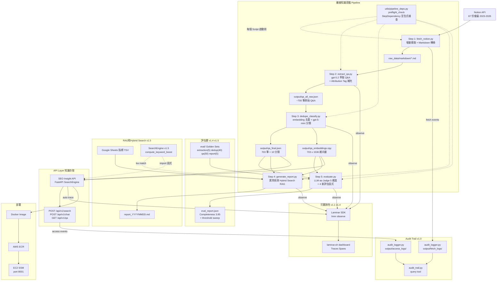

# 本專案架構與決策紀錄

> 屬於 [research/](./README.md)。涵蓋 Pipeline 全景、技術決策、架構圖、Changelog。

---

## 12. 本專案完整架構與決策

### Pipeline 全景

```
Notion 會議紀錄（87 份，2023–2026）
            ↓
[Step 1] fetch_notion.py — Notion API 擷取
  增量機制：比對 last_edited_time，只抓更新的頁面
            ↓ raw_data/markdown/*.md

[Step 2] extract_qa.py — LLM 萃取 Q&A
  模型：gpt-5.2（需要高品質理解）
  長文處理：超過 6000 tokens 自動切段
  產出：699 筆原始 Q&A
            ↓ output/qa_per_meeting/*.json

[Step 3] dedupe_classify.py — 去重 + 分類
  去重：text-embedding-3-small 計算向量
        cosine ≥ 0.88 → gpt-5.2 判斷是否合併
  分類：gpt-5-mini 貼 10 種標籤 + difficulty + evergreen
  產出：703 筆去重後 Q&A + 1536 維 embedding 向量
            ↓ output/qa_final.json + qa_embeddings.npy

[Step 4] generate_report.py — RAG 週報生成
  資料：Google Sheets 指標（TSV）
  流程：異常偵測 → Hybrid Search → RAG 組裝 → gpt-5.2 生成
            ↓ output/report_YYYYMMDD.md

[Step 5] evaluate.py — 評估
  Q&A 品質：gpt-5.2 LLM-as-Judge（4 維度）
  分類品質：gpt-5-mini 驗證分類正確率
  Retrieval 品質：語意搜尋 + gpt-5-mini 相關性判斷
            ↓ output/eval_report.json

══════════════ API 層（2026-02-27 新增）══════════════

[SEO Insight API] app/ — FastAPI，讀 Step 3 產出進記憶體
  啟動時載入：qa_final.json（703 筆）+ qa_embeddings.npy（703×1536）
  endpoints：
    POST /api/v1/search  → numpy cosine 語意搜尋
    POST /api/v1/chat    → RAG 問答（gpt-5.2）
    GET  /api/v1/qa      → 篩選列表
  部署：Docker image → ECR → EC2（SSM 遠端換容器）
            ↓ http://EC2:8001

══════════════ Audit Trail（2026-02-28 新增）══════════════

[AuditLogger] utils/audit_logger.py — 零副作用 JSONL 日誌
  fetch 事件：每次 Step 1 執行記錄 session → output/fetch_logs/fetch_YYYY-MM-DD.jsonl
    log_fetch_start → log_fetch_page / log_fetch_skip → log_fetch_complete
  access 事件：每次 API 呼叫記錄 query + returned QA IDs + client IP
    → output/access_logs/access_YYYY-MM-DD.jsonl
  查詢工具：scripts/audit_trail.py fetch|access|report
            ↓ make audit / make audit-top
```

### 模型選擇邏輯

```
需要理解複雜文本、推理、生成高品質輸出
  → gpt-5.2（主力模型）
  → 用於：Q&A 萃取、Q&A 合併、週報生成、LLM Judge

需要結構化輸出、分類、簡單判斷
  → gpt-5-mini（省成本）
  → 用於：Q&A 分類、Retrieval 相關性判斷

需要計算語意向量
  → text-embedding-3-small（極便宜，只做向量計算）
  → 用於：去重、Step 4/5 語意搜尋
```

### 當前品質基準線（2026-02-27，KW Fuzzy 匹配後）

| 指標                | 初始 baseline | 最新數值     | 狀態                |
| ------------------- | ------------- | ------------ | ------------------- |
| Relevance           | 4.65          | **4.80** / 5 | ✅ 提升             |
| Accuracy            | 3.80          | **3.95** / 5 | ✅ 提升             |
| Completeness        | 3.70          | **3.85** / 5 | ✅ 達標（目標 3.8） |
| Granularity         | 4.65          | **4.75** / 5 | ✅ 提升             |
| Category 正確率     | 75%           | 68%          | 可接受（抽樣波動）  |
| Retrieval MRR       | 0.79          | 0.75         | 可接受（±0.04）     |
| LLM Top-1 Precision | 100%          | 100%         | ✅                  |
| KW Hit Rate         | 54%           | **78%** ✅   | 已解決              |

### 花錢前必做：小規模驗證

任何需要 API 費用的改動，流程是：

```
1. 修改 prompt 或設定
2. --limit 3 只跑 3 份文件（驗證方向對）
3. 用 Step 5 評估那 3 份的品質
4. 通過門檻才擴大到全量
```

**不要先跑完 87 份再來評估要不要改 prompt。**

---

---

## 22. 架構圖與變更紀錄（Architecture Diagram & Changelog）

> 目標：每次架構調整後，自動維護一份 Mermaid 架構圖和 changes log。

### everything-claude-code 提供的工具

| 工具                  | 類型    | 功能                                                                                        | 適合場景           |
| --------------------- | ------- | ------------------------------------------------------------------------------------------- | ------------------ |
| **architect agent**   | Agent   | 設計新功能架構，會產出 high-level architecture diagram                                      | 有新元件要加入時   |
| **doc-updater agent** | Agent   | 掃描 codebase 生成文件 codemap（AST 分析）；可執行 `npx madge --image graph.svg` 生成相依圖 | 前端/Node.js 專案  |
| `/update-codemaps`    | Command | 掃描整個 codebase，在 `docs/CODEMAPS/` 生成 5 個 markdown 檔（含 ASCII 資料流圖）           | TypeScript/JS 專案 |

**限制**：`doc-updater` 和 `/update-codemaps` 依賴 Node.js（`madge`、`npx tsx`），不適合純 Python 專案。本專案應改用 Mermaid 手動維護。

### 本專案架構圖（Mermaid）



### 架構變更紀錄（Architecture Changelog）

| 日期       | 版本 | 變更內容                                                                                                                                                                                                                                                                                                                                                                                                                                                                                                                                                                                                                                         | 影響範圍                                                                                                                                                                                     |
| ---------- | ---- | ------------------------------------------------------------------------------------------------------------------------------------------------------------------------------------------------------------------------------------------------------------------------------------------------------------------------------------------------------------------------------------------------------------------------------------------------------------------------------------------------------------------------------------------------------------------------------------------------------------------------------------------------ | -------------------------------------------------------------------------------------------------------------------------------------------------------------------------------------------- |
| 2023-03    | v0.1 | 初始 Pipeline：Step 1-3，Notion 擷取 + Q&A 萃取 + 去重                                                                                                                                                                                                                                                                                                                                                                                                                                                                                                                                                                                           | —                                                                                                                                                                                            |
| 2026-02-27 | v0.2 | 新增 Step 4（RAG 週報生成）+ Step 5（評估層）                                                                                                                                                                                                                                                                                                                                                                                                                                                                                                                                                                                                    | `scripts/`                                                                                                                                                                                   |
| 2026-02-27 | v0.3 | 新增 SEO Insight API（FastAPI）+ ECR/EC2 部署                                                                                                                                                                                                                                                                                                                                                                                                                                                                                                                                                                                                    | `app/` 新增                                                                                                                                                                                  |
| 2026-02-27 | v0.4 | 修復 BUG-001（分類評估）+ BUG-002（Retrieval Judge）                                                                                                                                                                                                                                                                                                                                                                                                                                                                                                                                                                                             | `scripts/05_evaluate.py`                                                                                                                                                                     |
| 2026-02-27 | v0.5 | 新增 `[補充]` Attribution Tag 機制提升 Completeness                                                                                                                                                                                                                                                                                                                                                                                                                                                                                                                                                                                              | `utils/openai_helper.py`, `scripts/05_evaluate.py`                                                                                                                                           |
| 2026-02-27 | v0.6 | KW Hit Rate 改善：TypeA/TypeB 診斷 + Fuzzy 匹配（54% → 78%）+ `--debug-retrieval` + `--eval-reranking`                                                                                                                                                                                                                                                                                                                                                                                                                                                                                                                                           | `config.py`, `scripts/04_generate_report.py`, `scripts/05_evaluate.py`                                                                                                                       |
| 2026-02-28 | v0.7 | 死碼清理：移除 10 項未使用 import/參數/函式/常數（vulture 80% 信心門檻），26 tests passing                                                                                                                                                                                                                                                                                                                                                                                                                                                                                                                                                       | `app/core/chat.py`, `utils/`, `scripts/`, `config.py`, `app/config.py`                                                                                                                       |
| 2026-02-28 | v0.8 | 安全審查修復：config.py fail-fast env helpers（`_require_env`, `_get_float_env`, `_get_int_env`）；Google Sheets SSRF 防護（domain 白名單 + sheet_id/gid 格式驗證 + HTTP 狀態檢查 + 回應大小限制 10MB）；移除 `__import__` 非標準用法                                                                                                                                                                                                                                                                                                                                                                                                            | `config.py`, `scripts/04_generate_report.py`, `scripts/05_evaluate.py`                                                                                                                       |
| 2026-02-28 | v0.9 | Fetch 管道優化：max_depth 10→3；新增 `--since` 增量篩選（1d/7d/日期）；避免重複 meta 查詢；預期快 50-85%                                                                                                                                                                                                                                                                                                                                                                                                                                                                                                                                         | `scripts/01_fetch_notion.py`, `utils/notion_client.py`，新增 `docs/FETCH_OPTIMIZATION_GUIDE.md`                                                                                              |
| 2026-02-28 | v1.0 | Audit Trail：全 fetch + API 存取 JSONL 日誌（session_id 關聯、zero side-effects）；`scripts/audit_trail.py` query CLI；`make audit/audit-top` shortcuts                                                                                                                                                                                                                                                                                                                                                                                                                                                                                          | `utils/audit_logger.py`（new），`scripts/audit_trail.py`（new），`scripts/01_fetch_notion.py`, `utils/notion_client.py`, `app/routers/search.py`, `app/routers/chat.py`, `app/routers/qa.py` |
| 2026-02-28 | v1.1 | Laminar observability：`lmnr` 套件 + `Laminar.initialize()` 加入 `app/main.py`，所有 LLM 呼叫自動 trace；修復 `opentelemetry-semantic-conventions-ai 0.4.14` 缺少 `LLM_SYSTEM` 等 3 個屬性的相容問題                                                                                                                                                                                                                                                                                                                                                                                                                                             | `app/main.py`, `requirements_api.txt`, `.env.example`                                                                                                                                        |
| 2026-02-28 | v1.2 | 模組化 Pipeline 計畫：各 Script 可直接執行（不需 `run_pipeline.py`），統一 pre-flight 依賴檢查 + 新鮮度警告。計畫文件：`.claude/plan/modular-pipeline-with-dep-checks.md`                                                                                                                                                                                                                                                                                                                                                                                                                                                                        | 計畫階段，尚未實作                                                                                                                                                                           |
| 2026-02-28 | v1.3 | DB 遷移策略計畫：釐清 `output/*` → PostgreSQL + pgvector 對應；識別唯一破壞性風險（`GET /qa/{id}` sequential int）；MVC 需做 3 件事（stable_id + canonical endpoint + store 欄位）。計畫文件：`.claude/plan/db-migration-strategy.md`                                                                                                                                                                                                                                                                                                                                                                                                            | 計畫階段，尚未實作                                                                                                                                                                           |
| 2026-02-28 | v1.4 | **模組化 Pipeline 實作完成**：(1) `utils/pipeline_deps.py` — `StepDependency` frozen dataclass + `preflight_check()` 統一依賴檢查；(2) `config.py` 改 PEP 562 lazy loading（`import config` 不再觸發 env 驗證）；(3) 5 個 script 各自加入 `--check` flag + 宣告式依賴；(4) `run_pipeline.py` 移除 `check_config()`，改用 `parse_known_args()` 轉發 + `--check`/`--dry-run`；(5) Code review 修正：`PreflightError` 從 `SystemExit` 改為 `Exception`、`04_generate_report.py` import 去重、arg forwarding 限單步模式；(6) 新增 14 個 `config.py` lazy loading 測試（total 96 tests）；(7) Makefile 新增 `make check`；(8) README 更新分步執行文件 | `utils/pipeline_deps.py`（new），`tests/test_pipeline_deps.py`（new），`tests/test_config_lazy.py`（new），`config.py`，`scripts/01-05`，`scripts/run_pipeline.py`，`Makefile`，`README.md`  |
| 2026-02-28 | v1.4 | Laminar 全 pipeline tracing：`utils/observability.py`（`init_laminar` / `flush_laminar` / `observe` no-op shim）；`@observe()` 裝飾器套用至 5 支 scripts + `openai_helper`；`openai_helper` 結構化呼叫統一輸出；`scripts/02` CLASSIFY prompt 加入 2×10 few-shot examples（68% → 80%+ 分類目標）                                                                                                                                                                                                                                                                                                                                                  | `utils/observability.py`（new），`requirements.txt`（lmnr≥0.5.0），`utils/openai_helper.py`，`scripts/02_extract_qa.py`–`05_evaluate.py`                                                     |
| 2026-02-28 | v1.5 | Research-grade eval 體系：golden sets 四份（extraction 5 + dedup 40 pairs + qa 50 items + report 5）；`utils/search_engine.py`（new，`SearchEngine` + 模組級 `compute_keyword_boost`）；`app/core/store.py` 新增 `hybrid_search()`；`config.py` 新增 `SEMANTIC_WEIGHT=0.7 / KEYWORD_WEIGHT=0.3`；`scripts/05_evaluate.py` 新增 4 函式（`evaluate_extraction/dedup/dedup_threshold_sweep/report_quality`）+ 7 CLI flags；`04_generate_report.py` 消除 `_compute_keyword_boost` 重複（改 delegate）                                                                                                                                                | `eval/`（4 golden JSONs），`utils/search_engine.py`（new），`app/core/store.py`，`config.py`，`scripts/04_generate_report.py`，`scripts/05_evaluate.py`                                      |

### 更新架構圖的 SOP

每次架構有重大調整後：

1. 用 **architect agent** 討論新設計（`Task: subagent_type=everything-claude-code:architect`）
2. 把確認後的架構更新到 `research/06-project-architecture.md` 的 Mermaid 圖
3. 在 Architecture Changelog 新增一行（日期 + 版本 + 變更內容 + 影響範圍）
4. 更新 MEMORY.md 的確認基準線（如有評估數字變動）

> Mermaid 可以在 GitHub 預覽（直接渲染），也可以在 VS Code 安裝 Mermaid Preview 擴充套件後本機查看。
