# 本專案架構圖（Mermaid）

> 屬於 [research/](./README.md)，從 [06-project-architecture.md](./06-project-architecture.md) 拆出。
> 每次架構調整後依 [SOP](#更新架構圖的-sop) 更新此圖，並在 [06a-architecture-changelog.md](./06a-architecture-changelog.md) 新增一行。

---

## 架構圖（最新：v3.4+，2026-03-14）

```mermaid
flowchart TD
    N[Notion API<br/>87 份會議 2023-2026] --> S1
    MED_SRC["Medium RSS<br/>genehong.medium.com"] --> S1M
    ITH_SRC["iThome 鐵人賽<br/>30 篇 SC KPI 系列"] --> S1I
    GC_SRC["Google Search Central<br/>Case Studies (12 篇)"] --> S1G

    subgraph Pipeline["離線知識蒸餾 Pipeline"]
        PF[utils/pipeline_deps.py<br/>preflight_check<br/>StepDependency 宣告式檢查] -.->|每個 Script 啟動前| S1
        PF -.-> S2
        PF -.-> S3
        PF -.-> S4
        PF -.-> S5
        S1[Step 1a: fetch_notion.py<br/>增量擷取 + Markdown 轉換] --> MD[raw_data/markdown/*.md]
        S1M[Step 1b: fetch_medium.py<br/>RSS → Markdown] --> MD_MED[raw_data/medium_markdown/*.md]
        S1I[Step 1c: fetch_ithelp.py<br/>HTML → Markdown] --> MD_ITH[raw_data/ithelp_markdown/*.md]
        S1G[Step 1d: fetch_google_cases.py<br/>HTML → Markdown] --> MD_GC[raw_data/google_cases_markdown/*.md]
        MD --> S2[Step 2: extract_qa.py<br/>gpt-5.2 萃取 Q&A<br/>+ Attribution Tag 補充<br/>DIR_COLLECTION_MAP 自動偵測來源<br/>+ extraction_model / extraction_timestamp]
        MD_MED --> S2
        MD_ITH --> S2
        MD_GC --> S2
        S2 --> RAW[output/qa_all_raw.json<br/>source_type + source_collection 標記]
        RAW --> S3[Step 3: dedupe_classify.py<br/>Collection-Scoped Dedup<br/>各 collection 內部獨立去重]
        S3 --> QABASE[Step 3 基線快照<br/>歷史上曾產出 1,323 / 1,317 筆]
        QABASE --> CURATE[Step 3.5: curated QA 後處理鏈<br/>clean_qa_quality → restore_rewritten_qas<br/>→ sync_curated_qa_from_raw → add_retrieval_boosters]
        CURATE --> QA[output/qa_final.json<br/>目前 serving artifact 283 筆<br/>question-only salvage + manual boosters]
        S3 --> EMB[output/qa_embeddings.npy<br/>跨 collection 統一向量]
    end

    subgraph Eval["評估層（Claude Code 本地評估 + LLM Judge）"]
        GoldenSets["eval/ Golden Sets<br/>extraction(5) dedup(40) qa(50)<br/>report(5) retrieval(35) seo_analysis"]
        QA --> S5[Step 5: evaluate.py<br/>LLM-as-Judge<br/>4 維度評估 + 本地選項]
        EMB --> S5
        GoldenSets --> S5
        S5 --> ER["eval_report.json<br/>Completeness 3.95<br/>+ eval_local_*.json<br/>(Claude Code 評分)"]
    end

    subgraph RAG_Search["RAG和Hybrid Search v1.5"]
        GS[Google Sheets 指標 TSV] --> S4[Step 4: generate_report.py<br/>異常偵測 Hybrid Search RAG]
        QA --> S4
        EMB --> S4
        SE["SearchEngine v1.5<br/>compute_keyword_boost"] -.->|kw match| S4
        S4 --> RPT[report_YYYYMMDD.md]
    end

    subgraph Frontend["Frontend（vocus-web-ui，Next.js，port 3000）"]
        FE["6 頁 SPA<br/>Q&A Chunk / QA 詳情 / RAG 問答<br/>SEO 週報 / Pipeline / 同義詞管理"]
        FE --> FEHOOK["Custom Hooks<br/>useQAFilters / useEvalDashboard"]
        FE --> FECOMP["Components<br/>ChatMessage（null content 支援）<br/>EvalMetricsCards / EvalProviderComparison<br/>EvalSampleTable / EvalSaveForm<br/>PipelineMetrics / QAFilterToolbar"]
        FECOMP -->|context-only 模式| FEFB["Context-Only Badge<br/>+ SourcesList auto-expand"]
    end

    FE -->|"seoInsight.api.ts<br/>seoFetch（port 8002）"| HAPI

    subgraph Hono_API["API Layer v3.4（Hono + TypeScript，port 8002，Local Mode + Laminar）"]
        QA --> HAPI["SEO Insight API<br/>Hono + TypeScript<br/>QAStore / SupabaseQAStore（factory pattern）"]
        EMB -.->|"optional（Local Mode 不需要）"| HAPI
        SE -.->|hybrid_search / keywordOnlySearch| HAPI
        HAPI --> HMID["middleware/<br/>auth.ts（X-API-Key）<br/>rate-limit.ts（chat:20 search/qa:60 reports/gen:5 eval:60/min）<br/>cors.ts + error-handler.ts"]
        HMID --> HEP["9 個 Router + health（v3.4，42 端點）<br/>qa.ts — GET /qa, /qa/categories, /qa/collections, /qa/{id}（hex+int + maturity filter）<br/>search.ts — POST /search（mode: hybrid|keyword；maturity boost / rerank）<br/>chat.ts — POST /chat（mode: agent|rag|context-only）<br/>reports.ts — GET/POST /reports（本地 + OpenAI 雙模式）<br/>sessions.ts — CRUD /sessions + messages（mode-aware fallback）<br/>feedback.ts — POST /feedback<br/>pipeline.ts — source-docs / metrics / trends / llm-usage 等<br/>synonyms.ts — GET/POST /synonyms, PUT/DELETE /synonyms/{term}<br/>meeting-prep.ts — GET /meeting-prep, /meeting-prep/maturity-trend, /meeting-prep/{date}"]
        HEP --> HENV["ApiResponse[T]<br/>Zod schema validation<br/>data / error / meta"]
        HEP -->|not_relevant / helpful| LS
        HEP -->|"pipeline/eval proxy"| QT
        HEP -->|"read/write"| SYNSTORE["synonyms-store.ts<br/>output/synonym_custom.json"]
        HAPI --> HSTORE["store/<br/>qa-store.ts（QAStore / SupabaseQAStore factory）<br/>supabase-client.ts（thin REST，no SDK）<br/>supabase-qa-store.ts（pgvector hybrid search）<br/>search-engine.ts（hybrid + keyword boost + keywordOnlySearch）<br/>session-store.ts（FileSessionStore）<br/>learning-store.ts<br/>synonyms-store.ts（雙層：28 靜態 + custom JSON，v2.10）"]
        HAPI --> HUTIL["utils/<br/>npy-reader.ts（NumPy .npy 解析）<br/>cosine-similarity.ts（Float32Array）<br/>keyword-boost.ts（4 層匹配）<br/>sanitize.ts（HTML escape 防 XSS）<br/>cjk-tokenizer.ts（CJK 分詞 2-gram）<br/>mode-detect.ts（hasOpenAI 偵測）"]
        HAPI --> HSVC["services/<br/>embedding.ts（OpenAI wrapper）<br/>rag-chat.ts（RAG 問答 + v2.11 rerank 支援）<br/>reranker.ts（v2.11 新增，Haiku）<br/>context-relevance.ts（v2.12 新增，Claude haiku judge）<br/>report-generator-local.ts（v2.13 重寫，ECC 6 維度本地週報）<br/>report-evaluator.ts（v2.13 新增，5 維度規則式品質評估）<br/>pipeline-runner.ts（Python CLI 代理）"]
        HAPI --> HSCHEMA["schemas/ 10 個<br/>Zod runtime validation<br/>qa / search / chat / feedback<br/>report / session / pipeline / eval<br/>synonyms / api-response"]
    end

    subgraph Legacy_API["Python API Layer（FastAPI，port 8001，legacy — 預計下線）"]
        QA -.-> API["FastAPI QAStore singleton<br/>app/ 目錄<br/>（舊架構，主要由 Hono v2.12 取代）"]
        EMB -.-> API
        API -.-> EP["15 endpoints<br/>同 Hono 功能對等"]
    end

    subgraph AuditTrail["Audit Trail"]
        S1 -->|fetch events| AL["audit_logger.py<br/>output/fetch_logs/"]
        HEP -->|access events| AL2["output/access_logs/<br/>JSONL per day"]
        AL --> ATQ["audit_trail.py<br/>query tool"]
        AL2 --> ATQ
    end

    subgraph CacheLayer["Layer 1 Content-Addressed Cache v2.8（Model-Aware）"]
        S2 <-->|"extraction cache<br/>key=SHA256(model::content)"| PC["pipeline_cache.py<br/>output/.cache/{ns}/{h[:2]}/{h}.json<br/>namespace: extraction/embedding/classify/merge/report<br/>model-aware: key=SHA256(model::content)"]
        S3 <-->|"embed/classify/merge cache<br/>key=SHA256(model::content)"| PC
        S4 <-->|report cache| PC
        S3 -->|"record_artifact<br/>metadata.extraction_model"| PV["pipeline_version.py v1.19<br/>STEP_NAMES + resolve_step()<br/>label_version() + register_existing_file()<br/>output/.versions/registry.json"]
        S4 -->|record_artifact| PV
    end

    subgraph MultiLayerContext["Multi-Layer Context v2.11（離線 Enrichment + Contextual Embeddings）"]
        QA --> ENRICH["scripts/enrich_qa.py<br/>make enrich<br/>冪等 / 無 LLM / atomic write"]
        SYN["utils/synonym_dict.py<br/>三層合併（v2.11）：METRIC_QUERY_MAP（基礎 28 術語）<br/>+ _SUPPLEMENTAL_SYNONYMS（v2.11 新增 31 術語，共 59 術語）<br/>+ output/synonym_custom.json<br/>@lru_cache(maxsize=1)"] --> ENRICH
        CTX["scripts/_generate_context.py（v2.11 新增）<br/>Claude Haiku situating context<br/>150-300 字/筆"] --> ENRICH
        SYNSTORE -->|"custom synonyms"| SYN
        FRESH["utils/freshness.py<br/>exp(-0.693×age/540d)<br/>min_score=0.5"] --> ENRICH
        ENRICH --> QAE["output/qa_enriched.json<br/>（已歸檔 → archive_v1/）<br/>qa_final.json 為 API 主要資料源"]
        ENRICH --> CTXOUT["output/qa_context.json（v2.11 新增）<br/>situating context 150-300 字<br/>離線預生成"]
        QAE -.->|已歸檔，API 直接讀 qa_final.json| SE
        CTXOUT -->|context embedding| HAPI
        QAE -->|synonym_boost_vec<br/>freshness_vec 預計算| SE
        LS["utils/learning_store.py<br/>output/learnings.jsonl<br/>record_miss / record_feedback<br/>get_relevant_learnings"] -.->|query learnings| SE
    end

    subgraph Observability["可觀測性（三路整合：Python CLI + Hono API + 執行日誌）"]
        S2 -->|"@observe + init_laminar"| LM["Laminar SDK<br/>Python v0.5 + JS v0.8<br/>OpenTelemetry-based"]
        S3 -->|"@observe + init_laminar"| LM
        S4 -->|"@observe + init_laminar"| LM
        S5 -->|"@observe + init_laminar"| LM
        QT["qa_tools.py 6 subcommands<br/>@observe + flush_laminar<br/>+ execution_log.jsonl"] -->|"search/merge_qa/etc"| LM
        QT -->|"log_execution()"| ELOG["output/execution_log.jsonl<br/>command/args/duration/result"]
        HAPI -->|"initLaminar + observe"| LM
        HSVC -->|"observe(rag_chat)<br/>observe(get_embedding)"| LM
        EC["evals/eval_chat.py<br/>Laminar.initialize()"] -->|"lmnr eval"| LM
        LM --> LD["Laminar Dashboard<br/>Traces + Spans + Events"]
        OS -.->|"score_event"| LM
    end

    subgraph OfflineEvals["離線評估"]
        GoldenSets2["eval/ Golden Sets<br/>retrieval(307) extraction(5)<br/>chat(10) seo_analysis"]
        GoldenSets2 --> EvalR["evals/eval_retrieval.py<br/>keyword_hit_rate<br/>category_match"]
        GoldenSets2 --> EvalE["evals/eval_extraction.py<br/>qa_count<br/>keyword_coverage"]
        GoldenSets2 --> EvalC["evals/eval_chat.py<br/>answer_length<br/>has_sources"]
        GoldenSets2 --> EvalEnrich["evals/eval_enrichment.py v1.19<br/>kw_hit_rate_with_synonyms 79.67%<br/>freshness_rank_quality 1.0<br/>synonym_coverage 1.0"]
        EvalR -->|lmnr eval| LM
        EvalE -->|lmnr eval| LM
        EvalC -->|lmnr eval| LM
        EvalEnrich -->|lmnr eval group=enrichment_quality| LM
        HEP -->|score_rag_response| OS["laminar_scoring<br/>score_enrichment_boost<br/>score_search_miss"]
        OS -->|attach to trace| LM
    end

    subgraph Deploy["部署（v2.24 Lambda）"]
        HAPI --> LBUILD["tsup Lambda Build<br/>noExternal ESM bundle<br/>dist-lambda/lambda.js ~3.4MB"]
        LBUILD --> LAMBDA["AWS Lambda<br/>seo-insight-api<br/>arm64 / Node.js 22 / 512MB"]
        LAMBDA --> FURL["Function URL<br/>HTTPS auto<br/>~$0/月 free tier"]
        HAPI --> LENTRY["api/src/lambda.ts<br/>hono/aws-lambda handle()<br/>cold start initStores()"]
        LENTRY -.->|handler| LAMBDA
    end

    subgraph DataLayer["資料層（v2.24 Supabase pgvector 完成）"]
        direction LR
        QA -->|"hasSupabase() = true"| SB_STORE["SupabaseQAStore<br/>supabase-client.ts REST API<br/>async hybridSearch → RPC match_qa_items"]
        QA -.->|"hasSupabase() = false"| FILE_STORE["QAStore（檔案模式）<br/>npy-reader + Float32Array"]
        SB_STORE --> SB["Supabase pgvector<br/>eqrlomuujichshkbtoat<br/>qa_items 1,323 rows<br/>eval_runs<br/>IVFFlat index（lists=50）"]
    end
```

> Mermaid 可以在 GitHub 預覽（直接渲染），也可以在 VS Code 安裝 Mermaid Preview 擴充套件後本機查看。

---

## 更新架構圖的 SOP

每次架構有重大調整後：

1. 用 **architect agent** 討論新設計（`Task: subagent_type=everything-claude-code:architect`）
2. 把確認後的架構更新到本檔（`06b-architecture-diagram.md`）的 Mermaid 圖
3. 在 [06a-architecture-changelog.md](./06a-architecture-changelog.md) 新增一行（日期 + 版本 + 變更內容 + 影響範圍）
4. 更新 MEMORY.md 的確認基準線（如有評估數字變動）
